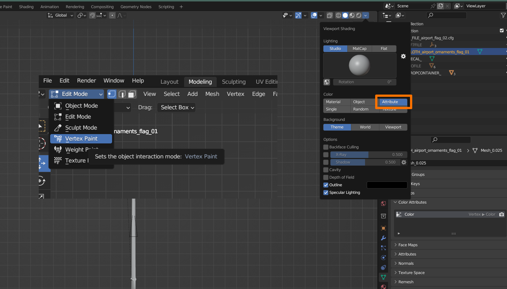
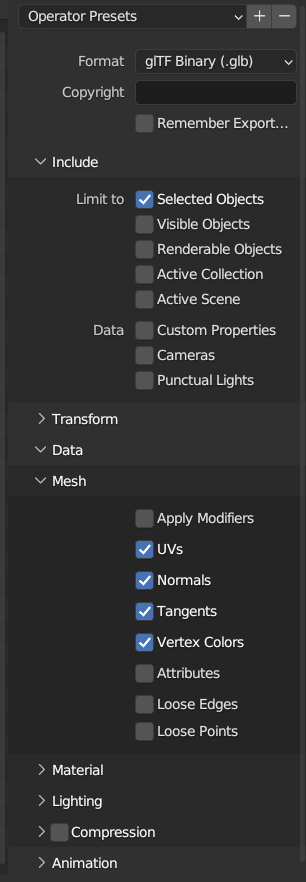

# Create custom cloth .rdms 

Taubenangriff made [a new version of the rdm4-bin.exe](https://discord.com/channels/578443209940926465/976856421536768050/1232382355520356364) which now supports the vertex format `P3f_N3f_G3f_B3f_T2f_C4b` when converting from `.gltf/.glb to .rdm` (atm not from `.rdm to .gltf/.glb`). 
This format is required for `Clothes`, which are usually used for flags, sails and all other models which are supposed to not to be stiff.

In comparison to the simple `Wind_Ripples` effect which is available for the common assets (`T2h` and `I4b`), `Clothes` allow much bigger meshes and targeted deflections for each vertice. If you just need a small awning which should fake
motion through wind, then the `Wind_Ripples` effect should be sufficient (simply enable it in the corresponding cfg material and adjust its values). 

As an easy example for this guide we recreate one of the ornamental airport flags but apply less deflections: `data/dlc11/graphics/buildings/ornaments/airport/airport_flag_02.cfg`

## Import mesh
You can...

- either just convert the .rdm to .gltf/.glb via console and import it into Blender without using the Anno Import/Export addon, cause the Addon does not support `P3f_N3f_G3f_B3f_T2f_C4b` as an export option yet anyway.
- or you import the whole .cfg as always and simply add an extra argument to the console at the end of the process.

In this case, import via option 2 is faster, so I used that one here. 

## Vertex Paint
- After import click on your model and go to the `Object Data Properties` tab on the right. There you click on `Color Attributes` (picture 1). With `+` you add a new attribute to our mesh.
- As soon as you do so, a window pops up and gives you some options: `Domain` should be `Vertex` and `DataType` should be `Color`. The color you select below is the default color all your vertices of this mesh will be assigned to:
  - White means = no deflection by default (100 % stiff)
  - Black means = max. deflection by default
  - Any grey tone inbetween = proportional deflection
- It´s up to you, I chose white in this case.
  

- Click on `Viewport Shading` and select `Attributes`. Then switch into `Vertex Paint` mode:

- If you chose white before, your whole mesh is now covered in white. To tell Anno where to deflect your mesh, select black or any grey tone in the color tab. Then draw on your mesh and see what happens if you hit a vertice with your brush :)
- In this case, the vertices on the left can be black, since they should move the most, the adjacent vertices should move a bit less. So either adjust the color again or simply use the `Strength` slider to get any grey tone.
- I left the vertices next to the pole and the upper vertices white, but they should actually be slightly grey to achieve a more realistic effect.

 
This is how it looks like in `Edit mode`:

## Export mesh and conversion to rdm

- If imported via .gltf/.glb: skip to the next step
- If imported via cfg: Click on the model --> `Ctrl A` --> `All Transforms`. Alternatively set all Location, Rotation values to 0 (except Rotation W = 1) and Scale to 1. Which option you choose, determines if you have to adjust the
Orientation_Transform in the cfg afterwards or not. If you decided to use `Ctrl A` and to export the whole cfg as well, which is probably the way most people here do it, then you have no locations, rotations, scales to adjust afterwards.
However there might be cases, where you don't want to export the cfg, but just the model. In such cases: If you chose `Ctrl A`, you have to manually set all Location, Rotation, Scale values to their default values in the cfg. But if you
set all Location, Rotation, Scale values to their default values in Blender before export, you don't have to touch the original Orientation_Transform in the cfg (this is, because we export the model via glTF 2.0 not via Addon).

- In any case: Choose `glTF 2.0` as export option with the settings below:

- Open a console terminal of your choice and use:

> `your_path/rdm4-bin.exe -i your_path/your_file.glb -g=P3f_N3f_G3f_B3f_T2f_C4b`

> and if you imported via .cfg add: `--negative-x-and-v0v2v1` to mirror the model correctly again.

- You may notice that in the .cfg file the vertex format for Clothes is displayed as `<VertexFormat>P3f_N3b,T2f</VertexFormat>`. Nothing to worry about.

Result ingame: 

