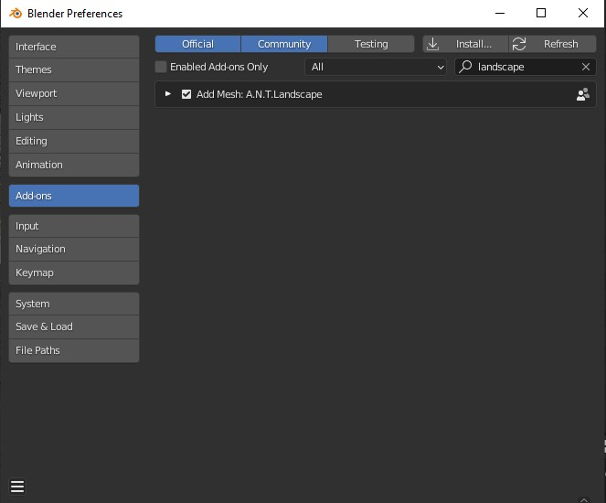
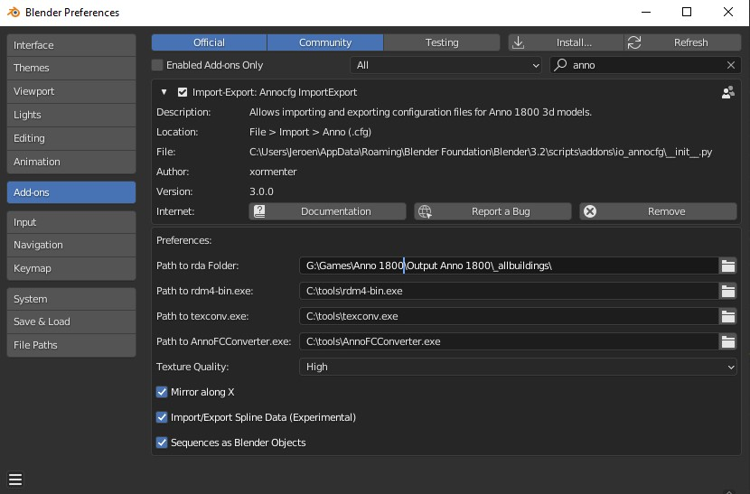
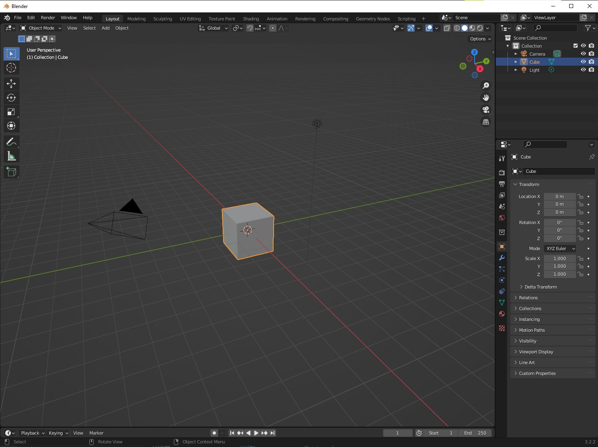
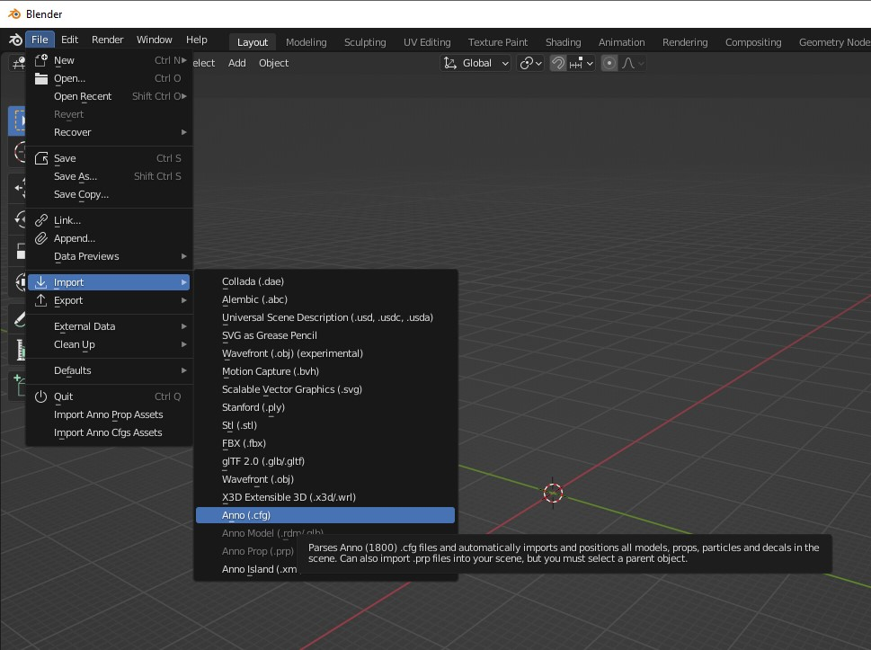
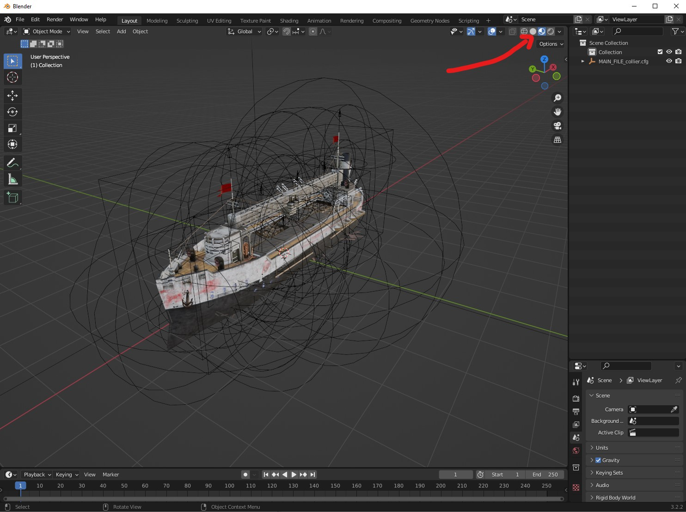
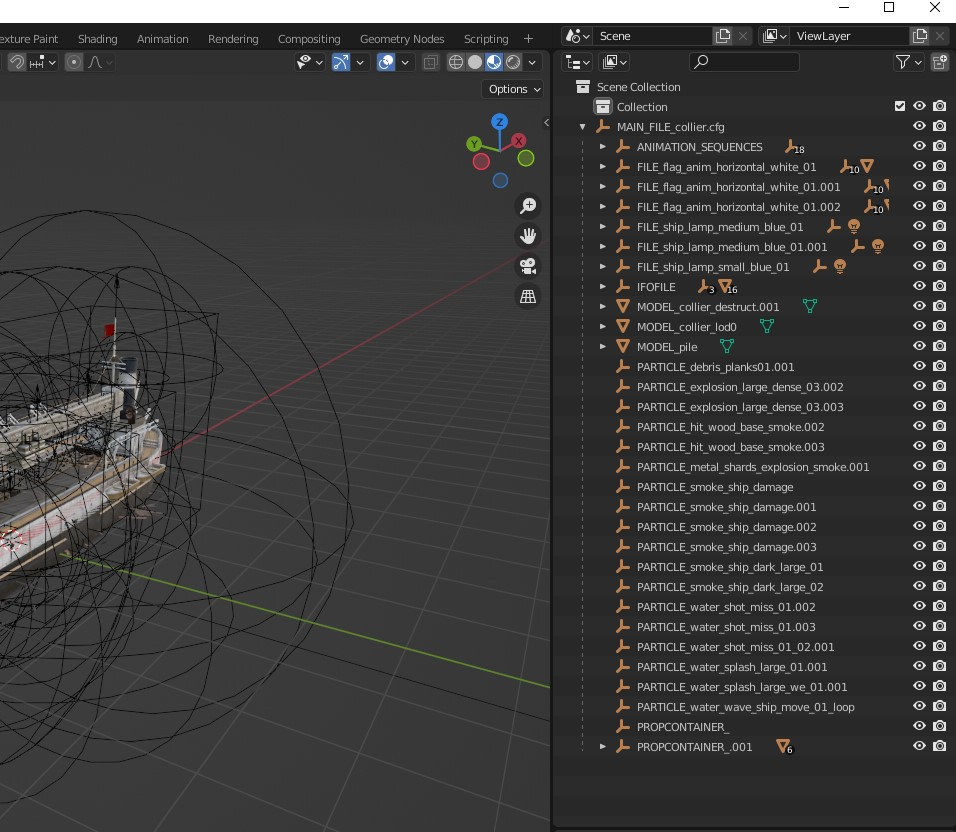
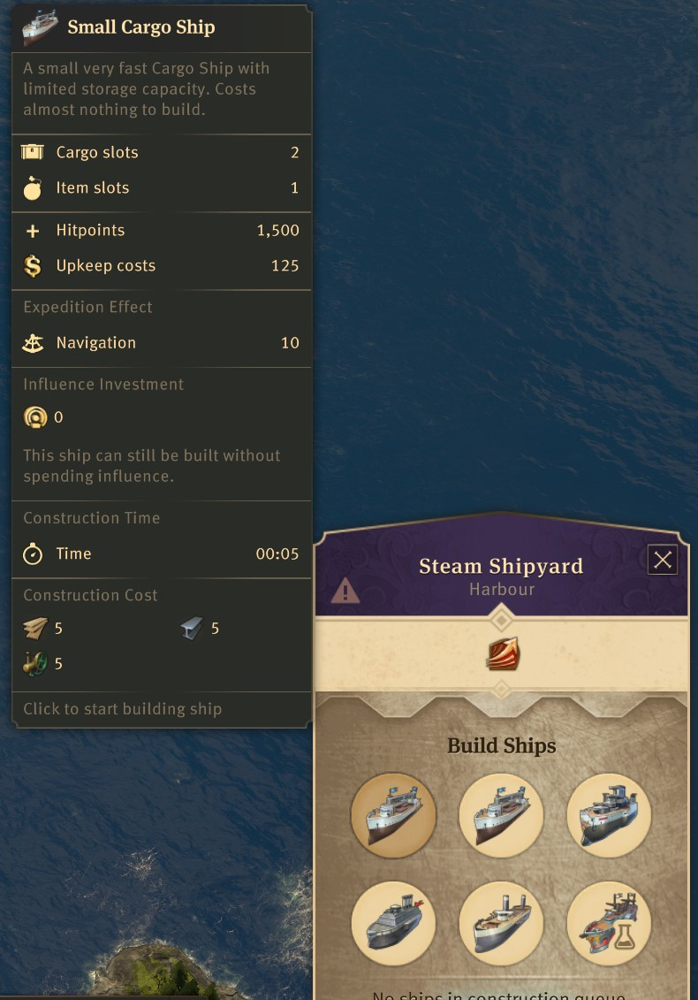
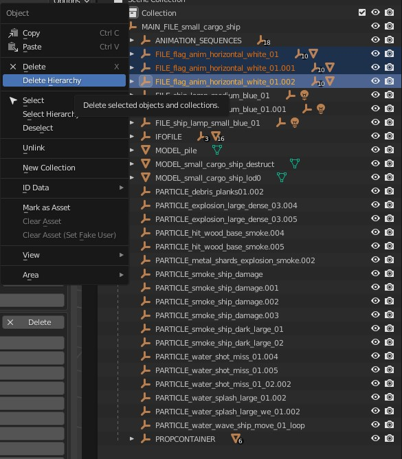

# Tutorial 4 - Making a new ship

The previous tutorial was a really big one. For the next one we are going to do something smaller but with a big new part, changing models in Blender.

## What are we going to do?

We are ging to use an existing model from the game to make a new small cargoship and adapt it in Blender to create a new one. Then we will be changing the diff map a bit to give it some unique visuals.

We will be creating:

- New ship asset for Small Cargo Ship
- Adding the ship to the steam shipyard
- Adding the ship to the tradeship pool
- Make trigger
- New model + textures/maps for Small cargoship
- Icon for Small cargoship

## Our mod structure

This is already the 4th tutorial so we begin to know the structure of a mod. This mod has some specific folders.

- [Gameplay] Small Cargo Ship
  - data
    - config
      - export
        - main
          - asset
            - xml file (assets.xml) which contains all the logic for our mod.
      - gui
        - xml files containing the translations for text in every language
          - texts_english.xml
          - texts_french.xml
          - texts_german.xml
          - …
    - graphics
      - small_cargoship.cfg and small_cargoship.ifo file with model logic.
      - icons
        - Custom graphics we use in our mod. Icon for our ship.
      - vehicle
        - small_cargoship (Contains files that describes the new ship)
          - maps  
             Contains maps which are the materials/textures of our ship. diff file only in this case.
          - rdm
            Contains the new model we will be creating

## The asset for the ship

We have done some modding and start to know how to search, adapt and create new or existing assets. We are going to create a ship. So, the easiest way to create one is to use a basic ship as an example and adapt it.

Go to the main assets.xml of the latest data.rda file and search for &lt;Template>TradeShip&lt;/Template>.
The moment of making this tutorial, you will have 46 results. Those are all tradeships that are used in the game. Not only ships that are available for yourself, but also curstom versions from AI and quests are in this list.

Go to the 4th result. This is the Tradeship with GUID "1010062". This is called "Collier (Trade)", but in fact is the Cargo ship. We will use this as the base to create our smaller version.

Copy the whole &lt;Asset> of this ship to your main assets.xml inside a &lt;ModOp>.

```XML
<ModOps>
    <!-- START SHIP - SMALL CARGOSHIP -->
    <ModOp Type="addPrevSibling" GUID='1010062'>
        <Asset>
            <Template>TradeShip</Template>
            <Values>
                <Standard>
                    <GUID>1010062</GUID>
                    <Name>Collier (Trade)</Name>
                    <IconFilename>data/ui/2kimages/main/3dicons/ships/icon_ship_collier.png</IconFilename>
                    <InfoDescription>1089</InfoDescription>
                </Standard>
                <Object>
                    <Variations>
                        <Item>
                            <Filename>data/graphics/vehicle/collier/collier.cfg</Filename>
                        </Item>
                    </Variations>
                    <Skins>
                        <SkinList>
                            <Item>
                                <SkinAssetGuid>80152</SkinAssetGuid>
                            </Item>
                            <Item>
                                <SkinAssetGuid>133388</SkinAssetGuid>
                            </Item>
                            <Item>
                                <SkinAssetGuid>133397</SkinAssetGuid>
                            </Item>
                        </SkinList>
                    </Skins>
                </Object>
                <Mesh>
                    <MeshPlacement>OnWaterSlope</MeshPlacement>
                </Mesh>
                <Selection>
                    <MultiSelectable>1</MultiSelectable>
                    <OnSelection>
                        <IsBaseAutoCreateAsset>1</IsBaseAutoCreateAsset>
                        <Values>
                            <ActionList />
                        </Values>
                    </OnSelection>
                </Selection>
                <Walking>
                    <ShortenSailsAfter>0</ShortenSailsAfter>
                    <ReservationLength>16</ReservationLength>
                    <ReservationWidth>6</ReservationWidth>
                    <PathPlannerLayer>Water</PathPlannerLayer>
                    <ExpensiveDirSmoothing>1</ExpensiveDirSmoothing>
                    <TurnAroundRadius>8</TurnAroundRadius>
                    <Acceleration>1.5</Acceleration>
                    <Deceleration>2</Deceleration>
                    <TurnRadius>8</TurnRadius>
                    <TurnSpeedInPlace>20</TurnSpeedInPlace>
                    <TurnDeceleration>0</TurnDeceleration>
                    <TurnMovement>0</TurnMovement>
                    <LeaningMaxAngle>-10</LeaningMaxAngle>
                    <ForwardSpeed>5.2</ForwardSpeed>
                    <WindMinSlowdownFactor>1</WindMinSlowdownFactor>
                    <WindMaxSpeedupFactor>1</WindMaxSpeedupFactor>
                    <CargoFullFactor>0.8</CargoFullFactor>
                    <MinSlowdownFactor>0.5</MinSlowdownFactor>
                    <CurveSegmentDensity>High</CurveSegmentDensity>
                </Walking>
                <Text>
                    <LocaText>
                        <English>
                            <Text>Cargo Ship</Text>
                            <Status>Exported</Status>
                            <ExportCount>2</ExportCount>
                        </English>
                    </LocaText>
                    <LineID>14859</LineID>
                </Text>
                <CommandQueue>
                    <FormationPriority>1</FormationPriority>
                    <TradeShipPoints>4</TradeShipPoints>
                    <PriorityShipList>2</PriorityShipList>
                </CommandQueue>
                <Drifting>
                    <OverrideAssetWidthAndLength>0</OverrideAssetWidthAndLength>
                    <Length>7</Length>
                    <Width>1.5</Width>
                    <FactorMovement>0.7</FactorMovement>
                    <FactorRotation>0.65</FactorRotation>
                </Drifting>
                <Collector />
                <Attackable>
                    <MaximumHitPoints>4000</MaximumHitPoints>
                    <HPBarOffset>4</HPBarOffset>
                    <AlertRange>150</AlertRange>
                    <SelfHealPerHealTick>1.667</SelfHealPerHealTick>
                    <SelfHealPausedTimeIfAttacked>60000</SelfHealPausedTimeIfAttacked>
                </Attackable>
                <MinimapToken>
                    <TokenAsset>2001947</TokenAsset>
                    <StrategicMapAsset>501018</StrategicMapAsset>
                </MinimapToken>
                <SoundEmitter>
                    <ActiveSounds>
                        <Item>
                            <Sound>201827</Sound>
                        </Item>
                    </ActiveSounds>
                    <DestroySounds>
                        <Item>
                            <Sound>238314</Sound>
                        </Item>
                    </DestroySounds>
                </SoundEmitter>
                <UpgradeList />
                <QuestObject />
                <Infolayer />
                <ItemContainer>
                    <SocketCount>2</SocketCount>
                    <SocketAllocation>Ship;SteamShip;Tradeship</SocketAllocation>
                    <SlotCount>6</SlotCount>
                </ItemContainer>
                <FeedbackController />
                <Draggable>
                    <DraggableOnDrag>
                        <IsBaseAutoCreateAsset>1</IsBaseAutoCreateAsset>
                        <Values>
                            <ActionList />
                        </Values>
                    </DraggableOnDrag>
                    <DraggableOnDrop>
                        <IsBaseAutoCreateAsset>1</IsBaseAutoCreateAsset>
                        <Values>
                            <ActionList />
                        </Values>
                    </DraggableOnDrop>
                </Draggable>
                <Cost>
                    <Costs>
                        <Item>
                            <Ingredient>1010218</Ingredient>
                            <Amount>20</Amount>
                        </Item>
                        <Item>
                            <Ingredient>1010224</Ingredient>
                            <Amount>20</Amount>
                        </Item>
                    </Costs>
                    <InfluenceCostType>TradeShip</InfluenceCostType>
                    <InfluenceCostPoints>6</InfluenceCostPoints>
                </Cost>
                <Craftable>
                    <CraftingTime>540000</CraftingTime>
                </Craftable>
                <TradeRouteVehicle />
                <Locked />
                <Nameable />
                <MetaPersistent />
                <ExpeditionAttribute>
                    <BaseMorale>70</BaseMorale>
                    <ExpeditionAttributes>
                        <Item>
                            <Attribute>Might</Attribute>
                        </Item>
                        <Item>
                            <Attribute>Navigation</Attribute>
                            <Amount>20</Amount>
                        </Item>
                        <Item>
                            <Attribute>PerkTradeShip</Attribute>
                            <Amount>1</Amount>
                        </Item>
                        <Item>
                            <Attribute>PerkSteamShip</Attribute>
                            <Amount>1</Amount>
                        </Item>
                    </ExpeditionAttributes>
                </ExpeditionAttribute>
                <ShipMaintenance>
                    <Maintenance>500</Maintenance>
                </ShipMaintenance>
                <Sellable>
                    <Baseprice>
                        <Item>
                            <VectorElement>
                                <InheritedIndex>0</InheritedIndex>
                                <InheritanceMapV2>
                                    <Entry>
                                        <TemplateName>TradeShip</TemplateName>
                                        <Index>0</Index>
                                    </Entry>
                                </InheritanceMapV2>
                            </VectorElement>
                            <Amount>300000</Amount>
                        </Item>
                    </Baseprice>
                </Sellable>
                <Stance />
                <Rentable />
                <WorldMapSound />
                <Pausable />
                <ShipIncident />
                <SoundEmitterCommandBarks>
                    <BarkMapping>
                        <Selection>
                            <AudioPool>700094</AudioPool>
                        </Selection>
                        <SelectionDamaged>
                            <AudioPool>700125</AudioPool>
                        </SelectionDamaged>
                        <MoveCommand>
                            <AudioPool>700095</AudioPool>
                        </MoveCommand>
                        <EscortCommand>
                            <AudioPool>700127</AudioPool>
                        </EscortCommand>
                        <PatrolCommand>
                            <AudioPool>700126</AudioPool>
                        </PatrolCommand>
                    </BarkMapping>
                </SoundEmitterCommandBarks>
            </Values>
        </Asset>
    </ModOp>
    <!-- END SHIP - SMALL CARGOSHIP -->
</ModOps>
```

### Cleanup and changing the ship asset

First we are going to go through the whole asset amd clean up the code we do not need. The same time we will be changing the values to make our ship different from the main Cargo ship.

Let's go over everything we did:

#### GUID, Name and description

We choose a new GUID for this ship. We ended with the GUID 1742008812 in the last tutorial. So we are going to take the next GUID available, **&lt;GUID>1742008813&lt;/GUID>** for this ships name. For the description we take **&lt;InfoDescription>1742008814&lt;/InfoDescription>**.

```XML
<Standard>
    <GUID>1742008813</GUID>
    <Name>Small Cargo Ship</Name>
    <IconFilename>data/graphics/vehicle/small_cargoship/icon_small_cargoship.png</IconFilename>
    <InfoDescription>1742008814</InfoDescription>
</Standard>
```

We do not have created the icon yet, but we can already declare the path to the icon. **&lt;IconFilename>data/graphics/vehicle/small_cargoship/icon_small_cargoship.png&lt;/IconFilename>**.

We change the name to &lt;Name>Small Cargo Ship&lt;/Name>.

#### cfg model variation

We also do not have created the cfg model yet, but again, we already declare the correct path to this file we will be creating later on. **<Filename>data/graphics/vehicle/small_cargoship/small_cargoship.cfg</Filename>**

We remove the &lt;Skins> part. We do not have skins.

```XML
<Object>
    <Variations>
        <Item>
            <Filename>data/graphics/vehicle/small_cargoship/small_cargoship.cfg</Filename>
        </Item>
    </Variations>
</Object>
```

#### Mesh / Selection

We do not change anything here. We want the same behaviour for our ships.

#### Walking

In this part we will be changing some of the values, depending on what we want to give our ship as specifications (speed, length,...).

This smaller version will be faster, more agile but will have more effect of slowdowns. So we adapt the values according to that. See original values of the Cargo Ship next to it.

```XML
<Walking>
    <ShortenSailsAfter>0</ShortenSailsAfter>
    <ReservationLength>12</ReservationLength> <!-- Original Cargo Ship - 16 -->
    <ReservationWidth>5</ReservationWidth> <!-- Original Cargo Ship - 6 -->
    <PathPlannerLayer>Water</PathPlannerLayer>
    <ExpensiveDirSmoothing>1</ExpensiveDirSmoothing>
    <TurnAroundRadius>4</TurnAroundRadius> <!-- Original Cargo Ship - 8 -->
    <Acceleration>2.5</Acceleration> <!-- Original Cargo Ship - 1.5 -->
    <Deceleration>1.5</Deceleration> <!-- Original Cargo Ship - 2 -->
    <TurnRadius>4</TurnRadius> <!-- Original Cargo Ship - 8 -->
    <TurnSpeedInPlace>30</TurnSpeedInPlace> <!-- Original Cargo Ship - 20 -->
    <TurnDeceleration>0</TurnDeceleration>
    <TurnMovement>0</TurnMovement>
    <LeaningMaxAngle>-10</LeaningMaxAngle>
    <ForwardSpeed>6.4</ForwardSpeed> <!-- Original Cargo Ship - 5.2 -->
    <WindMinSlowdownFactor>1</WindMinSlowdownFactor> <!-- Not adapting Steam Ship -->
    <WindMaxSpeedupFactor>1</WindMaxSpeedupFactor> <!-- Not adapting Steam Ship -->
    <CargoFullFactor>0.6</CargoFullFactor> <!-- Original Cargo Ship - 0.8 -->
    <MinSlowdownFactor>0.6</MinSlowdownFactor> <!-- Original Cargo Ship - 0.5 -->
    <CurveSegmentDensity>High</CurveSegmentDensity>
</Walking>
```

#### Text

```XML
<Text>Small Cargo Ship</Text>
```

#### CommandQueue

For the &lt;CommandQueue> we choose some different values. The TradeShipPoints we can change to 2.

```XML
<CommandQueue>
    <FormationPriority>1</FormationPriority>
    <TradeShipPoints>2</TradeShipPoints>
    <PriorityShipList>2</PriorityShipList>
</CommandQueue>
```

#### Drifting

We do not change anything here. We want the same behaviour for our ships. We maybe could adapt some values, but it will nog have that big of an impact.

#### Attackable

Important part where we will be choosing some values of our ship. We look at the values of the normal Cargo Ship and change those values according to that.

```XML
<Attackable>
    <MaximumHitPoints>1500</MaximumHitPoints>
    <HPBarOffset>4</HPBarOffset>
    <AlertRange>150</AlertRange>
    <SelfHealPerHealTick>1.2</SelfHealPerHealTick>
    <SelfHealPausedTimeIfAttacked>30000</SelfHealPausedTimeIfAttacked>
</Attackable>
```

#### MinimapToken

Nothing to change here. This defines which icon to use on the minimap. The icons are ok.

#### SoundEmitter

We can just take the same sounds as from the normal Cargo Ship. So we do not change anything here.

#### ItemContainer

Another interesting part. We can define here how many itemsockets and cargo holds the ship gets. We want to balance our ship offcourse, and it is a smaller version of the normal Cargo Ship so we choose only 1 item socket and 2 cargo holds.

**Good to know**: There is a maximum of slots that are available in the UI, so adding 10 slots for example will not have the best effect.

The &lt;SocketAllocation> values stay the same. This is also a ship, Steamship and Tradeship. Those values define which items will be possible to put into the item socket. For example, military ship items will not be possible to put into this ship, or other specialists who have nothing to do with ships.

```XML
<ItemContainer>
    <SocketCount>1</SocketCount>
    <SocketAllocation>Ship;SteamShip;Tradeship</SocketAllocation>
    <SlotCount>2</SlotCount>
</ItemContainer>
```

#### Draggable

We can leave this as is.

#### Cost

The normal costs for steamships exists of Steel Beams and Steam Motors. We will be adding also some Timber. We adapt the values for the existing materials compared to the normal Cargo Ship.

For influence we do the same.

```XML
<Cost>
    <Costs>
        <Item>
            <Ingredient>1010196</Ingredient> <!-- Timber -->
            <Amount>5</Amount>
        </Item>
        <Item>
            <Ingredient>1010218</Ingredient> <!-- Steel Beams -->
            <Amount>5</Amount>
        </Item>
        <Item>
            <Ingredient>1010224</Ingredient> <!-- Steam Motors -->
            <Amount>5</Amount>
        </Item>
    </Costs>
    <InfluenceCostType>TradeShip</InfluenceCostType>
    <InfluenceCostPoints>1</InfluenceCostPoints>
</Cost>
```

#### Craftable

The duration it takes to build the ship. The normal Cargo Ship takes 540 000 miliseconds to build. That is 540 seconds and is 9 minutes. Our smaller variation will only take 3 minutes to build, so 180 000 miliseconds.

```XML
<Craftable>
    <CraftingTime>180000</CraftingTime>
</Craftable>
```

#### ExpeditionAttribute

If we send our ship on an expedition, what proporties does it have. We change the values according to what the normal Cargo Ship has. We remove the might because without an amount it has no value being there.

```XML
<ExpeditionAttribute>
    <BaseMorale>35</BaseMorale>
    <ExpeditionAttributes>
        <Item>
            <Attribute>Navigation</Attribute>
            <Amount>10</Amount>
        </Item>
        <Item>
            <Attribute>PerkTradeShip</Attribute>
            <Amount>1</Amount>
        </Item>
        <Item>
            <Attribute>PerkSteamShip</Attribute>
            <Amount>1</Amount>
        </Item>
    </ExpeditionAttributes>
</ExpeditionAttribute>
```

#### ShipMaintenance

The maintenance cost in coins, upkeep cost for this ship. We should balance this offcourse.

```XML
<ShipMaintenance>
    <Maintenance>125</Maintenance>
</ShipMaintenance>
```

#### Sellable

Change the amount to a balanced value compared to the existing amount.

```XML
<Sellable>
    <Baseprice>
        <Item>
            <VectorElement>
                <InheritedIndex>0</InheritedIndex>
                <InheritanceMapV2>
                    <Entry>
                        <TemplateName>TradeShip</TemplateName>
                        <Index>0</Index>
                    </Entry>
                </InheritanceMapV2>
            </VectorElement>
            <Amount>125000</Amount>
        </Item>
    </Baseprice>
</Sellable>
```

#### SoundEmitterCommandBarks

We can just leave all the same voice commands for this ship.

### Add ship to steram shipyard

To be able to build the ship, we have to add the new ship to the buildingmenu of the steam shipyard.
The best startingpoint in this case is the steam shipyard. We search for &lt;Template>Shipyard&lt;/Template> to find the different shipyards. The one with GUID **1010521** is the steam shipyard.

If we look at that asset we can find a part where we have a list of <Vehicle> nodes. We need to add our new ship to that list as a new &lt;Vehicle>. This is inside the &lt;AssemblyOptions>.

```XML
...
<Shipyard>
    <AssemblyOptions>
        <Item>
            <Vehicle>1010062</Vehicle>
        </Item>
        <Item>
            <Vehicle>100442</Vehicle>
        </Item>
        <Item>
            <Vehicle>100443</Vehicle>
        </Item>
        <Item>
            <Vehicle>100853</Vehicle>
        </Item>
        <Item>
            <Vehicle>118718</Vehicle>
        </Item>
    </AssemblyOptions>
</Shipyard>
...
```

In this case, we actually want to add our new ship right before the normal Cargo Ship. So we have to do a specific type of ModOp.

The type we will be using is **Type="addPrevSibling"**, where we define a GUID inside the tree where we want to add our new asset as a previous sibling. We want to do this inside our Steam shipyard. Let's have a look at the code and break it down.

```XML
<!-- START ADD SHIPS TO STEAM SHIPYARD -->
<ModOp Type="addPrevSibling" GUID='1010521' Path="/Values/Shipyard/AssemblyOptions/Item[Vehicle='1010062']">
    <Item>
        <Vehicle>1742008813</Vehicle> <!-- Small Cargoship -->
    </Item>
</ModOp><!-- END ADD SHIPS TO STEAM SHIPYARD -->
```

We start with defining the **Type** of action we want to take. In this case as we said, the **addPrevSibling**.

Then we define in which asset we want to do that action, in our case the Steam Shipyard (GUID **1010521**), so we put the GUID of the Steam shipyard there. We already got that GUID from before, if not you can look it up again.

The the tricky part emerges, the path. Go back to the main assets.xml and go back to the steam shipyard asset. Go down the asset tree to look which path we need to take to get to the part where the different Items are inserted. In this case the last node which contains all the Vehicles/Items is **&lt;AssemblyOptions>**. So our path is **/Values/Shipyard/AssemblyOptions/**. But we are not ready with our path yet. We have to define specificly before which item we want to add our asset as a sibling. We do this by adding **Item[Vehicle='1010062']**, where **1010062** is the GUID of our normal Cargo Ship.

After that we add the &lt;Item> with the same &lt;Vehicle> structure as the other ships with our GUID **1742008813** of our new ship.

There we go, we added our ship to the steam shipyard.

### Add new ship to Trade ship pool

We are almost finished with our assets.xml, just 2 more steps. In this step we have to add our ship to the actual trade ship pool, so it is included in the different types of logic of a trade ship.

To do so, we look for the correct ship pool. We look for &lt;Template>ItemEffectTargetPool&lt;/Template> and look for the one **<Name>all tradeships NEW</Name>**. This has the GUID **193982**, so you could also look direcly for that asset with that GUID.

If we look at that asset we can see a list of **EffectTargetGUIDs**. We will add our new ship to that list with a new ModOp. This one is from the **Type="add"**. We use the GUID **193982** of the **ItemEffectTargetPool** and for the path we go down the asset tree to see the path we need to follow to add our new item to the list.

```XML
<!-- START ADD ItemEffectTargetPool -->
  <ModOp Type="add" GUID='193982' Path="/Values/ItemEffectTargetPool/EffectTargetGUIDs">
    <Item>
        <GUID>1742008813</GUID> <!-- Small Cargoship -->
    </Item>
</ModOp>
<!-- END ADD ItemEffectTargetPool -->
```

### Add the trigger

We are now at the last step of our assets.xml, we will be adding the trigger to unlock the ship.

In our case we will be unlocking this ship when the steam shipyard is unlocked. This is at 500 engineers.

We will be unhiding and unlocking the asset at the same time.

```XML
    <!-- START TRIGGER SMALL STEAM SHIPS -->
    <ModOp Type="addnextSibling" GUID="130248">
        <Asset>
            <Template>Trigger</Template>
            <Values>
                <Standard>
                    <GUID>1742008815</GUID>
                    <Name>Ships Trigger</Name>
                </Standard>
                <Trigger>
                    <TriggerCondition>
                        <Template>ConditionPlayerCounter</Template>
                        <Values>
                            <Condition />
                            <ConditionPlayerCounter>
                                <PlayerCounter>PopulationByLevel</PlayerCounter>
                                <Context>15000003</Context> <!-- Engineers - Same condition as unlock Steam Shipyard -->
                                <CounterAmount>500</CounterAmount>
                            </ConditionPlayerCounter>
                        </Values>
                    </TriggerCondition>
                    <TriggerActions>
                        <Item>
                            <TriggerAction>
                                <Template>ActionUnlockAsset</Template>
                                <Values>
                                    <Action />
                                    <ActionUnlockAsset>
                                        <UnhideAssets>
                                            <Item>
                                                <Asset>1742008813</Asset> <!-- Small Cargoship -->
                                            </Item>
                                        </UnhideAssets>
                                        <UnlockAssets>
                                            <Item>
                                                <Asset>1742008813</Asset> <!-- Small Cargoship -->
                                            </Item>
                                        </UnlockAssets>
                                    </ActionUnlockAsset>
                                </Values>
                            </TriggerAction>
                        </Item>
                    </TriggerActions>
                </Trigger>
                <TriggerSetup />
            </Values>
        </Asset>
    </ModOp>
    <!-- END TRIGGER SMALL STEAM SHIPS -->
```

So, there we go. We have now a working assets.xml, ready to use!

```XML
<ModOps>
    <!-- START SHIP - SMALL CARGO SHIP -->
    <ModOp Type="addPrevSibling" GUID='1010062'>
        <Asset>
            <Template>TradeShip</Template>
            <Values>
                <Standard>
                    <GUID>1742008813</GUID>
                    <Name>Small Cargo Ship</Name>
                    <IconFilename>data/graphics/vehicle/small_cargoship/icon_small_cargoship.png</IconFilename>
                    <InfoDescription>1742008814</InfoDescription>
                </Standard>
                <Object>
                    <Variations>
                        <Item>
                            <Filename>data/graphics/vehicle/small_cargoship/small_cargoship.cfg</Filename>
                        </Item>
                    </Variations>
                </Object>
                <Mesh>
                    <MeshPlacement>OnWaterSlope</MeshPlacement>
                </Mesh>
                <Selection>
                    <MultiSelectable>1</MultiSelectable>
                    <OnSelection>
                        <IsBaseAutoCreateAsset>1</IsBaseAutoCreateAsset>
                        <Values>
                            <ActionList />
                        </Values>
                    </OnSelection>
                </Selection>
                <Walking>
                    <ShortenSailsAfter>0</ShortenSailsAfter>
                    <ReservationLength>12</ReservationLength> <!-- Original Cargo Ship - 16 -->
                    <ReservationWidth>5</ReservationWidth> <!-- Original Cargo Ship - 6 -->
                    <PathPlannerLayer>Water</PathPlannerLayer>
                    <ExpensiveDirSmoothing>1</ExpensiveDirSmoothing>
                    <TurnAroundRadius>4</TurnAroundRadius> <!-- Original Cargo Ship - 8 -->
                    <Acceleration>2.5</Acceleration> <!-- Original Cargo Ship - 1.5 -->
                    <Deceleration>1.5</Deceleration> <!-- Original Cargo Ship - 2 -->
                    <TurnRadius>4</TurnRadius> <!-- Original Cargo Ship - 8 -->
                    <TurnSpeedInPlace>30</TurnSpeedInPlace> <!-- Original Cargo Ship - 20 -->
                    <TurnDeceleration>0</TurnDeceleration>
                    <TurnMovement>0</TurnMovement>
                    <LeaningMaxAngle>-10</LeaningMaxAngle>
                    <ForwardSpeed>6.4</ForwardSpeed> <!-- Original Cargo Ship - 5.2 -->
                    <WindMinSlowdownFactor>1</WindMinSlowdownFactor> <!-- Not adapting Steam Ship -->
                    <WindMaxSpeedupFactor>1</WindMaxSpeedupFactor> <!-- Not adapting Steam Ship -->
                    <CargoFullFactor>0.6</CargoFullFactor> <!-- Original Cargo Ship - 0.8 -->
                    <MinSlowdownFactor>0.6</MinSlowdownFactor> <!-- Original Cargo Ship - 0.5 -->
                    <CurveSegmentDensity>High</CurveSegmentDensity>
                </Walking>
                <Text>
                    <LocaText>
                        <English>
                            <Text>Small Cargo Ship</Text>
                            <Status>Exported</Status>
                            <ExportCount>2</ExportCount>
                        </English>
                    </LocaText>
                    <LineID>14859</LineID>
                </Text>
                <CommandQueue>
                    <FormationPriority>1</FormationPriority>
                    <TradeShipPoints>2</TradeShipPoints>
                    <PriorityShipList>2</PriorityShipList>
                </CommandQueue>
                <Drifting>
                    <OverrideAssetWidthAndLength>0</OverrideAssetWidthAndLength>
                    <Length>7</Length>
                    <Width>1.5</Width>
                    <FactorMovement>0.7</FactorMovement>
                    <FactorRotation>0.65</FactorRotation>
                </Drifting>
                <Collector />
                <Attackable>
                    <MaximumHitPoints>1500</MaximumHitPoints>
                    <HPBarOffset>4</HPBarOffset>
                    <AlertRange>150</AlertRange>
                    <SelfHealPerHealTick>1.2</SelfHealPerHealTick>
                    <SelfHealPausedTimeIfAttacked>30000</SelfHealPausedTimeIfAttacked>
                </Attackable>
                <MinimapToken>
                    <TokenAsset>2001947</TokenAsset>
                    <StrategicMapAsset>501018</StrategicMapAsset>
                </MinimapToken>
                <SoundEmitter>
                    <ActiveSounds>
                        <Item>
                            <Sound>201827</Sound>
                        </Item>
                    </ActiveSounds>
                    <DestroySounds>
                        <Item>
                            <Sound>238314</Sound>
                        </Item>
                    </DestroySounds>
                </SoundEmitter>
                <UpgradeList />
                <QuestObject />
                <Infolayer />
                <ItemContainer>
                    <SocketCount>1</SocketCount>
                    <SocketAllocation>Ship;SteamShip;Tradeship</SocketAllocation>
                    <SlotCount>2</SlotCount>
                </ItemContainer>
                <FeedbackController />
                <Draggable>
                    <DraggableOnDrag>
                        <IsBaseAutoCreateAsset>1</IsBaseAutoCreateAsset>
                        <Values>
                            <ActionList />
                        </Values>
                    </DraggableOnDrag>
                    <DraggableOnDrop>
                        <IsBaseAutoCreateAsset>1</IsBaseAutoCreateAsset>
                        <Values>
                            <ActionList />
                        </Values>
                    </DraggableOnDrop>
                </Draggable>
                <Cost>
                    <Costs>
                        <Item>
                            <Ingredient>1010196</Ingredient> <!-- Timber -->
                            <Amount>5</Amount>
                        </Item>
                        <Item>
                            <Ingredient>1010218</Ingredient> <!-- Steel Beams -->
                            <Amount>5</Amount>
                        </Item>
                        <Item>
                            <Ingredient>1010224</Ingredient> <!-- Steam Motors -->
                            <Amount>5</Amount>
                        </Item>
                    </Costs>
                    <InfluenceCostType>TradeShip</InfluenceCostType>
                    <InfluenceCostPoints>1</InfluenceCostPoints>
                </Cost>
                <Craftable>
                    <CraftingTime>180000</CraftingTime>
                </Craftable>
                <TradeRouteVehicle />
                <Locked />
                <Nameable />
                <MetaPersistent />
                <ExpeditionAttribute>
                    <BaseMorale>35</BaseMorale>
                    <ExpeditionAttributes>
                        <Item>
                            <Attribute>Navigation</Attribute>
                            <Amount>10</Amount>
                        </Item>
                        <Item>
                            <Attribute>PerkTradeShip</Attribute>
                            <Amount>1</Amount>
                        </Item>
                        <Item>
                            <Attribute>PerkSteamShip</Attribute>
                            <Amount>1</Amount>
                        </Item>
                    </ExpeditionAttributes>
                </ExpeditionAttribute>
                <ShipMaintenance>
                    <Maintenance>125</Maintenance>
                </ShipMaintenance>
                <Sellable>
                    <Baseprice>
                        <Item>
                            <VectorElement>
                                <InheritedIndex>0</InheritedIndex>
                                <InheritanceMapV2>
                                    <Entry>
                                        <TemplateName>TradeShip</TemplateName>
                                        <Index>0</Index>
                                    </Entry>
                                </InheritanceMapV2>
                            </VectorElement>
                            <Amount>125000</Amount>
                        </Item>
                    </Baseprice>
                </Sellable>
                <Stance />
                <Rentable />
                <WorldMapSound />
                <Pausable />
                <ShipIncident />
                <SoundEmitterCommandBarks>
                    <BarkMapping>
                        <Selection>
                            <AudioPool>700094</AudioPool>
                        </Selection>
                        <SelectionDamaged>
                            <AudioPool>700125</AudioPool>
                        </SelectionDamaged>
                        <MoveCommand>
                            <AudioPool>700095</AudioPool>
                        </MoveCommand>
                        <EscortCommand>
                            <AudioPool>700127</AudioPool>
                        </EscortCommand>
                        <PatrolCommand>
                            <AudioPool>700126</AudioPool>
                        </PatrolCommand>
                    </BarkMapping>
                </SoundEmitterCommandBarks>
            </Values>
        </Asset>
    </ModOp>
    <!-- END SHIP - SMALL CARGOSHIP -->

    <!-- START ADD SHIPS TO STEAM SHIPYARD -->
    <ModOp Type="addPrevSibling" GUID='1010521' Path="/Values/Shipyard/AssemblyOptions/Item[Vehicle='1010062']">
        <Item>
            <Vehicle>1742008813</Vehicle> <!-- Small Cargoship -->
        </Item>
    </ModOp>
    <!-- END ADD SHIPS TO STEAM SHIPYARD -->

    <!-- START ADD ItemEffectTargetPool -->
    <ModOp Type="add" GUID='193982' Path="/Values/ItemEffectTargetPool/EffectTargetGUIDs">
        <Item>
            <GUID>1742008813</GUID> <!-- Small Cargoship -->
        </Item>
    </ModOp>
    <!-- END ADD ItemEffectTargetPool -->

    <!-- START TRIGGER SMALL STEAM SHIPS -->
    <ModOp Type="addnextSibling" GUID="130248">
        <Asset>
            <Template>Trigger</Template>
            <Values>
                <Standard>
                    <GUID>1742008815</GUID>
                    <Name>Ships Trigger</Name>
                </Standard>
                <Trigger>
                    <TriggerCondition>
                        <Template>ConditionPlayerCounter</Template>
                        <Values>
                            <Condition />
                            <ConditionPlayerCounter>
                                <PlayerCounter>PopulationByLevel</PlayerCounter>
                                <Context>15000003</Context> <!-- Engineers - Same condition as unlock Steam Shipyard -->
                                <CounterAmount>500</CounterAmount>
                            </ConditionPlayerCounter>
                        </Values>
                    </TriggerCondition>
                    <TriggerActions>
                        <Item>
                            <TriggerAction>
                                <Template>ActionUnlockAsset</Template>
                                <Values>
                                    <Action />
                                    <ActionUnlockAsset>
                                        <UnhideAssets>
                                            <Item>
                                                <Asset>1742008813</Asset> <!-- Small Cargoship -->
                                            </Item>
                                        </UnhideAssets>
                                        <UnlockAssets>
                                            <Item>
                                                <Asset>1742008813</Asset> <!-- Small Cargoship -->
                                            </Item>
                                        </UnlockAssets>
                                    </ActionUnlockAsset>
                                </Values>
                            </TriggerAction>
                        </Item>
                    </TriggerActions>
                </Trigger>
                <TriggerSetup />
            </Values>
        </Asset>
    </ModOp>
    <!-- END TRIGGER SMALL STEAM SHIPS -->
</ModOps>
```

## Model for the ship

The next step will be an interesting one. We will be adapting an existing model of a ship to create a new model for our small Cargo Ship.

### Blender

For editing the model we use the free and open 3D creation software **Blender** (https://www.blender.org/). Download this and install it on your computer.

We have no intention of making tutorials of how to use Blender. We will do our best to be as clear as possible for what we need. For detailed tutorials you can find a lot of information already on the internet/Youtube. It is probabluy not a bad idea to have a look at some basic Blender tutorials. For example: https://www.youtube.com/watch?v=nIoXOplUvAw&ab_channel=BlenderGuru

### Plugins/Add-ons we need or should install to make our workflow easier

Blender is an amazing tool, but apart from the tool itself some Anno community wizards have created some amazing plugins/addons to make our workflow a lot easier. To be able to handle/import models and filetypes specificly for Anno in Blender or just converting files, we need some magic.

#### rdm4 converter

https://github.com/lukts30/rdm4

Models in Anno are defined as .rdm files. To be able to actually see those models on our computer we can use a rdm converter to for example convert those files to .glb files. .glb files can be opened with the standard 3D Viewer on a Windows computer.

#### texconv.exe

https://github.com/microsoft/DirectXTex

The converter lets us convert .dds files to for example .png files. We normally should already have installed this in previous tutorials, but we need this .exe file in a specific location to be accessible by Blender.

#### FileDBReader

https://github.com/anno-mods/FileDBReader

We are not going to use this in this tutorial but this is a powerful tool to convert multiple filetypes.

#### Blender-Anno-.cfg-Import-Addon

https://github.com/xormenter/Blender-Anno-.cfg-Import-Addon/releases

Amazing plugin for Blender that lets us import and export files to Anno specific filestypes. Powerful combined with the above tools.

#### Installation of the add-ons/plugins

Now that we have downloaded all those tools, let's make sure they are actually used by Blender and at the right location.

##### Add Mesh A.N.T.Landscape

- Go to **Edit** > **Preferences** .
- Select the Add-ons tab
- Search for **landscape**. In the list of available Add-ons you should see **Add Mesh A.N.T.Landscape**. Check this add-on to activate it.



##### Install Blender-Anno-.cfg-Import-Addon

Click in the same panel on the **Install** buttons and choose the downloaded **io_annocfg.zip** to install the add-on and check it to activate it.

Then we open the settings of this add-on. We have a couple of things we need to set up for our addon to work.

###### Path to rda folder

All the different rda files of our game contain the different models, textures for our buildings and other assets from all the different releases. To be able to use those we export all the rda files and merge those **data** folders together to 1 **data** folder where we can have all the models together.


We need this path to that folder to set up our workflow for the Blender plugin to work and to pick up the materials and other assets when reusing those.



###### Paths to other tools

Apart from the rda folder we also need the paths to the **rdm4-bin.exe**, **texconv.exe** and **AnnoFCConverter.exe** all those tools we downloaded before. Put those together in a folder and link those paths in the add-on correctly as seen in the above screenshot.

We are now ready to start with Blender and have fun!

### Import and existing model

When we start Blender we see the following interface:



It looks complicated and overwhelming. But with the basic tutorials you should have followed, you would have an idea of the basic things like moving, rotating, scaling, duplicating, the scene selection,...

We start with removing/deleting everyting from our scene. Then we have a clean scene to work on.

#### .cfg

The .cfg file is a Anno specific filetype. We already touched this filetype in the previous tutorial where we changed the path to our building for our Tea production building. But now, we will be importing this file. Because we will be doing this with the amazing add-on, Blender will recognise all the references to the model, materials, props in this file and put those as 3D models in Blender, for us to adapt.

**Good to know!** Make sure all paths are set correctly in the add-on in Blender. Also, make sure the rda exports are done correctly and in 1 data folder to make sure when importing in Blender everything can be linked correctly by the add-on.

Next, we import an existing .cfg file of an existing ship, for example, lets import the .cfg from the normal Cargo Ship. As mentioned above, we should have a data folder that contains all our assets.

The Cargo Ship is a ship that existed from the start of the game so it will be in the main **graphics** folder. Then we go to the **vehicle** folder and then we have the **collier** folder. Remember that that was the name of the Cargo Ship. Opening this shows all the files and folders of the Cargo Ship / Collier.


##### Import .cfg

To import the .cfg file we go in Blender to **File** > **Import** > **Anno (.cfg)**



We will now see the Cargo Ship on our scene with the model and other specifications and assets.


You probably see the model and assets without any materials/textures. If you do not know how to change this, To change to view change the Viewport Shading from Solid preview to **Material preview** in the upper right corner of the scene.



### Scene collection

If we take a look at the scene collection we se a big tree structure of different references.



#### MAIN_FILE_name.cfg

The main parent of our imported file is the **MAIN_FILE_name.cfg**. This contains everything linked to this specific parent file and those are 'children' of that file.

#### Animations, other FILE, IFOFILE, MODEL, PARTICLES, PROPCONTAINER

The children of our main parent all have different functions. We do not need all of them in all cases and we are not going to use all of them in this case.

We will be deleting the AMIMATIONS_SEQUENCE, all the FILE children, the MODEL children (we will be importing another model and adapt that one), some of the PARTICLE children and some of the props inside the PROPCONTAINER.

To make sure the whole tree underneath that children is deleted, right click and choose **Delete Hierarchy**.



For now we leave the rest of the assets as is and move them aside a bit deeper on our scene, because we will be importing another ship. Go back one level up to the **vehicle** folder and go to the **small_feedback_ship_01** folder. Inside this folder we have different .cfg files. Import **small_feedback_ship_01_b.cfg**.


This is a ship we can not build ingame (yet). It is a small ship that is used for other things in the game, but we will be adapting this to make a smaller cargo ship that suits us and is buildable.

### Quick test

We could go crazy and actually change the path in our assets.xml to the path of this .cfg file and this would work perfectly.

Let's do this! Change the path to the path of the **small_feedback_ship_01_b.cfg** and maybe to make it quick, set the time to build the ship to 5 seconds to see the result really quick.

```XML
<Object>
    <Variations>
        <Item>
            <!--<Filename>data/graphics/vehicle/small_cargoship/small_cargoship.cfg</Filename>-->
            <Filename>data/graphics/vehicle/small_feedback_ship_01/small_feedback_ship_01_b.cfg</Filename>
        </Item>
    </Variations>
</Object>
```

```XML
<Craftable>
    <CraftingTime>5000</CraftingTime>
</Craftable>
```




As you can see, we have not created a custom icon yet, but we are able to build and see our new ship already ingame.

### Adapting our model

Now that we actually have seen the ship ingame we can adapt that model so it suits our idea of a smaller cargo ship.

If we look at the tree structure of the **small_feedback_ship_01_b.cfg** we can see that this is less complex then the normal cargo ship. It does not have certain particles for explosions or debris when destroyed. That is because in normal gameplay this will never be attacked or destroyed. We could just use this ship as is and be done with it, but we are going a step further and will be adding all those things to this ship to make sure the experience ingame is the same as a normal ship.
