# Tutorial 4 - Making a new ship

The previous tutorial was a really big one. For the next one we are going to do something smaller but with a big new part, changing models in Blender.

## What are we going to do?

We are ging to use an existing model from the game to make a new small cargo ship and adapt it in Blender to create a new one. Then we will be changing the diff map a bit to give it some unique visuals.

We will be creating:

- New ship asset for Small Cargo Ship
- Adding the ship to the steam shipyard
- Adding the ship to the tradeship pool
- Make trigger
- New model + textures/maps for Small cargo Ship
- Icon for Small cCargo Ship

## Our mod structure

This is already the 4th tutorial so we begin to know the structure of a mod. This mod has some specific folders.

- [Gameplay] Small Cargo Ship
  - data
    - config
      - export
        - main
          - asset
            - xml file (assets.xml) which contains all the logic for our mod.
      - gui
        - xml files containing the translations for text in every language
          - texts_english.xml
          - texts_french.xml
          - texts_german.xml
          - …
    - graphics
      - small_cargo_ship.cfg and small_cargo_ship.ifo file with model logic.
      - icons
        - Custom graphics we use in our mod. Icon for our ship.
      - vehicle
        - small_cargo_ship (Contains files that describes the new ship)
          - maps  
             Contains maps which are the materials/textures of our ship. diff file only in this case.
          - rdm
            Contains the new model we will be creating

## The asset for the ship

We have done some modding and start to know how to search, adapt and create new or existing assets. We are going to create a ship. So, the easiest way to create one is to use a basic ship as an example and adapt it.

Go to the main assets.xml of the latest data.rda file and search for &lt;Template>TradeShip&lt;/Template>.
The moment of making this tutorial, you will have 46 results. Those are all tradeships that are used in the game. Not only ships that are available for yourself, but also curstom versions from AI and quests are in this list.

Go to the 4th result. This is the Tradeship with GUID "1010062". This is called "Collier (Trade)", but in fact is the Cargo ship. We will use this as the base to create our smaller version.

Copy the whole &lt;Asset> of this ship to your main assets.xml inside a &lt;ModOp>.

```XML
<ModOps>
    <!-- START SHIP - SMALL CARGOSHIP -->
    <ModOp Type="addPrevSibling" GUID='1010062'>
        <Asset>
            <Template>TradeShip</Template>
            <Values>
                <Standard>
                    <GUID>1010062</GUID>
                    <Name>Collier (Trade)</Name>
                    <IconFilename>data/ui/2kimages/main/3dicons/ships/icon_ship_collier.png</IconFilename>
                    <InfoDescription>1089</InfoDescription>
                </Standard>
                <Object>
                    <Variations>
                        <Item>
                            <Filename>data/graphics/vehicle/collier/collier.cfg</Filename>
                        </Item>
                    </Variations>
                    <Skins>
                        <SkinList>
                            <Item>
                                <SkinAssetGuid>80152</SkinAssetGuid>
                            </Item>
                            <Item>
                                <SkinAssetGuid>133388</SkinAssetGuid>
                            </Item>
                            <Item>
                                <SkinAssetGuid>133397</SkinAssetGuid>
                            </Item>
                        </SkinList>
                    </Skins>
                </Object>
                <Mesh>
                    <MeshPlacement>OnWaterSlope</MeshPlacement>
                </Mesh>
                <Selection>
                    <MultiSelectable>1</MultiSelectable>
                    <OnSelection>
                        <IsBaseAutoCreateAsset>1</IsBaseAutoCreateAsset>
                        <Values>
                            <ActionList />
                        </Values>
                    </OnSelection>
                </Selection>
                <Walking>
                    <ShortenSailsAfter>0</ShortenSailsAfter>
                    <ReservationLength>16</ReservationLength>
                    <ReservationWidth>6</ReservationWidth>
                    <PathPlannerLayer>Water</PathPlannerLayer>
                    <ExpensiveDirSmoothing>1</ExpensiveDirSmoothing>
                    <TurnAroundRadius>8</TurnAroundRadius>
                    <Acceleration>1.5</Acceleration>
                    <Deceleration>2</Deceleration>
                    <TurnRadius>8</TurnRadius>
                    <TurnSpeedInPlace>20</TurnSpeedInPlace>
                    <TurnDeceleration>0</TurnDeceleration>
                    <TurnMovement>0</TurnMovement>
                    <LeaningMaxAngle>-10</LeaningMaxAngle>
                    <ForwardSpeed>5.2</ForwardSpeed>
                    <WindMinSlowdownFactor>1</WindMinSlowdownFactor>
                    <WindMaxSpeedupFactor>1</WindMaxSpeedupFactor>
                    <CargoFullFactor>0.8</CargoFullFactor>
                    <MinSlowdownFactor>0.5</MinSlowdownFactor>
                    <CurveSegmentDensity>High</CurveSegmentDensity>
                </Walking>
                <Text>
                    <LocaText>
                        <English>
                            <Text>Cargo Ship</Text>
                            <Status>Exported</Status>
                            <ExportCount>2</ExportCount>
                        </English>
                    </LocaText>
                    <LineID>14859</LineID>
                </Text>
                <CommandQueue>
                    <FormationPriority>1</FormationPriority>
                    <TradeShipPoints>4</TradeShipPoints>
                    <PriorityShipList>2</PriorityShipList>
                </CommandQueue>
                <Drifting>
                    <OverrideAssetWidthAndLength>0</OverrideAssetWidthAndLength>
                    <Length>7</Length>
                    <Width>1.5</Width>
                    <FactorMovement>0.7</FactorMovement>
                    <FactorRotation>0.65</FactorRotation>
                </Drifting>
                <Collector />
                <Attackable>
                    <MaximumHitPoints>4000</MaximumHitPoints>
                    <HPBarOffset>4</HPBarOffset>
                    <AlertRange>150</AlertRange>
                    <SelfHealPerHealTick>1.667</SelfHealPerHealTick>
                    <SelfHealPausedTimeIfAttacked>60000</SelfHealPausedTimeIfAttacked>
                </Attackable>
                <MinimapToken>
                    <TokenAsset>2001947</TokenAsset>
                    <StrategicMapAsset>501018</StrategicMapAsset>
                </MinimapToken>
                <SoundEmitter>
                    <ActiveSounds>
                        <Item>
                            <Sound>201827</Sound>
                        </Item>
                    </ActiveSounds>
                    <DestroySounds>
                        <Item>
                            <Sound>238314</Sound>
                        </Item>
                    </DestroySounds>
                </SoundEmitter>
                <UpgradeList />
                <QuestObject />
                <Infolayer />
                <ItemContainer>
                    <SocketCount>2</SocketCount>
                    <SocketAllocation>Ship;SteamShip;Tradeship</SocketAllocation>
                    <SlotCount>6</SlotCount>
                </ItemContainer>
                <FeedbackController />
                <Draggable>
                    <DraggableOnDrag>
                        <IsBaseAutoCreateAsset>1</IsBaseAutoCreateAsset>
                        <Values>
                            <ActionList />
                        </Values>
                    </DraggableOnDrag>
                    <DraggableOnDrop>
                        <IsBaseAutoCreateAsset>1</IsBaseAutoCreateAsset>
                        <Values>
                            <ActionList />
                        </Values>
                    </DraggableOnDrop>
                </Draggable>
                <Cost>
                    <Costs>
                        <Item>
                            <Ingredient>1010218</Ingredient>
                            <Amount>20</Amount>
                        </Item>
                        <Item>
                            <Ingredient>1010224</Ingredient>
                            <Amount>20</Amount>
                        </Item>
                    </Costs>
                    <InfluenceCostType>TradeShip</InfluenceCostType>
                    <InfluenceCostPoints>6</InfluenceCostPoints>
                </Cost>
                <Craftable>
                    <CraftingTime>540000</CraftingTime>
                </Craftable>
                <TradeRouteVehicle />
                <Locked />
                <Nameable />
                <MetaPersistent />
                <ExpeditionAttribute>
                    <BaseMorale>70</BaseMorale>
                    <ExpeditionAttributes>
                        <Item>
                            <Attribute>Might</Attribute>
                        </Item>
                        <Item>
                            <Attribute>Navigation</Attribute>
                            <Amount>20</Amount>
                        </Item>
                        <Item>
                            <Attribute>PerkTradeShip</Attribute>
                            <Amount>1</Amount>
                        </Item>
                        <Item>
                            <Attribute>PerkSteamShip</Attribute>
                            <Amount>1</Amount>
                        </Item>
                    </ExpeditionAttributes>
                </ExpeditionAttribute>
                <ShipMaintenance>
                    <Maintenance>500</Maintenance>
                </ShipMaintenance>
                <Sellable>
                    <Baseprice>
                        <Item>
                            <VectorElement>
                                <InheritedIndex>0</InheritedIndex>
                                <InheritanceMapV2>
                                    <Entry>
                                        <TemplateName>TradeShip</TemplateName>
                                        <Index>0</Index>
                                    </Entry>
                                </InheritanceMapV2>
                            </VectorElement>
                            <Amount>300000</Amount>
                        </Item>
                    </Baseprice>
                </Sellable>
                <Stance />
                <Rentable />
                <WorldMapSound />
                <Pausable />
                <ShipIncident />
                <SoundEmitterCommandBarks>
                    <BarkMapping>
                        <Selection>
                            <AudioPool>700094</AudioPool>
                        </Selection>
                        <SelectionDamaged>
                            <AudioPool>700125</AudioPool>
                        </SelectionDamaged>
                        <MoveCommand>
                            <AudioPool>700095</AudioPool>
                        </MoveCommand>
                        <EscortCommand>
                            <AudioPool>700127</AudioPool>
                        </EscortCommand>
                        <PatrolCommand>
                            <AudioPool>700126</AudioPool>
                        </PatrolCommand>
                    </BarkMapping>
                </SoundEmitterCommandBarks>
            </Values>
        </Asset>
    </ModOp>
    <!-- END SHIP - SMALL CARGOSHIP -->
</ModOps>
```

### Cleanup and changing the ship asset

First we are going to go through the whole asset and clean up the code we do not need. The same time we will be changing the values to make our ship different from the main Cargo ship.

Let's go over everything we did:

#### GUID, Name and description

We choose a new GUID for this ship. We ended with the GUID 1742008812 in the last tutorial. So we are going to take the next GUID available, **&lt;GUID>1742008813&lt;/GUID>** for this ships name. For the description we take **&lt;InfoDescription>1742008814&lt;/InfoDescription>**.

```XML
<Standard>
    <GUID>1742008813</GUID>
    <Name>Small Cargo Ship</Name>
    <IconFilename>data/graphics/icons/icon_small_cargo_ship.png</IconFilename>
    <InfoDescription>1742008814</InfoDescription>
</Standard>
```

We do not have created the icon yet, but we can already declare the path to the icon. **&lt;IconFilename>data/graphics/icons/icon_small_cargo_ship.png&lt;/IconFilename>**.

We change the name to &lt;Name>Small Cargo Ship&lt;/Name>.

#### cfg model variation

We also do not have created the cfg model yet, but again, we already declare the correct path to this file we will be creating later on. **<Filename>data/graphics/vehicle/small_cargo_ship/small_cargo_ship.cfg</Filename>**

We remove the &lt;Skins> part. We do not have skins.

```XML
<Object>
    <Variations>
        <Item>
            <Filename>data/graphics/vehicle/small_cargo_ship/small_cargo_ship.cfg</Filename>
        </Item>
    </Variations>
</Object>
```

#### Mesh / Selection

We do not change anything here. We want the same behaviour for our ships.

#### Walking

In this part we will be changing some of the values, depending on what we want to give our ship as specifications (speed, length,...).

This smaller version will be faster, more agile but will have more effect of slowdowns. So we adapt the values according to that. See original values of the Cargo Ship next to it.

```XML
<Walking>
    <ShortenSailsAfter>0</ShortenSailsAfter>
    <ReservationLength>12</ReservationLength> <!-- Original Cargo Ship - 16 -->
    <ReservationWidth>5</ReservationWidth> <!-- Original Cargo Ship - 6 -->
    <PathPlannerLayer>Water</PathPlannerLayer>
    <ExpensiveDirSmoothing>1</ExpensiveDirSmoothing>
    <TurnAroundRadius>4</TurnAroundRadius> <!-- Original Cargo Ship - 8 -->
    <Acceleration>2.5</Acceleration> <!-- Original Cargo Ship - 1.5 -->
    <Deceleration>1.5</Deceleration> <!-- Original Cargo Ship - 2 -->
    <TurnRadius>4</TurnRadius> <!-- Original Cargo Ship - 8 -->
    <TurnSpeedInPlace>30</TurnSpeedInPlace> <!-- Original Cargo Ship - 20 -->
    <TurnDeceleration>0</TurnDeceleration>
    <TurnMovement>0</TurnMovement>
    <LeaningMaxAngle>-10</LeaningMaxAngle>
    <ForwardSpeed>6.4</ForwardSpeed> <!-- Original Cargo Ship - 5.2 -->
    <WindMinSlowdownFactor>1</WindMinSlowdownFactor> <!-- Not adapting Steam Ship -->
    <WindMaxSpeedupFactor>1</WindMaxSpeedupFactor> <!-- Not adapting Steam Ship -->
    <CargoFullFactor>0.6</CargoFullFactor> <!-- Original Cargo Ship - 0.8 -->
    <MinSlowdownFactor>0.6</MinSlowdownFactor> <!-- Original Cargo Ship - 0.5 -->
    <CurveSegmentDensity>High</CurveSegmentDensity>
</Walking>
```

#### Text

```XML
<Text>Small Cargo Ship</Text>
```

#### CommandQueue

For the &lt;CommandQueue> we choose some different values. The TradeShipPoints we can change to 2.

```XML
<CommandQueue>
    <FormationPriority>1</FormationPriority>
    <TradeShipPoints>2</TradeShipPoints>
    <PriorityShipList>2</PriorityShipList>
</CommandQueue>
```

#### Drifting

We do not change anything here. We want the same behaviour for our ships. We maybe could adapt some values, but it will nog have that big of an impact.

#### Attackable

Important part where we will be choosing some values of our ship. We look at the values of the normal Cargo Ship and change those values according to that.

```XML
<Attackable>
    <MaximumHitPoints>1500</MaximumHitPoints>
    <HPBarOffset>4</HPBarOffset>
    <AlertRange>150</AlertRange>
    <SelfHealPerHealTick>1.2</SelfHealPerHealTick>
    <SelfHealPausedTimeIfAttacked>30000</SelfHealPausedTimeIfAttacked>
</Attackable>
```

#### MinimapToken

Nothing to change here. This defines which icon to use on the minimap. The icons are ok.

#### SoundEmitter

We can just take the same sounds as from the normal Cargo Ship. So we do not change anything here.

#### ItemContainer

Another interesting part. We can define here how many itemsockets and cargo holds the ship gets. We want to balance our ship offcourse, and it is a smaller version of the normal Cargo Ship so we choose only 1 item socket and 2 cargo holds.

**Good to know**: There is a maximum of slots that are available in the UI, so adding 10 slots for example will not have the best effect.

The &lt;SocketAllocation> values stay the same. This is also a ship, Steamship and Tradeship. Those values define which items will be possible to put into the item socket. For example, military ship items will not be possible to put into this ship, or other specialists who have nothing to do with ships.

```XML
<ItemContainer>
    <SocketCount>1</SocketCount>
    <SocketAllocation>Ship;SteamShip;Tradeship</SocketAllocation>
    <SlotCount>2</SlotCount>
</ItemContainer>
```

#### Draggable

We can leave this as is.

#### Cost

The normal costs for steamships exists of Steel Beams and Steam Motors. We will be adding also some Timber. We adapt the values for the existing materials compared to the normal Cargo Ship.

For influence we do the same.

```XML
<Cost>
    <Costs>
        <Item>
            <Ingredient>1010196</Ingredient> <!-- Timber -->
            <Amount>5</Amount>
        </Item>
        <Item>
            <Ingredient>1010218</Ingredient> <!-- Steel Beams -->
            <Amount>5</Amount>
        </Item>
        <Item>
            <Ingredient>1010224</Ingredient> <!-- Steam Motors -->
            <Amount>5</Amount>
        </Item>
    </Costs>
    <InfluenceCostType>TradeShip</InfluenceCostType>
    <InfluenceCostPoints>1</InfluenceCostPoints>
</Cost>
```

#### Craftable

The duration it takes to build the ship. The normal Cargo Ship takes 540 000 miliseconds to build. That is 540 seconds and is 9 minutes. Our smaller variation will only take 3 minutes to build, so 180 000 miliseconds.

```XML
<Craftable>
    <CraftingTime>180000</CraftingTime>
</Craftable>
```

#### ExpeditionAttribute

If we send our ship on an expedition, what proporties does it have. We change the values according to what the normal Cargo Ship has. We remove the might because without an amount it has no value being there.

```XML
<ExpeditionAttribute>
    <BaseMorale>35</BaseMorale>
    <ExpeditionAttributes>
        <Item>
            <Attribute>Navigation</Attribute>
            <Amount>10</Amount>
        </Item>
        <Item>
            <Attribute>PerkTradeShip</Attribute>
            <Amount>1</Amount>
        </Item>
        <Item>
            <Attribute>PerkSteamShip</Attribute>
            <Amount>1</Amount>
        </Item>
    </ExpeditionAttributes>
</ExpeditionAttribute>
```

#### ShipMaintenance

The maintenance cost in coins, upkeep cost for this ship. We should balance this offcourse.

```XML
<ShipMaintenance>
    <Maintenance>125</Maintenance>
</ShipMaintenance>
```

#### Sellable

Change the amount to a balanced value compared to the existing amount.

```XML
<Sellable>
    <Baseprice>
        <Item>
            <VectorElement>
                <InheritedIndex>0</InheritedIndex>
                <InheritanceMapV2>
                    <Entry>
                        <TemplateName>TradeShip</TemplateName>
                        <Index>0</Index>
                    </Entry>
                </InheritanceMapV2>
            </VectorElement>
            <Amount>125000</Amount>
        </Item>
    </Baseprice>
</Sellable>
```

#### SoundEmitterCommandBarks

We can just leave all the same voice commands for this ship.

### Add ship to steam shipyard

To be able to build the ship, we have to add the new ship to the buildingmenu of the steam shipyard.
The best startingpoint in this case is the steam shipyard. We search for &lt;Template>Shipyard&lt;/Template> to find the different shipyards. The one with GUID **1010521** is the steam shipyard.

If we look at that asset we can find a part where we have a list of <Vehicle> nodes. We need to add our new ship to that list as a new &lt;Vehicle>. This is inside the &lt;AssemblyOptions>.

```XML
...
<Shipyard>
    <AssemblyOptions>
        <Item>
            <Vehicle>1010062</Vehicle>
        </Item>
        <Item>
            <Vehicle>100442</Vehicle>
        </Item>
        <Item>
            <Vehicle>100443</Vehicle>
        </Item>
        <Item>
            <Vehicle>100853</Vehicle>
        </Item>
        <Item>
            <Vehicle>118718</Vehicle>
        </Item>
    </AssemblyOptions>
</Shipyard>
...
```

In this case, we actually want to add our new ship right before the normal Cargo Ship. So we have to do a specific type of ModOp.

The type we will be using is **Type="addPrevSibling"**, where we define a GUID inside the tree where we want to add our new asset as a previous sibling. We want to do this inside our Steam shipyard. Let's have a look at the code and break it down.

```XML
<!-- START ADD SHIPS TO STEAM SHIPYARD -->
<ModOp Type="addPrevSibling" GUID='1010521' Path="/Values/Shipyard/AssemblyOptions/Item[Vehicle='1010062']">
    <Item>
        <Vehicle>1742008813</Vehicle> <!-- Small Cargoship -->
    </Item>
</ModOp><!-- END ADD SHIPS TO STEAM SHIPYARD -->
```

We start with defining the **Type** of action we want to take. In this case as we said, the **addPrevSibling**.

Then we define in which asset we want to do that action, in our case the Steam Shipyard (GUID **1010521**), so we put the GUID of the Steam shipyard there. We already got that GUID from before, if not you can look it up again.

The the tricky part emerges, the path. Go back to the main assets.xml and go back to the steam shipyard asset. Go down the asset tree to look which path we need to take to get to the part where the different Items are inserted. In this case the last node which contains all the Vehicles/Items is **&lt;AssemblyOptions>**. So our path is **/Values/Shipyard/AssemblyOptions/**. But we are not ready with our path yet. We have to define specificly before which item we want to add our asset as a sibling. We do this by adding **Item[Vehicle='1010062']**, where **1010062** is the GUID of our normal Cargo Ship.

After that we add the &lt;Item> with the same &lt;Vehicle> structure as the other ships with our GUID **1742008813** of our new ship.

There we go, we added our ship to the steam shipyard.

### Add new ship to Trade ship pool

We are almost finished with our assets.xml, just 2 more steps. In this step we have to add our ship to the actual trade ship pool, so it is included in the different types of logic of a trade ship.

To do so, we look for the correct ship pool. We look for &lt;Template>ItemEffectTargetPool&lt;/Template> and look for the one **<Name>all tradeships NEW</Name>**. This has the GUID **193982**, so you could also look direcly for that asset with that GUID.

If we look at that asset we can see a list of **EffectTargetGUIDs**. We will add our new ship to that list with a new ModOp. This one is from the **Type="add"**. We use the GUID **193982** of the **ItemEffectTargetPool** and for the path we go down the asset tree to see the path we need to follow to add our new item to the list.

```XML
<!-- START ADD ItemEffectTargetPool -->
  <ModOp Type="add" GUID='193982' Path="/Values/ItemEffectTargetPool/EffectTargetGUIDs">
    <Item>
        <GUID>1742008813</GUID> <!-- Small Cargoship -->
    </Item>
</ModOp>
<!-- END ADD ItemEffectTargetPool -->
```

### Add the trigger

We are now at the last step of our assets.xml, we will be adding the trigger to unlock the ship.

In our case we will be unlocking this ship when the steam shipyard is unlocked. This is at 500 engineers.

We will be unhiding and unlocking the asset at the same time.

```XML
    <!-- START TRIGGER SMALL STEAM SHIPS -->
    <ModOp Type="addnextSibling" GUID="130248">
        <Asset>
            <Template>Trigger</Template>
            <Values>
                <Standard>
                    <GUID>1742008815</GUID>
                    <Name>Ships Trigger</Name>
                </Standard>
                <Trigger>
                    <TriggerCondition>
                        <Template>ConditionPlayerCounter</Template>
                        <Values>
                            <Condition />
                            <ConditionPlayerCounter>
                                <PlayerCounter>PopulationByLevel</PlayerCounter>
                                <Context>15000003</Context> <!-- Engineers - Same condition as unlock Steam Shipyard -->
                                <CounterAmount>500</CounterAmount>
                            </ConditionPlayerCounter>
                        </Values>
                    </TriggerCondition>
                    <TriggerActions>
                        <Item>
                            <TriggerAction>
                                <Template>ActionUnlockAsset</Template>
                                <Values>
                                    <Action />
                                    <ActionUnlockAsset>
                                        <UnhideAssets>
                                            <Item>
                                                <Asset>1742008813</Asset> <!-- Small Cargoship -->
                                            </Item>
                                        </UnhideAssets>
                                        <UnlockAssets>
                                            <Item>
                                                <Asset>1742008813</Asset> <!-- Small Cargoship -->
                                            </Item>
                                        </UnlockAssets>
                                    </ActionUnlockAsset>
                                </Values>
                            </TriggerAction>
                        </Item>
                    </TriggerActions>
                </Trigger>
                <TriggerSetup />
            </Values>
        </Asset>
    </ModOp>
    <!-- END TRIGGER SMALL STEAM SHIPS -->
```

So, there we go. We have now a working assets.xml, ready to use!

```XML
<ModOps>
    <!-- START SHIP - SMALL CARGO SHIP -->
    <ModOp Type="addPrevSibling" GUID='1010062'>
        <Asset>
            <Template>TradeShip</Template>
            <Values>
                <Standard>
                    <GUID>1742008813</GUID>
                    <Name>Small Cargo Ship</Name>
                    <IconFilename>data/graphics/icons/icon_small_cargo_ship.png</IconFilename>
                    <InfoDescription>1742008814</InfoDescription>
                </Standard>
                <Object>
                    <Variations>
                        <Item>
                            <Filename>data/graphics/vehicle/small_cargo_ship/small_cargo_ship.cfg</Filename>
                        </Item>
                    </Variations>
                </Object>
                <Mesh>
                    <MeshPlacement>OnWaterSlope</MeshPlacement>
                </Mesh>
                <Selection>
                    <MultiSelectable>1</MultiSelectable>
                    <OnSelection>
                        <IsBaseAutoCreateAsset>1</IsBaseAutoCreateAsset>
                        <Values>
                            <ActionList />
                        </Values>
                    </OnSelection>
                </Selection>
                <Walking>
                    <ShortenSailsAfter>0</ShortenSailsAfter>
                    <ReservationLength>12</ReservationLength> <!-- Original Cargo Ship - 16 -->
                    <ReservationWidth>5</ReservationWidth> <!-- Original Cargo Ship - 6 -->
                    <PathPlannerLayer>Water</PathPlannerLayer>
                    <ExpensiveDirSmoothing>1</ExpensiveDirSmoothing>
                    <TurnAroundRadius>4</TurnAroundRadius> <!-- Original Cargo Ship - 8 -->
                    <Acceleration>2.5</Acceleration> <!-- Original Cargo Ship - 1.5 -->
                    <Deceleration>1.5</Deceleration> <!-- Original Cargo Ship - 2 -->
                    <TurnRadius>4</TurnRadius> <!-- Original Cargo Ship - 8 -->
                    <TurnSpeedInPlace>30</TurnSpeedInPlace> <!-- Original Cargo Ship - 20 -->
                    <TurnDeceleration>0</TurnDeceleration>
                    <TurnMovement>0</TurnMovement>
                    <LeaningMaxAngle>-10</LeaningMaxAngle>
                    <ForwardSpeed>6.4</ForwardSpeed> <!-- Original Cargo Ship - 5.2 -->
                    <WindMinSlowdownFactor>1</WindMinSlowdownFactor> <!-- Not adapting Steam Ship -->
                    <WindMaxSpeedupFactor>1</WindMaxSpeedupFactor> <!-- Not adapting Steam Ship -->
                    <CargoFullFactor>0.6</CargoFullFactor> <!-- Original Cargo Ship - 0.8 -->
                    <MinSlowdownFactor>0.6</MinSlowdownFactor> <!-- Original Cargo Ship - 0.5 -->
                    <CurveSegmentDensity>High</CurveSegmentDensity>
                </Walking>
                <Text>
                    <LocaText>
                        <English>
                            <Text>Small Cargo Ship</Text>
                            <Status>Exported</Status>
                            <ExportCount>2</ExportCount>
                        </English>
                    </LocaText>
                    <LineID>14859</LineID>
                </Text>
                <CommandQueue>
                    <FormationPriority>1</FormationPriority>
                    <TradeShipPoints>2</TradeShipPoints>
                    <PriorityShipList>2</PriorityShipList>
                </CommandQueue>
                <Drifting>
                    <OverrideAssetWidthAndLength>0</OverrideAssetWidthAndLength>
                    <Length>7</Length>
                    <Width>1.5</Width>
                    <FactorMovement>0.7</FactorMovement>
                    <FactorRotation>0.65</FactorRotation>
                </Drifting>
                <Collector />
                <Attackable>
                    <MaximumHitPoints>1500</MaximumHitPoints>
                    <HPBarOffset>4</HPBarOffset>
                    <AlertRange>150</AlertRange>
                    <SelfHealPerHealTick>1.2</SelfHealPerHealTick>
                    <SelfHealPausedTimeIfAttacked>30000</SelfHealPausedTimeIfAttacked>
                </Attackable>
                <MinimapToken>
                    <TokenAsset>2001947</TokenAsset>
                    <StrategicMapAsset>501018</StrategicMapAsset>
                </MinimapToken>
                <SoundEmitter>
                    <ActiveSounds>
                        <Item>
                            <Sound>201827</Sound>
                        </Item>
                    </ActiveSounds>
                    <DestroySounds>
                        <Item>
                            <Sound>238314</Sound>
                        </Item>
                    </DestroySounds>
                </SoundEmitter>
                <UpgradeList />
                <QuestObject />
                <Infolayer />
                <ItemContainer>
                    <SocketCount>1</SocketCount>
                    <SocketAllocation>Ship;SteamShip;Tradeship</SocketAllocation>
                    <SlotCount>2</SlotCount>
                </ItemContainer>
                <FeedbackController />
                <Draggable>
                    <DraggableOnDrag>
                        <IsBaseAutoCreateAsset>1</IsBaseAutoCreateAsset>
                        <Values>
                            <ActionList />
                        </Values>
                    </DraggableOnDrag>
                    <DraggableOnDrop>
                        <IsBaseAutoCreateAsset>1</IsBaseAutoCreateAsset>
                        <Values>
                            <ActionList />
                        </Values>
                    </DraggableOnDrop>
                </Draggable>
                <Cost>
                    <Costs>
                        <Item>
                            <Ingredient>1010196</Ingredient> <!-- Timber -->
                            <Amount>5</Amount>
                        </Item>
                        <Item>
                            <Ingredient>1010218</Ingredient> <!-- Steel Beams -->
                            <Amount>5</Amount>
                        </Item>
                        <Item>
                            <Ingredient>1010224</Ingredient> <!-- Steam Motors -->
                            <Amount>5</Amount>
                        </Item>
                    </Costs>
                    <InfluenceCostType>TradeShip</InfluenceCostType>
                    <InfluenceCostPoints>1</InfluenceCostPoints>
                </Cost>
                <Craftable>
                    <CraftingTime>180000</CraftingTime>
                </Craftable>
                <TradeRouteVehicle />
                <Locked />
                <Nameable />
                <MetaPersistent />
                <ExpeditionAttribute>
                    <BaseMorale>35</BaseMorale>
                    <ExpeditionAttributes>
                        <Item>
                            <Attribute>Navigation</Attribute>
                            <Amount>10</Amount>
                        </Item>
                        <Item>
                            <Attribute>PerkTradeShip</Attribute>
                            <Amount>1</Amount>
                        </Item>
                        <Item>
                            <Attribute>PerkSteamShip</Attribute>
                            <Amount>1</Amount>
                        </Item>
                    </ExpeditionAttributes>
                </ExpeditionAttribute>
                <ShipMaintenance>
                    <Maintenance>125</Maintenance>
                </ShipMaintenance>
                <Sellable>
                    <Baseprice>
                        <Item>
                            <VectorElement>
                                <InheritedIndex>0</InheritedIndex>
                                <InheritanceMapV2>
                                    <Entry>
                                        <TemplateName>TradeShip</TemplateName>
                                        <Index>0</Index>
                                    </Entry>
                                </InheritanceMapV2>
                            </VectorElement>
                            <Amount>125000</Amount>
                        </Item>
                    </Baseprice>
                </Sellable>
                <Stance />
                <Rentable />
                <WorldMapSound />
                <Pausable />
                <ShipIncident />
                <SoundEmitterCommandBarks>
                    <BarkMapping>
                        <Selection>
                            <AudioPool>700094</AudioPool>
                        </Selection>
                        <SelectionDamaged>
                            <AudioPool>700125</AudioPool>
                        </SelectionDamaged>
                        <MoveCommand>
                            <AudioPool>700095</AudioPool>
                        </MoveCommand>
                        <EscortCommand>
                            <AudioPool>700127</AudioPool>
                        </EscortCommand>
                        <PatrolCommand>
                            <AudioPool>700126</AudioPool>
                        </PatrolCommand>
                    </BarkMapping>
                </SoundEmitterCommandBarks>
            </Values>
        </Asset>
    </ModOp>
    <!-- END SHIP - SMALL CARGOSHIP -->

    <!-- START ADD SHIPS TO STEAM SHIPYARD -->
    <ModOp Type="addPrevSibling" GUID='1010521' Path="/Values/Shipyard/AssemblyOptions/Item[Vehicle='1010062']">
        <Item>
            <Vehicle>1742008813</Vehicle> <!-- Small Cargoship -->
        </Item>
    </ModOp>
    <!-- END ADD SHIPS TO STEAM SHIPYARD -->

    <!-- START ADD ItemEffectTargetPool -->
    <ModOp Type="add" GUID='193982' Path="/Values/ItemEffectTargetPool/EffectTargetGUIDs">
        <Item>
            <GUID>1742008813</GUID> <!-- Small Cargoship -->
        </Item>
    </ModOp>
    <!-- END ADD ItemEffectTargetPool -->

    <!-- START TRIGGER SMALL STEAM SHIPS -->
    <ModOp Type="addnextSibling" GUID="130248">
        <Asset>
            <Template>Trigger</Template>
            <Values>
                <Standard>
                    <GUID>1742008815</GUID>
                    <Name>Ships Trigger</Name>
                </Standard>
                <Trigger>
                    <TriggerCondition>
                        <Template>ConditionPlayerCounter</Template>
                        <Values>
                            <Condition />
                            <ConditionPlayerCounter>
                                <PlayerCounter>PopulationByLevel</PlayerCounter>
                                <Context>15000003</Context> <!-- Engineers - Same condition as unlock Steam Shipyard -->
                                <CounterAmount>500</CounterAmount>
                            </ConditionPlayerCounter>
                        </Values>
                    </TriggerCondition>
                    <TriggerActions>
                        <Item>
                            <TriggerAction>
                                <Template>ActionUnlockAsset</Template>
                                <Values>
                                    <Action />
                                    <ActionUnlockAsset>
                                        <UnhideAssets>
                                            <Item>
                                                <Asset>1742008813</Asset> <!-- Small Cargoship -->
                                            </Item>
                                        </UnhideAssets>
                                        <UnlockAssets>
                                            <Item>
                                                <Asset>1742008813</Asset> <!-- Small Cargoship -->
                                            </Item>
                                        </UnlockAssets>
                                    </ActionUnlockAsset>
                                </Values>
                            </TriggerAction>
                        </Item>
                    </TriggerActions>
                </Trigger>
                <TriggerSetup />
            </Values>
        </Asset>
    </ModOp>
    <!-- END TRIGGER SMALL STEAM SHIPS -->
</ModOps>
```

### Quick test

We could **change the path in our assets.xml to the path of a .cfg file that already exists** and this would work perfectly.

Change the path to the path of the normal **collier.cfg** (Cargo Ship) and maybe to make it quick, set the time to build the ship to 5 seconds to see the result almost immediatly.

```XML
<Object>
    <Variations>
        <Item>
            <!--<Filename>data/graphics/vehicle/small_cargo_ship/small_cargo_ship.cfg</Filename>-->
            <Filename>data/graphics/vehicle/collier/collier.cfg</Filename>
        </Item>
    </Variations>
</Object>
```

```XML
<Craftable>
    <CraftingTime>5000</CraftingTime>
</Craftable>
```

We could also change the icon to the icon of the normal Cargo Ship for now to also have an icon ingame.

```XML
<!--><IconFilename>data/graphics/icons/icon_small_cargo_ship.png</IconFilename>-->
<IconFilename>data/ui/2kimages/main/3dicons/ships/icon_ship_collier.png</IconFilename>
```

Now copy the modfolder to you mods folder of Anno 1800 and start the game. In the steam shipyard you will ee the new Small Cargo Ship before the normal Cargo Ship.


When building you see the Small Cargo Ship with the modal of the normal Cargo Ship like we set up. See the 2 cargo slots and 1 item slot, the cost of the ship, ect. Perfect (for now)!


## Model for the ship

The next step will be an interesting one. We will be adapting an existing model of a ship to create a new model for our small Cargo Ship.

### Blender

For editing the model we use the free and open 3D creation software **Blender** (https://www.blender.org/). Download this and install it on your computer.

We have no intention of making tutorials of how to use Blender. We will do our best to be as clear as possible for what we need. For detailed tutorials you can find a lot of information already on the internet/Youtube. It is probably not a bad idea to have a look at some basic Blender tutorials. For example: https://www.youtube.com/watch?v=nIoXOplUvAw&ab_channel=BlenderGuru

### Plugins/Add-ons we need or should install to make our workflow easier

Blender is an amazing tool, but apart from the tool itself some Anno community wizards have created some amazing plugins/addons to make our workflow a lot easier. To be able to handle/import models and filetypes specificly for Anno in Blender or just converting files, we need some magic.

#### rdm4 converter

https://github.com/lukts30/rdm4

Models in Anno are defined as .rdm files. To be able to actually see those models on our computer we can use a rdm converter to for example convert those files to .glb files. .glb files can be opened with the standard 3D Viewer on a Windows computer.

#### texconv.exe

https://github.com/microsoft/DirectXTex

The converter lets us convert .dds files to for example .png files. We normally should already have installed this in previous tutorials, but we need this .exe file in a specific location to be accessible by Blender.

#### FileDBReader

https://github.com/anno-mods/FileDBReader

We are not going to use this in this tutorial but this is a powerful tool to convert multiple filetypes.

#### Blender-Anno-.cfg-Import-Addon

https://github.com/xormenter/Blender-Anno-.cfg-Import-Addon/releases

Amazing plugin for Blender that lets us import and export files to Anno specific filestypes. Powerful combined with the above tools.

#### Installation of the add-ons/plugins

Now that we have downloaded all those tools, let's make sure they are actually used by Blender and at the right location.

##### Add Mesh A.N.T.Landscape

- Go to **Edit** > **Preferences** .
- Select the Add-ons tab
- Search for **landscape**. In the list of available Add-ons you should see **Add Mesh A.N.T.Landscape**. Check this add-on to activate it.


##### Install Blender-Anno-.cfg-Import-Addon

Click in the same panel on the **Install** buttons and choose the downloaded **io_annocfg.zip** to install the add-on and check it to activate it.

Then we open the settings of this add-on. We have a couple of things we need to set up for our addon to work.

###### Path to rda folder

All the different rda files of our game contain the different models, textures for our buildings and other assets from all the different releases. To be able to use those we export all the rda files and merge those **data** folders together to 1 **data** folder where we can have all the models together.


We need this path to that folder to set up our workflow for the Blender plugin to work and to pick up the materials and other assets when reusing those.


###### Paths to other tools

Apart from the rda folder we also need the paths to the **rdm4-bin.exe**, **texconv.exe** and **AnnoFCConverter.exe** all those tools we downloaded before. Put those together in a folder and link those paths in the add-on correctly as seen in the above screenshot.

We are now ready to start with Blender and have fun!

### Import and existing model

When we start Blender we see the following interface:


It looks complicated and overwhelming. But with the basic tutorials you should have followed, you would have an idea of the basic things like moving, rotating, scaling, duplicating, the scene selection,...

We start with removing/deleting everyting from our scene. Then we have a clean scene to work on.

#### .cfg

The .cfg file is a Anno specific filetype. We already touched this filetype in the previous tutorial where we changed the path to our building for our Tea production building. But now, we will be importing this file. Because we will be doing this with the amazing add-on, Blender will recognise all the references to the model, materials, props in this file and put those as 3D models in Blender, for us to adapt.

**Good to know!** Make sure all paths are set correctly in the add-on in Blender. Also, make sure the rda exports are done correctly and in 1 data folder to make sure when importing in Blender everything can be linked correctly by the add-on.

Next, we import an existing .cfg file of an existing ship, for example, lets import the .cfg from the normal Cargo Ship. As mentioned above, we should have a data folder that contains all our assets.

The Cargo Ship is a ship that existed from the start of the game so it will be in the main **graphics** folder. Then we go to the **vehicle** folder and then we have the **collier** folder. Remember that that was the name of the Cargo Ship. Opening this shows all the files and folders of the Cargo Ship / Collier.

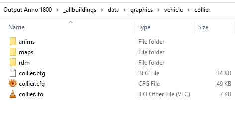

##### Import .cfg

To import the .cfg file we go in Blender to **File** > **Import** > **Anno (.cfg)**


We will now see the Cargo Ship on our scene with the model and other specifications and assets.

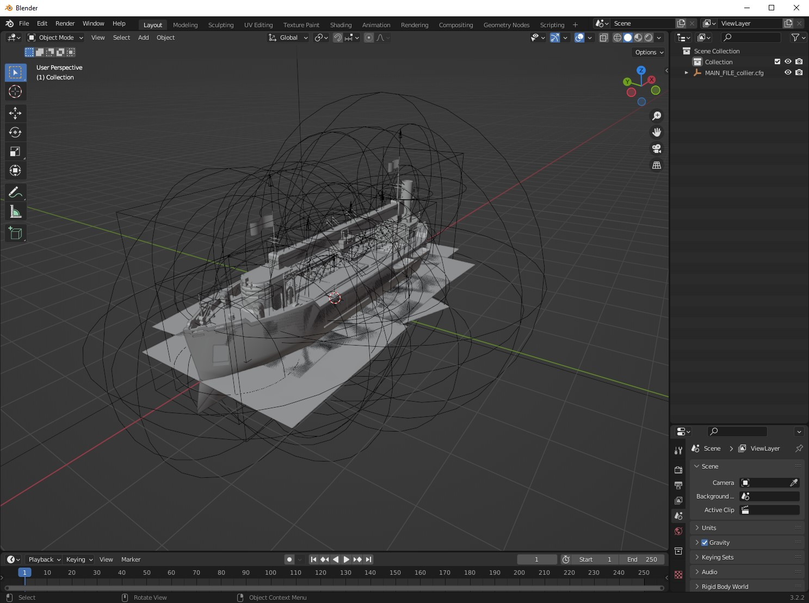

You probably see the model and assets without any materials/textures. If you do not know how to change this, To change to view change the Viewport Shading from Solid preview to **Material preview** in the upper right corner of the scene.


### Scene collection

If we take a look at the scene collection we se a big tree structure of different references.


#### MAIN_FILE_name.cfg

The main parent of our imported file is the **MAIN_FILE_name.cfg**. This contains everything linked to this specific parent file and those are 'children' of that file.

#### Animations, other FILE, IFOFILE, MODEL, PARTICLES, PROPCONTAINER

The children of our main parent all have different functions. We do not need all of them in all cases. Ships for example have other functions then buildings.

### Adapting our model

#### What are we going to adapt?

Before we dive into adapting the model we will have a look at what we are going to change so we can have a bit of knowledge and structure before going crazy.

##### ANIMATION_SEQUENCES

We will leave the standard animations for this ship. In more advanced tutorials we can adapt those and add more for ourselves.

##### Flags

We have some FILE_flag files. We will be removing those. Our smaller ships will not have flags or we will not be reusing the flags.

##### Ship lamp

We have some FILE_ship_lamp files. Those are files that hang on a part of the model and will be giving light when it is dark ingame. We will keep those and maybe add or remove one or two.

##### IFOFILE

This file contains a lot of important children.

- BoundingBox_BoundingBox: This is a big box that wraps everything of this scene. Every model, prop, other asset needs to be inside this box. If not, it will be cut off ingame and we will have a visual problem. For example, if we have smoke that goes up, the box needs to be tall enough for the smoke. We will be making our ship bigger, so we will have to scale this box according to the size of our ship and other modifications we will be making.
- MeshBoundingBox_MeshBoundingBox: This is a smaller box as you can see, it only wraps around the model and the meshes of the model. Same logic as for the BoundingBox_BoundingBox, but now only for the model. When we make our model bigger we will have to make sure to also make this BoundingBox bigger.
- Dummy_DamageImpact: This shows impact of damage on the model when attacked.
- Dummy_FireDummy: This shows impact of fire on the model when on fire.
- Dummy_hit_metal: This shows the impact of metal (for example special weapons) on the model when attacked
- IntersectBox_Hitbox: The box where the model can be hit by damage.
- Sequence: Are linked to the animations

We will be adapting some of them to correspond with the smaller ship length and functions.

##### MODEL_collier_destruct

The model itself that contains the 3D model of our ship that is used when destroyed. We will reuse this model.

##### MODEL_collier_lod0

The model itself that contains the 3D model of our ship. We will be adapting this model to give it a unique look.

**Good to know:**

As we can see, the scene can have multiple MODEL files.

Important to know is that when we export our .cfg file, this export will look up the reference to this model, so the link to the model. The scene does not contain the model itself, but a reference to a file that is somewhere in the folderstructure of your computer. This is important because when moving folders/files this reference can be broken and opening your Blender file can then result in models not showing. This model also contains the materials and also those are linked, but more about that later in this tutorial.

##### MODEL_pile

A separate model for the pile of cargo in the hold. We will remove this and add our own props or adapt it.

##### PARTICLE_ship_smoke01

This file is from the PARTICLE type and is the smoke that comes out of the ships chimney. When adapting our ships model, there is a big chance we will have to change this to make sure it aligns correctly with the chimney.

##### PARTICLE_water_wave_ship_move / PARTICLE_water_splash

When the ship floats through the water, the water that hits the ship on the front is a specific visual. The ship splits the water and that has to be visually correct. This PARTICLE makes sure about that. When making the ship bigger we will have to change this PARTICLE also according to the ships size. The water_splash shows other water animations around the ship.

##### Other PARTICLES for explosions/damage/debris

The visuals when the ship is hit, taken damage, smoke, destroyed, ect. We will be removing some because our ship will be smaller, make some a bit smaller, change locations, ect.

##### PROPCONTAINER

The PROPCONTAINER contains extra props like barrels, storage things, plants, ect. We already used this in the previous tutorial where we added a tree to our .cfg file in the code. If we look at our ship it already has some storage props for when the ship is desroyed. We see 2 PROPCONTAINER files. We can delete the first that is empty and will be using the second one. We can adapt the name to **PROPCONTAINER** instead of **PROPCONTAINER\_.001** make it clean.

### Double check workflow

We now have a model inside Blender that we are going to adapt, a tree structure we will be using, ect. Let's make a small change to our model and treee structure, export everything and have a look ingame if it works before doing everything and finding out after hours of work there is something wrong in our workflow.

#### Changing names and save

First of all let's change all the names in the tree view from **collier** to **small_cargo_ship**.
Also save your work as a blender file. This can be inside the vehicle/small_cargo_ship folder.

#### Removing Flags, adapting the model

Now let's remove all the flags by selecting all of the in te tree view (Click + CTRL for selecting multiple) and right-click and choose **Delete Hierarchy**.


#### Small adaptations on the model

Click on the eye next to the **MODEL_small_cargo_ship_destruct** to hide it in the scene. It should be greyed out in the tree view.
Then select our **MODEL_small_cargo_ship_lod0** file. Our main model should be selected now.

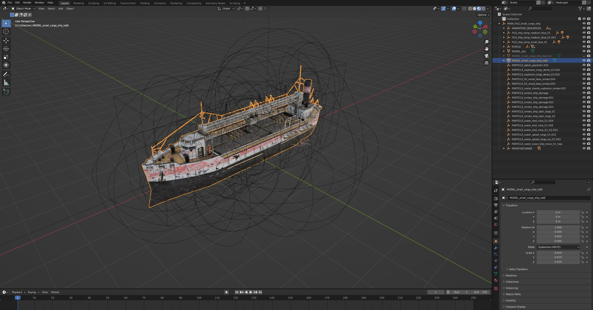

Our main model we selected can now be adapted, but first we have to change our **Interaction mode**. Change the Interaction mode from **Object Mode** to **Edit Mode**.

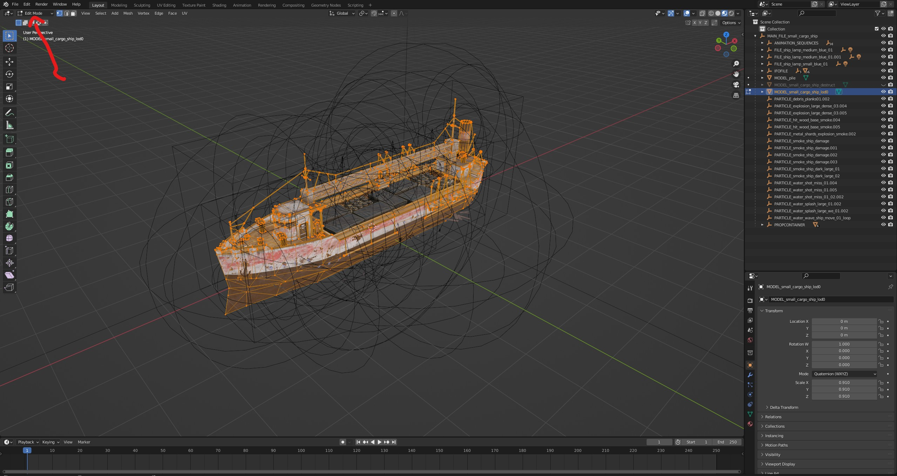

We can now see the complexe polygons of our model where we can adapt the vertices.

Change the 2 poles where the flags were on and make then smaller. Make sure to toggle **X-Ray View** on.

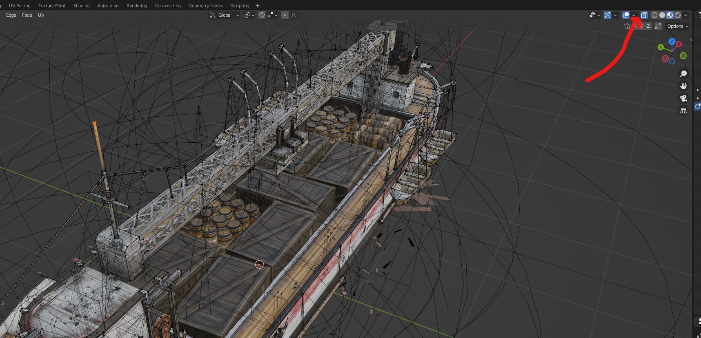

Another thing we can quickly do is removing the lifeboats at the sides of the ship. To easily swith the the rearview use the numpad shortcut **3**. Select the arms and the lifeboats and delete by using the delete button and choose **vertices** to remove everything.

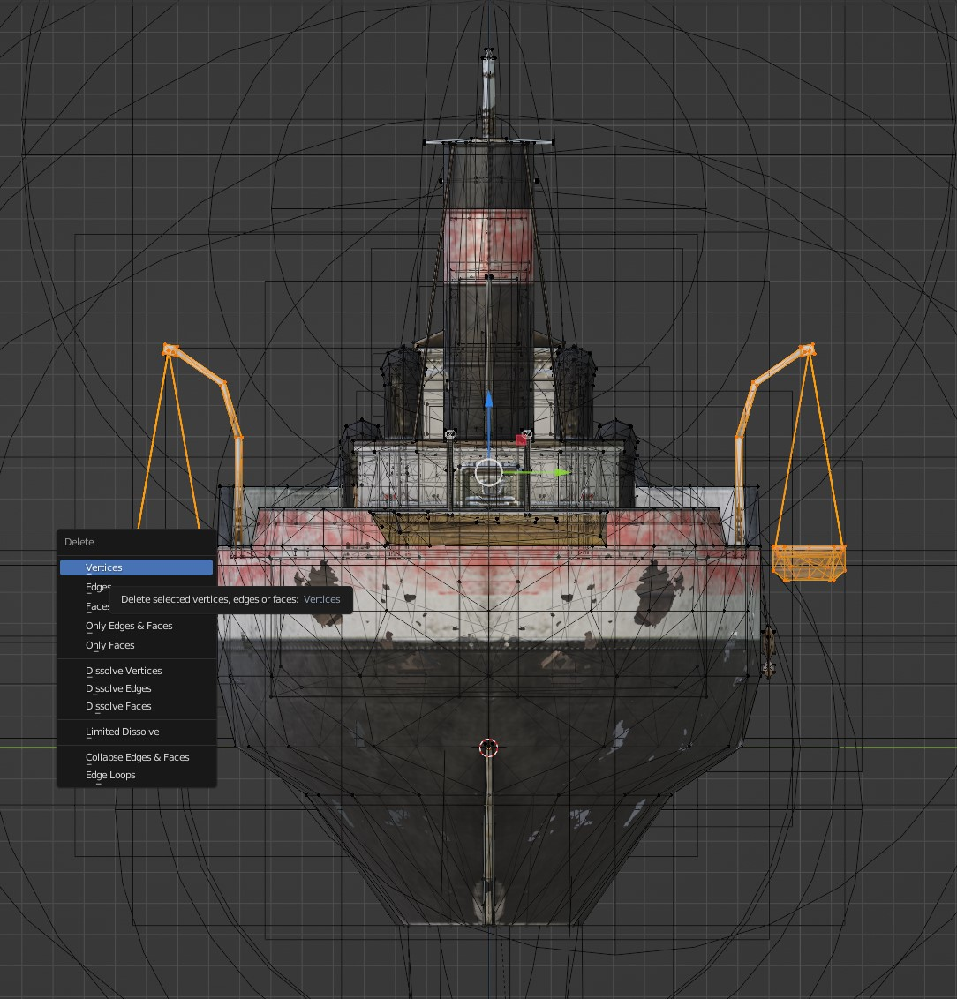

If we switch back to Object mode we can see our adapted model a bit better without the higher poles and without the lifeboats.

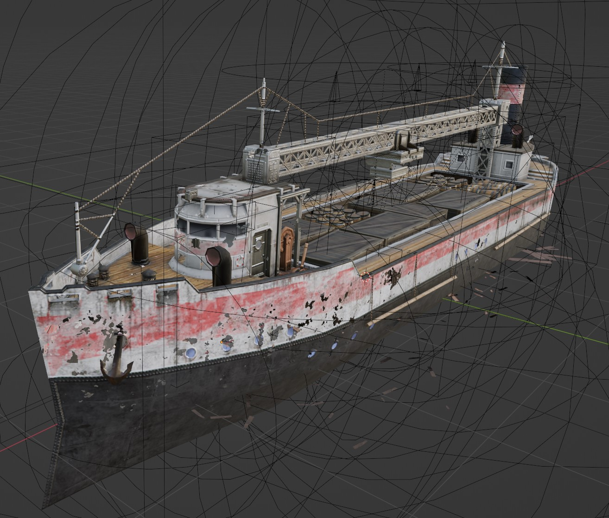

#### Exporting model

To start ttesting our workflow, we will begin with exporting the model itself.

Make sure you are in **Object Mode** and select our model **MODEL_small_cargo_ship_lod0** in the tree view. Make sure you select the highest parent of the model, and not the children inside. We can now export our model. So we will be creating a new model of our ship that is different from the normal cargo ship.

- Make sure you select **MODEL_small_cargo_ship_lod0** in the tree view
- Go to **File** > **Export** > **Anno Model (.rdm/.glb)**


- Navigate to the original **vehicle** folder where all the exported buildings and assets can be found.
- If this folder does not exist yet, make a new folder inside the vehicle folder and name it **small_cargo_ship**
- Open this folder
- If the folders do not exist yet, make 2 new folders inside this folder named **maps** and **rdm**
- Open the **rdm** folder and save your model (small_cargo_ship.rdm) inside this folder.

Now if you navigate to this folder on your computer you will see 2 files you just created. A .glb file and a .rdm file. You can open the .glb file with the standard 3D viewer from windows and you will see the model you created in 3D preview, without any materials or props or particles.

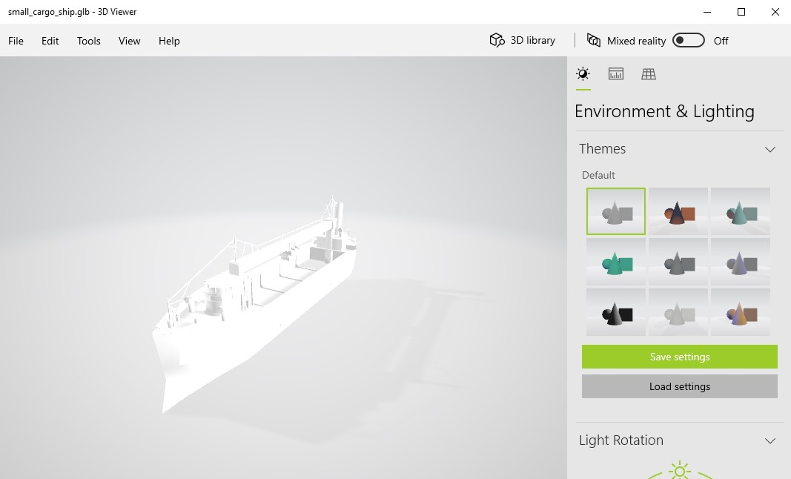

Now if we go back to Blender, we have to link our new model to the model in our file. To do so we use the **Anno Object panel**. This is a bit hidden. It can be found underneath the Viewport Shading buttons. It is an arrow that will open a couple of panels, one of those panels is the Anno Object Panel.

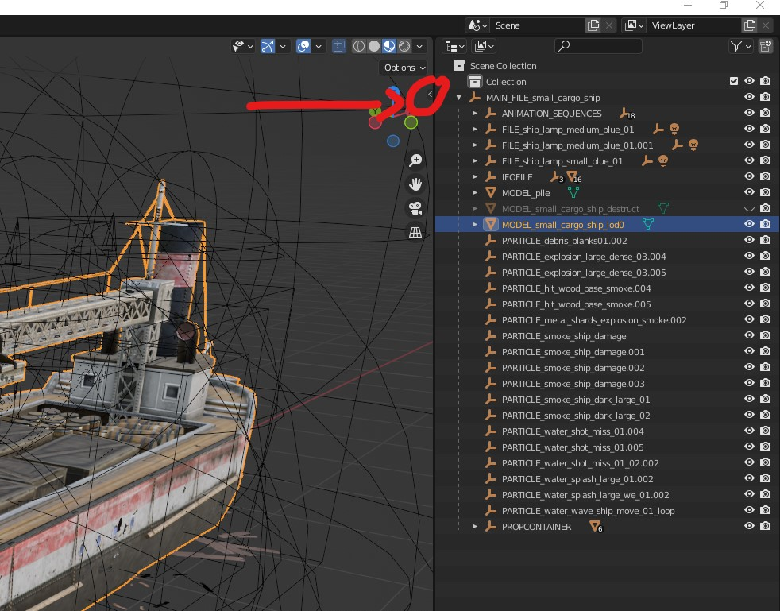

Look at the FileName of the Anno Object. This should be the link to the correct model. Sometimes Blender did not pick up the exported rdm yet and then you have to manually link this here. In my case this is correct.


#### Exporting .cfg

It is time to export our whole asset to a .cfg file, the file that contains our model, props, assets, particles, smoke, and other logic of the asset.

To export our .cfg file we need:

- Select our **MAIN_FILE_small_cargo_ship** in our tree view.
- Go to **File** > **Export** > **Anno (.cfg)**
- We save this .cfg file in our **data/graphics/vehicle/small_cargo_ship/** folder

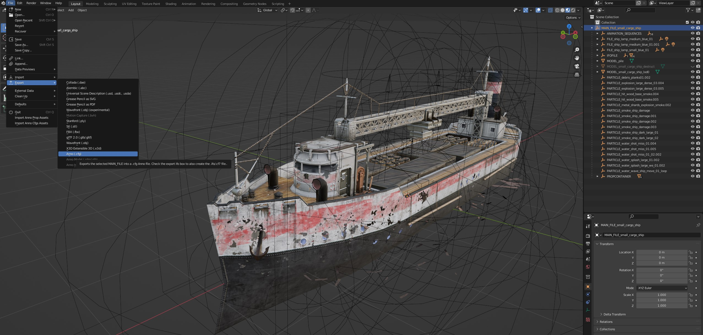

#### Test ingame

We have now already created our workflow for the adapted model and cfg. We did not change our maps yet but that is for later.

First change the link to the .cfg again in the assets.xml.

```XML
<Object>
    <Variations>
        <Item>
            <Filename>data/graphics/vehicle/small_cargo_ship/small_cargo_ship.cfg</Filename>
        </Item>
    </Variations>
</Object>
```

Now also copy the folder **data/graphics/vehicle/small_cargo_ship/** in the location where you created the model to your corresponding mod folder. This should be the same structure so links would perfectly work.

Copy your modfolder to the Anno 1800 mods folder and start the game and test!

As we can see, the left ship, the new Small Cargo Ship does not have the lifeboats on the side, and does not have the flags anymore. So we know our workflow works! Super!

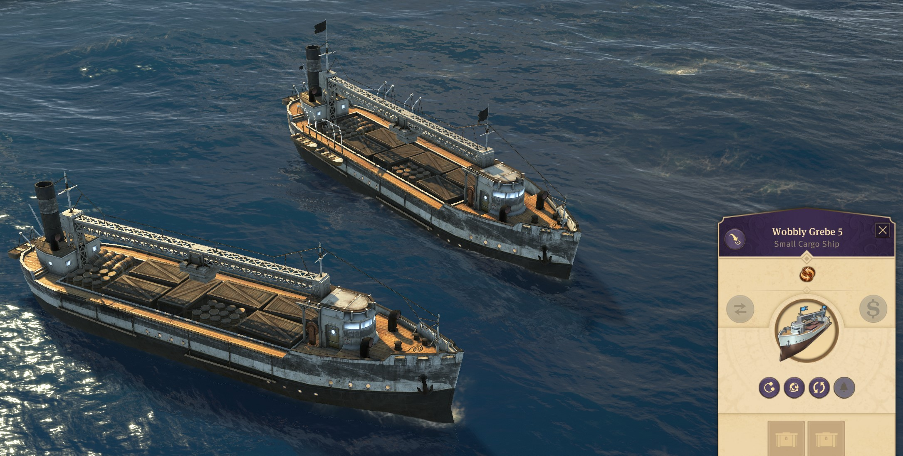

### Changing the material

Before we dive into making more adjustments to the model, let's make sure also our workflow for our maps work (the textures on the model that shows the different colors, ect)

If we have a look at the ship we see that the bottom part is black. I would like to change that to a white color.

Let's find the original material file. From the previous tutorial we know that we have different types of material files. diff, mask, metal and norm.

We will only adapt the diff version. The other versions can stay the same.

We can find the material files of the original ship in the same location where we could find the .cfg file. **data/graphics/vehicle/collier/maps**. The file **collier_diff_0.dds** is the highest quality file we can adapt. First we change the name from **collier_diff_0.dds** to **small_cargo_ship_diff_0.dds**. Then we convert this file from .dds to .png like we did before.
To convert the dds file we can use different tools:

- https://www.xnview.com/
- https://www.aconvert.com/image/dds-to-png/

Let's open this diff map in our preferred editing program and change colors the way we want. I changed the black color to a white-grey color to have some visual difference.


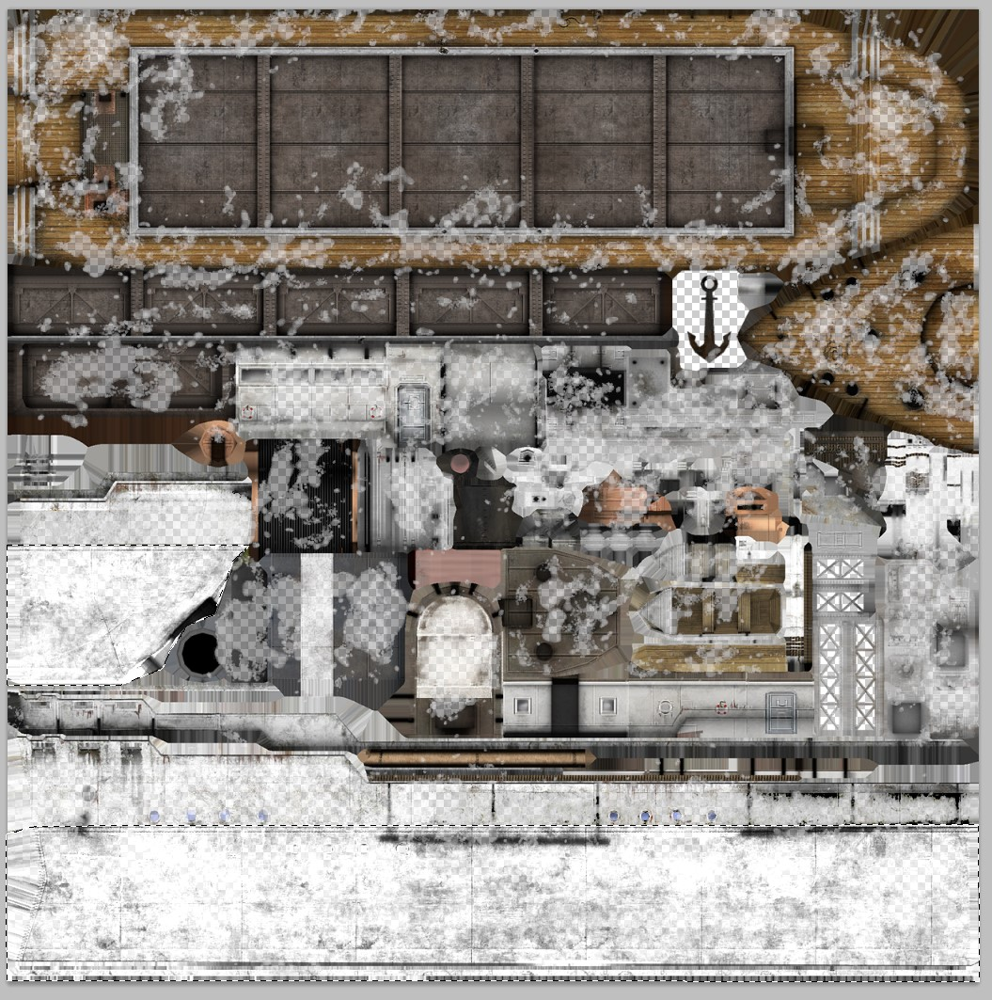

Also make sure to make the different versions.

- small_cargo_ship_diff_0 (1280x1280)
- small_cargo_ship_diff_1 (640x640)
- small_cargo_ship_diff_2 (320x320)
- small_cargo_ship_diff_3 (160x160)
- small_cargo_ship_diff_4 (80x80)

Covert those .png files to .dds files. and move all those files inside our **maps** folder inside our **small_cargo_ship** vehicle folder.

### Link the new materials in Blender

We go back to Blender to link our new created materials to our model.

We change our workspace to **Shading**. And we can see the linked diff material.


Change the linked material to our newly created diff map.

Make sure you go down the tree and change both LOD versions. We should now see the white ship.

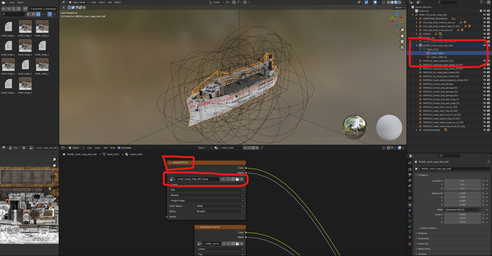

We should also change the corresponding maps for the **MODEL_small_cargo_ship_destruct** to the wite maps.

### Export .cfg again

Now select the **MAIN_FILE_small_cargo_ship** again in the tree and export the .cfg again and overwrite the files we previously created.

### Moving our ship folder to our mod folder

Copy the **data/graphics/vehicle/small_cargo_ship/** folder again to our mod folder like we did before.

Copy the mod folder again to the Anno 1800 mod folder and start the game. We should see everything we created ingame with the white ship.

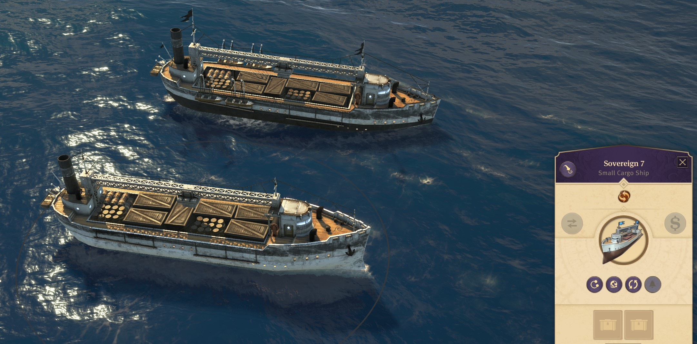

As you can see we now actually created a skin for our normal Cargo Ship. We now know our maps workflow also works! Time to change some more things and differentiate the model more.

#### Making the ship smaller

Let's dive again into blender and change the model itself some more. The ship can be a bit smaller and maybe some extra tweaks on other specifications of the ship. If you have followed the basic Blender tutorials you know the basics of editing models.

Select the MODEL you want to create on your scene or select it on the right in the tree structure. If you select it on the right in the tree structure, make sure to select **MODEL** and **not the MAIN_FILE**. The MAIN_FILE contains more then only the model. The only thing we will be adapting now is the **MODEL_small_cargo_ship_lod0** model like we did before with the flag posts and lifeboats.

For easier changes change the **Viewport Shading** to **Solid mode** in the upper right corner of your screen. In the same line of icons also toggle the **X-Ray** to see the vertices better on all sides of the model.

Now let's rotate around the model with our middle mouse button and see where we could adapt the ship. We can adapt the ship in the middle to make it shorter.

Make sure you are in **Edit Mode** and you have selected all the vertices. They should all look orange. Rotate around it with the middle mouse button to make sure they are all selected. If not make sure you toggled the **X-Ray** on in the upper right corner to be able to see and select vertices behind other vertices. Also make sure the **Object Proporties** panel is open where we can see the location and scale of our selected model.

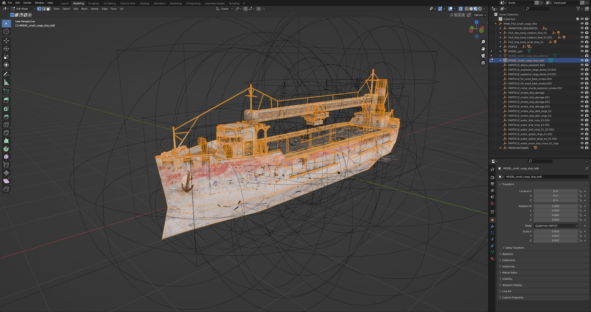

We can see that our ships location is x=0 y=0 and z=0. We want our model to be in the middle of our scene for every value, so x and y and z value should be 0. We see that our ship sank a bit lower. For now this is fine. This is like this inside the model itself.

To have a good view click on NUMPAD 1 to have a rearview of the scene. Make sure you have selected the model, that you are in Edit Mode, you have toggled X-Ray view and you are in the Solid Viewport Mode.

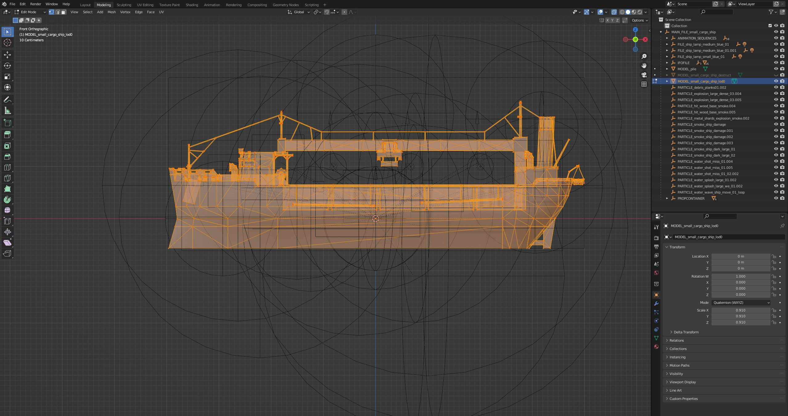

From the overhanging crane we will be deleting 2 pieces. Select both pieces like in the underneath screenshot. Select the vertices and delete **faces**.


Now select all vertices of the front of the ship that we want to move to the right to make the ship smaller from the front to the back.

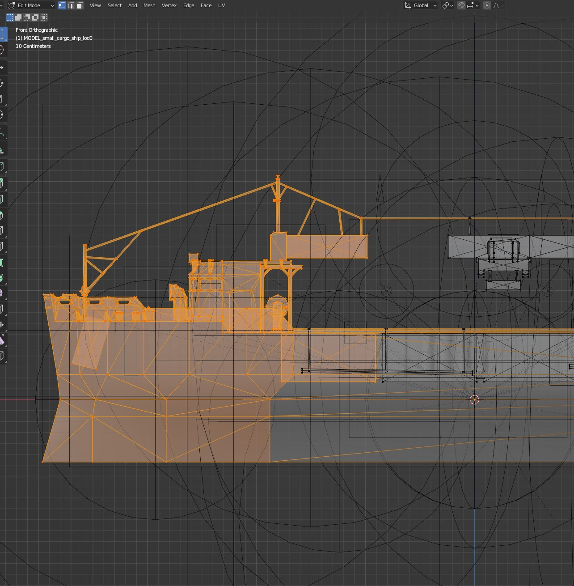

Move those vertices to the right like in the underneath screenshot.

We can now move all those vertices to the right bij using the **shorcut G** for dragging and use the middle mouse button to stay on the X-axis and move our mouse as far as we want. We can also use the move tool on the left.

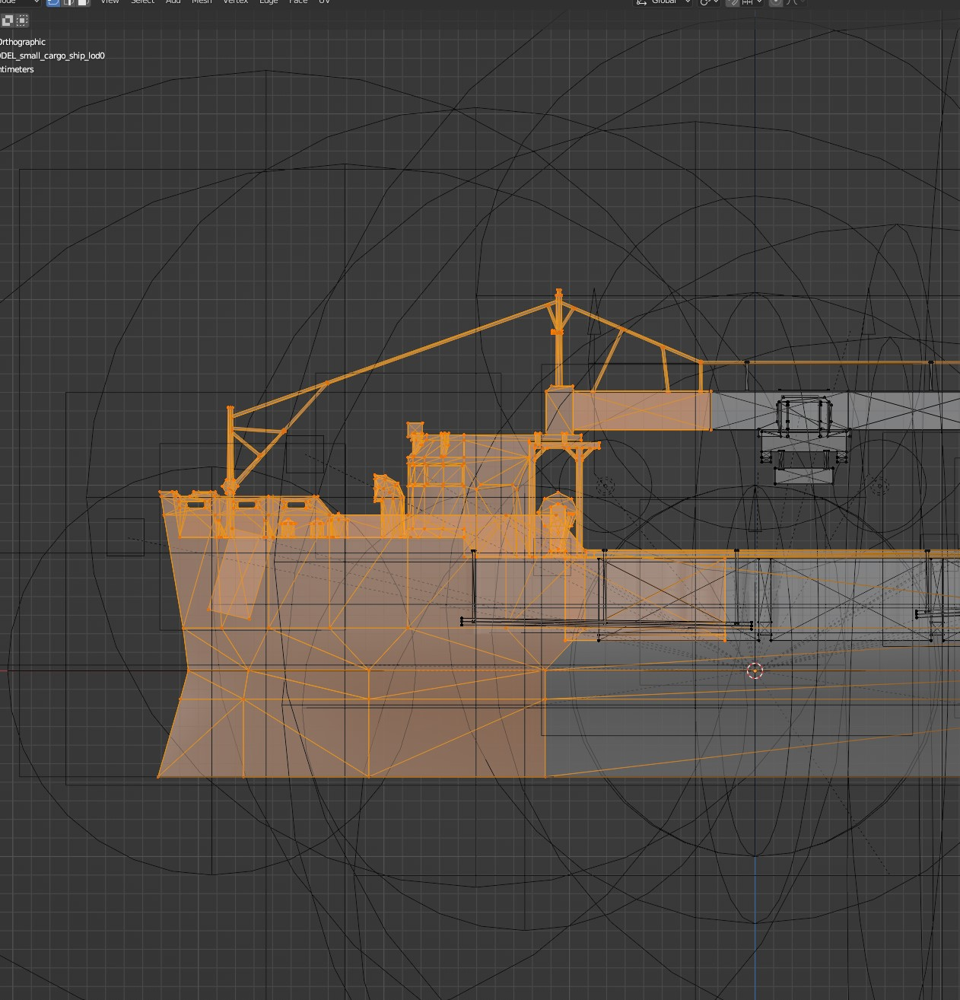

Do the same for the back side.

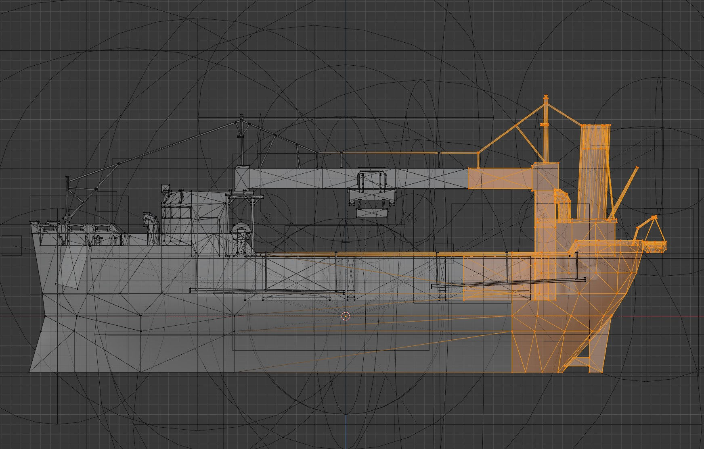

We have some changes to make to make sure nothing is actually clipping or having strange visuals.

If we switch to **Material Preview Mode** we can see that the material is stretched and that the shadows of the wood at the side is also not ok anymore. We could adapting our material , but to minimize this stretching we could also adapt our model.

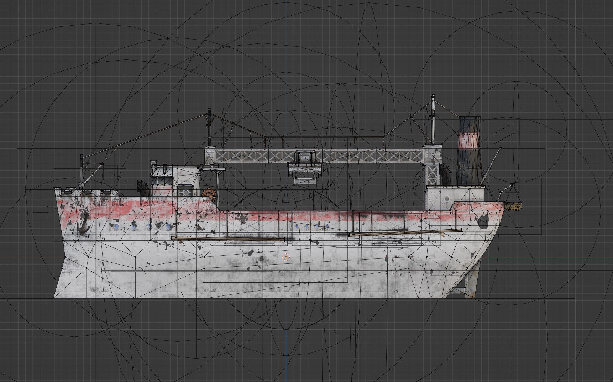

**NOTE:** If you did not do this already, it is wise to save your work as a Blender file. So you can always come back to this file and adapt if needed.

#### Fixing visual problems on the model

If we have a look at the model now and go around it we can see some optimazations we can make.

##### Wood at the side

The shadows of the wood on the side are not aligned anymore with the wood. We can fix that by changing the vertices of the wood. Do this for both sides.

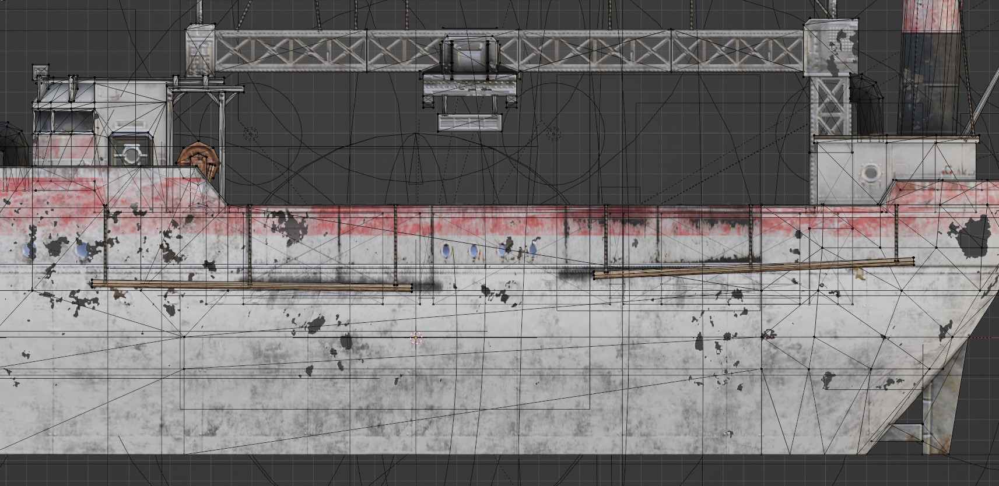

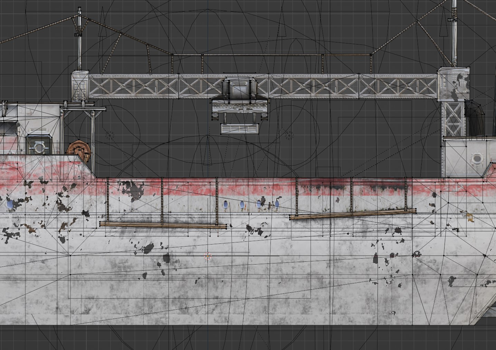

##### Pile of cargo

If we look at the top, we see clearly that the cargo pile is clipping inside the ship.


Delete the **MODEL_pile** in the tree view. We will be adding our own props to the cargo hold.


### Adapting other assets

Now that we have adapted the model, it is time to adapt/move/add all the other elements on our scene. We talked already about those above, so this should go smooth. Make sure you are back in **Object Mode** and NOT in Edit mode.

When moving the objects, make sure to move the parent and not one of the children. Otherwise ingame your asset will not be at the right location.

Lets move the **FILE_ship_lamp** files to the correct location.


Let's move the **PARTICLE_smoke_ship_dark_large_01** and the **PARTICLE_smoke_ship_dark_large_02** so it is aligned again with the chimney.


Move **PARTICLE_water_wave_ship_move_01_loop** for the water waves a bit to the back.


### IFOFILE

#### Dummy files

We have some Dummy files for damage impact, fire, hits. We can reuse those and delete, move the ones we need/do not need around so they are fitting the size of the ship again..

#### BoundingBox / IntersectBox / MeshBoundingBox

Those 3 boxes also need to be resized based on the new size of the ship. Use the scale tool for this.

### PROPCONTAINER

The last step we are going to take is adding extra props to our ship. We have deleted the original cargo space and now have some room to add some wooden crates, boxes, ect to give it a nice cargo ship feeling. For adding props, we need the PROPCONTAINER.

First of all, select your PROPCONTAINER and look at the **Object Proporties** panel. Make sure the location of this PROPCONTAINER is x=0 y=0 z=0. This is important because all added props will be ingame positioned on this coordinates of this parent.

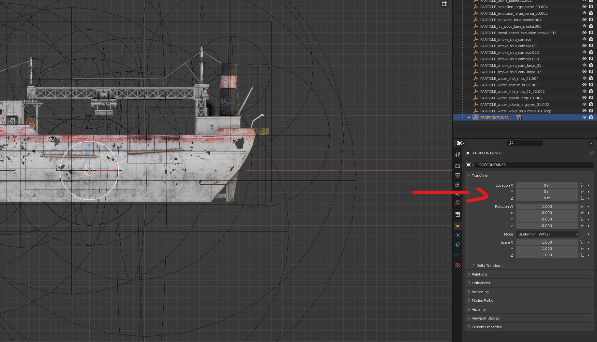

To add props (.prp files) to you scene, we will be using again the import function with the amazing Anno add-on. If we dive into our folder structure that we exported we can find a specific folder where we can find all the storage props. Barrels, wooden creates, other piles of storage materials. **data/graphics/props/storage**.

To add one of the props to our scene:

- Select the PROPCONTAINER in the tree view
- Go to **File** > **Import** > **Anno Prop (.prp)** > And **open the .prp file** you want to add. For example **large_wooden_box_01.prp** or **wooden_box.prp**.

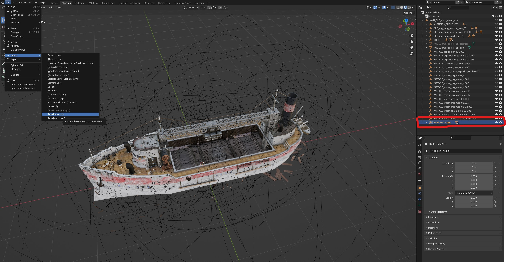

You can always move, scale, rotate the file. Make sure when moveing, rotating, scaling the prop you have selected the file itself and NOT the PROPCONTAINER.

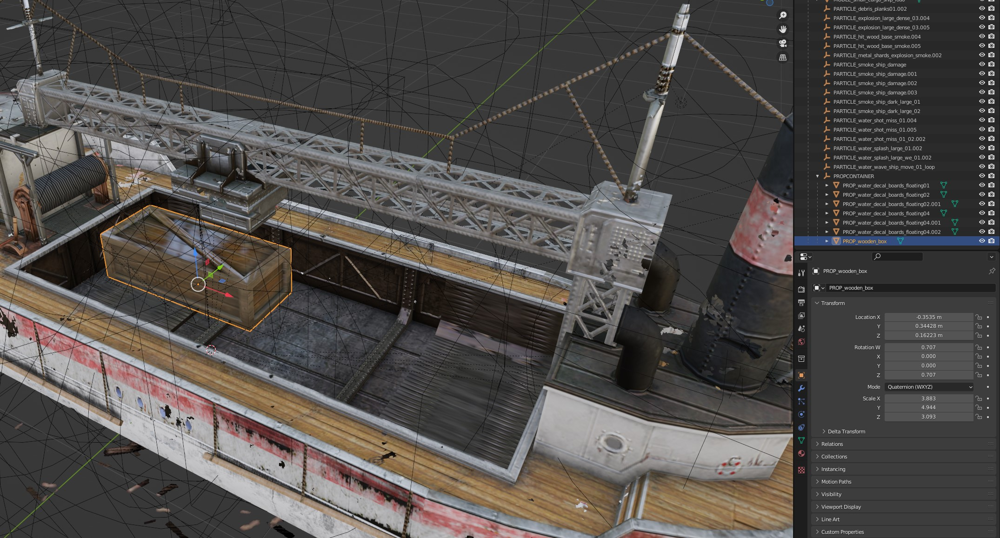

**NOTE:** Only when selecting the PROPCONTAINER the option to import the .prp files will be available. If you did not select the PROPCONTAINER it will be greyed out.

You can immediatly move the prop around at the correct place. Always make sure to move the highest parent of the prop and not the children. In this case the PROP file and not the PROPCONTAINER and not the Mesh inside.

Add as many props as you want and go creative!

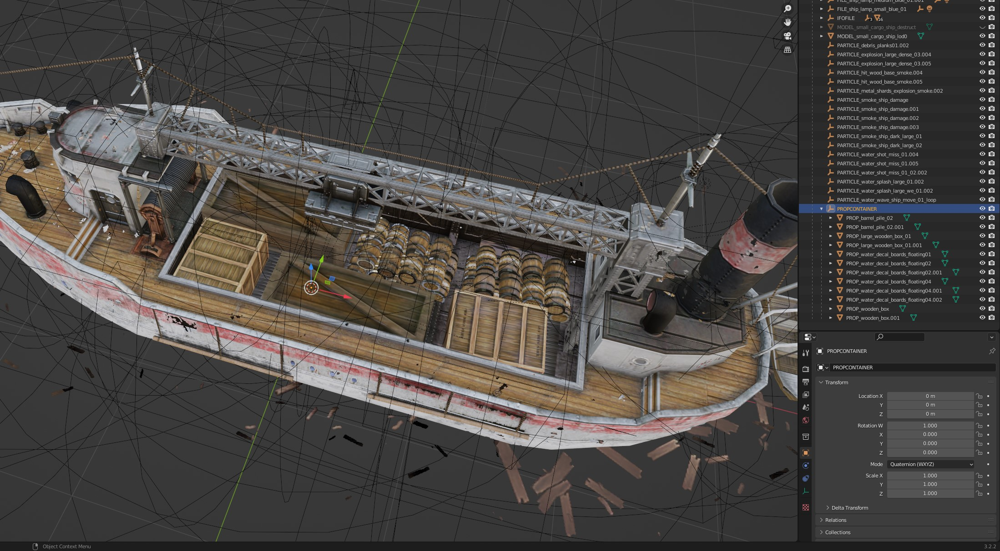

We are now finished with changing, adding, editing, ect in Blender. We can now export again to have our final result!

Export the MODEL and MAIN_FILE again. Copy the folder again to your Mod folder and then copy the modfolder again to your Anno mod folder to test it ingame if it still works and everything looks good.

### Creating the icon

We will create an icon based on the oroginal Cargo Ship icon.
