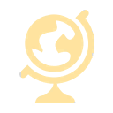
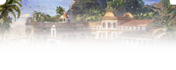
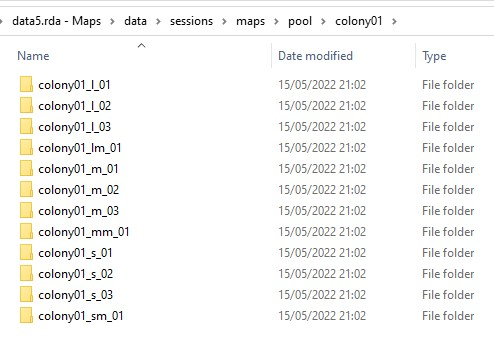
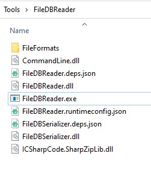
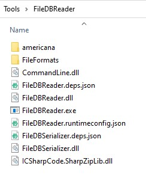
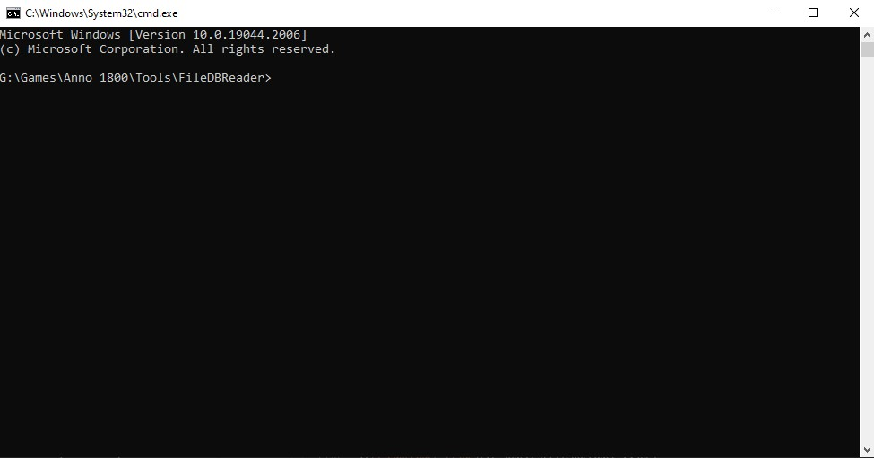
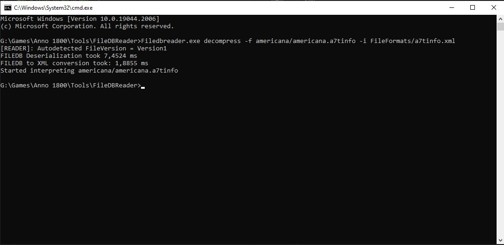
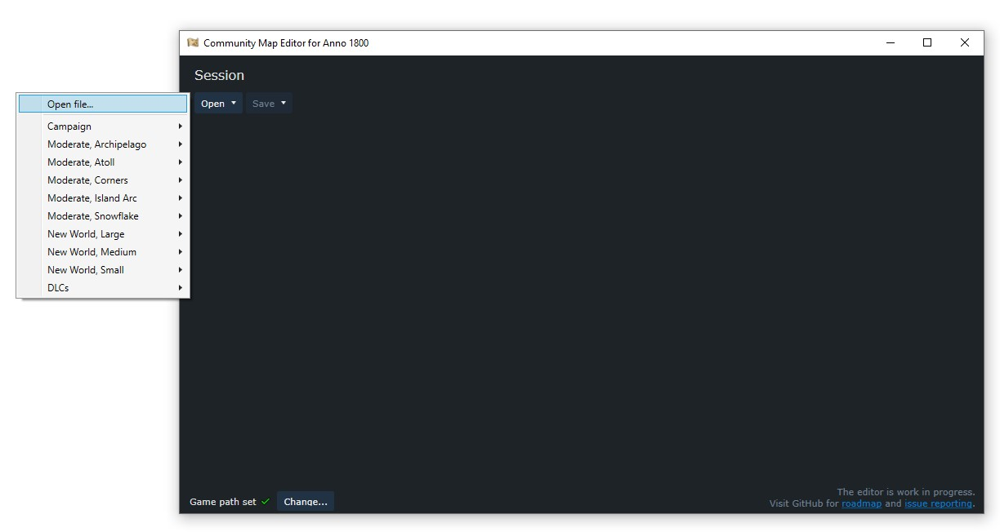
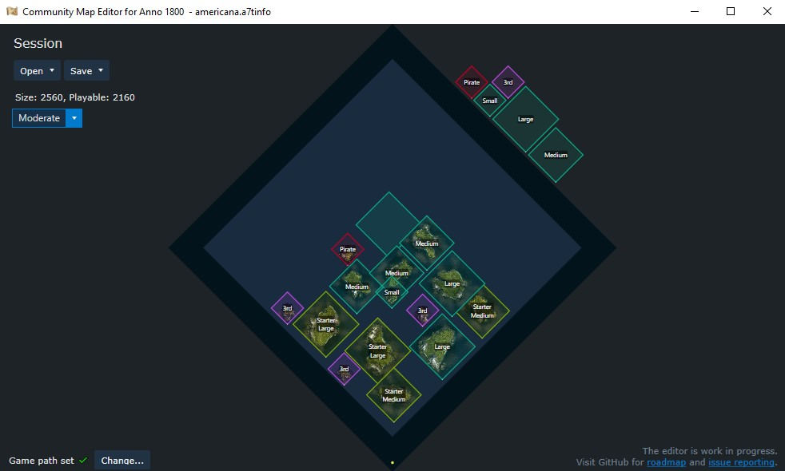
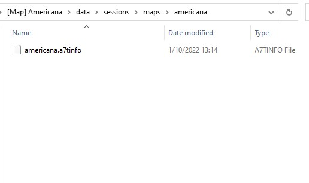

# Tutorial X - Making a new session

We already have different sessions in the standard game. Old World and New World are the basic sessions we can go to without any DLC’s. With the DLC’s from the past 4 years other sessions joined the club. We now also have Cape Trelawney (Old World session), The Arctic (Arctic session) and Enbesa (Enbesa session).

Adding sessions to your game makes the game more challenging! But of course also puts a big performance hog on your computer. The more sessions the more difficult it is for your computer to manage all those sessions. During the past years some mods were already created where new sessions were added. Modder Kreitani created “Four Crowns” and ”Kingsgrove”, both new Old World sessions. “Four Crowns” was a direct hit for people loving the big island from Cape Trelawney, but it immediately showed performance problems because of the big constraints it puts on the computer. Flickering appeared for some people because of those performance problems. So, if you add new sessions be aware it puts a big pressure on your maybe already struggling game experience/computer.

I created my first new session based on the work Kreitani already did. So a HUGE thanks to him. This tutorial uses his knowledge and I tweaked where I needed. Do know that the sky is again the limit for what you want to add to a session. In this tutorial we are not going to cover everything that is possible.

## What are we going to do?

- Creating a New World session
- Using existing islands from the New World island pool

## What could you do extra? (But we are not going to cover)

- Creating new AI like pirates or neutral traders for this session
- Creating new diving opportunities
- Extra new mechanics for this session (You would be amazed what you could do with some imagination and hard work)

## What do we need for a new session?

- Basic knowledge of modding. If this is your first time modding, you better try a more basic mod first and come back to this one when you have more experience. Start with the starter tutorial of this series.
- A good name for the new session

## Folder structure

As always we start with setting up our folder structure for this mod.

We start with our mod mapname. In our case we use ”[Map] Americana”. Inside this map we then put our main “data” folder. In our “data” folder we have 4 maps. “config”, “graphics”, ”sessions” and “ui”. See further structure underneath:

- [Map] Americana
  _ data
  _ config
  _ export
  _ main
  _ asset
  _ assets.xml > we will be creating this file later
  _ gui
  _ xml files containing the translations for text in every language > we will be creating those files later \
  texts\*english.xml \
  texts_french.xml \
  texts_german.xml \
  …
  - graphics
    _ ui
    _ 3d\*objects
  - world\*map
  - The file that contains the world map with the new session \
    world\*map_01.fc
  - sessions
    _ maps
    _ americana \
    The folder which contains the session files. Files which tells you what is included in the session > we will be creating those files later
    _ americana.a7t
    _ americana.a7te
    _ americana.a7tinfo
    _ ui
    _ 2kimages
    _ main
    _ assets
    _ session\*btn
  - session\*btn_americana.png > we will be creating this file later
  - worldcard\*bg
  - bg\*worldcard_americana.png > we will be creating this file later
  - icons \* icon_session_americana.png > we will be creating this file later

## Creating the assets.xml with the right info

Now that we have our folder structure it is time to create our main “assets.xml” file. Create a new file in ”[Map] Americana/data/config/export/main/asset”.

We start with adding our opening modding tags so we can actually start.

```XML
<ModOps>

</ModOps>
```

### Adding the new session to the assets.xml

Next we have to create our new session and add it. There are different sessions depending on which region.

- `180023` - The Old World - Europe_Session - SessionModerate
- `180025` - The New World - SouthAmerica_Session - SessionSouthAmerica
- `180045` - The Arctic - Arctic Session - SessionArctic
- `112132` - Enbesa - African_Session - SessionSouthAmerica

We also have some other sessions in the main assets.xml like campaign session or test sessions but those do not matter in this case.

We create a mod tag where we add the new session after the corresponding already existing session. In our case the session with GUID of the New World. We also add some comments.

```XML
<ModOps>
	<!-- ***************************************************** -->
	<!-- **** START NEW SESSION WITH NEW GROUP OF ISLANDS **** -->
    	<!-- ***************************************************** -->
	<!-- Add New Session -->
	<ModOp Type="add" Path="//Assets[Asset/Values/Standard/GUID='180025']">

	</ModOp>
	<!-- ***************************************************** -->
    	<!-- **** END NEW SESSION WITH NEW GROUP OF ISLANDS **** -->
    	<!-- ***************************************************** -->
</ModOps>
```

### Add the right template

We create our main &lt;Asset> in our mod structure and add the correct template for our session. In our case it is a “SessionSouthAmerica”. We now have declared that the session we created is a New World session.

```XML
<ModOps>
	<!-- ***************************************************** -->
    	<!-- **** START NEW SESSION WITH NEW GROUP OF ISLANDS **** -->
    	<!-- ***************************************************** -->
	<!-- Add New Session -->
	<ModOp Type="add" Path="//Assets[Asset/Values/Standard/GUID='180025']">
		<Asset>
		    <Template>SessionSouthAmerica</Template>
		</Asset>
	</ModOp>
	<!-- ***************************************************** -->
    	<!-- **** END NEW SESSION WITH NEW GROUP OF ISLANDS **** -->
    	<!-- ***************************************************** -->
</ModOps>
```

This is important because the template we choose already has a lot of properties that we can inherit from. Every New World session has for example fertilities that are default to the game. Fertilities is only one of the many things already set for a New World session.

Let’s dive deeper into this. We have our template “SessionSouthAmerica”. In the same folder where we find the main “assets.xml” there is also a ”templates.xml”. This contains a lot of the templates used in the game. The template “SessionSouthAmerica” is one of those templates. If you go to this file and search for “SessionSouthAmerica” you will find one exact reference.

```XML
<Template>
	<Name>SessionSouthAmerica</Name>
	<Properties>
		<Standard />
		<Session>
			<Region>5000001</Region>
			<FixDayTime>12</FixDayTime>
		</Session>
		<Text />
		<Locked />
		<WorldMapSound />
	</Properties>
</Template>
```

We can see this template contains not that much info but refers to another GUID, `5000001` which is a region.

A session inherits from a region. So, a region is 1 level higher and it is that region that actually contains all the info about fertilities and other stuff.

If we go back to the main “assets.xml” and search for `5000001` we get a lot of results because also `15000001` is for example taken into account. Instead of that, search for “&lt;GUID>5000001&lt;/GUID>”. We now have 1 result which is the actual region template we were looking for.

```XML
<Asset>
    <Template>Region</Template>
    <Values>
        <Standard>
            <GUID>5000001</GUID>
            <Name>Region South America</Name>
            <IconFilename>data/ui/2kimages/main/icons/icon_session_southamerica.png</IconFilename>
            <ID>RegionSouthAmerica</ID>
        </Standard>
        <Region>
            <Ambiente>Region_map_global</Ambiente>
            <RegionID>Colony01</RegionID>
            <FeedbackDescription>141486</FeedbackDescription>
            <AnimalDescription>141553</AnimalDescription>
            <Street>1000178</Street>
            <DistributionCenter>101290</DistributionCenter>
            <AllowedWeather>Rain</AllowedWeather>
            <SlotBuildings>
                <Clay>
                    <Building>101267</Building>
                </Clay>
                <GoldOre>
                    <Building>101311</Building>
                </GoldOre>
                <Bauxite>
                    <Building>1308</Building>
                </Bauxite>
                <SAGas>
                    <Building>1353</Building>
                </SAGas>
                <DLC12Ore1>
                    <Building>1388</Building>
                </DLC12Ore1>
                <DLC12Ore2>
                    <Building>1390</Building>
                </DLC12Ore2>
            </SlotBuildings>
            …
        </Region>
    </Values>
<Asset>
```

This template contains A LOT! Scroll down and see all the things that are defined in this region template.

We have for example &lt;SlotBuildings> which defines which mines will be used in this region. For the New World the only 2 are clay pits (GUID 101267) and gold mines (GUID 101311). We could add others but for now we are not going to adapt the region template. Maybe later in this tutorial.

### Add the default SessionSouthAmerica to the assets.xml

If we go back to our assets.xml, we only have declared &lt;Template>SessionSouthAmerica&lt;/Template> in our mod. But we can actually make it a lot easier for ourselves and save us a lot of time for the next step.

We will be creating a new session based on an already existing session. So why not use the default session as a base and start from that.

Go back to the main assets.xml and search for “&lt;Template>SessionSouthAmerica&lt;/Template>”. You will get 4 results but the first result should be the one we want.

```XML
<Asset>
    <Template>SessionSouthAmerica</Template>
    <Values>
        <Standard>
            <GUID>180025</GUID>
            <Name>SouthAmerica_Session</Name>
            <IconFilename>...</IconFilename>
        </Standard>
        <Session>
            <CameraLoopSequence1>11</CameraLoopSequence1>
            <CameraLoopSequence2>10</CameraLoopSequence2>
            <AllowAdvancedCameraSettings>1</AllowAdvancedCameraSettings>
            <TransferData>
                <Item>
                    <Session>180023</Session>
                    <Duration>270000</Duration>
                </Item>
                …
            </TransferData>
        </Session>
    </Values>
</Asset>
```

This is the main New World session we all use when playing. We actually want to make a duplicate of this one and maybe do some extra manipulations. But first we should copy paste this asset to our assets.xml.

Copy the whole asset to your assets.xml inside the ModOp structure and replace the &lt;Asset>&lt;/Asset> with the new version we have taken from the main assets.xml.

```XML
<ModOps>
    <!-- ***************************************************** -->
    <!-- **** START NEW SESSION WITH NEW GROUP OF ISLANDS **** -->
    <!-- ***************************************************** -->
    <!-- Add New Session -->
    <ModOp Type="add" Path="//Assets[Asset/Values/Standard/GUID='180025']">
        <Asset>
            <Template>SessionSouthAmerica</Template>
            <Values>
                <Standard>
                    <GUID>180025</GUID>
                    <Name>SouthAmerica_Session</Name>
                    <IconFilename>PATH icon_session_southamerica.png</IconFilename>
                </Standard>
                <Session>
                    <CameraLoopSequence1>11</CameraLoopSequence1>
                    <CameraLoopSequence2>10</CameraLoopSequence2>
                    <AllowAdvancedCameraSettings>1</AllowAdvancedCameraSettings>
                    <TransferData>
                        <Item>
                            <Session>180023</Session>
                            <Duration>270000</Duration>
                        </Item>
                        <Item>
                            <Session>803421</Session>
                            <Duration>270000</Duration>
                            <Direction>SouthEast</Direction>
                        </Item>
                        <Item>
                            <Session>110934</Session>
                            <Duration>270000</Duration>
                            <Direction>SouthEast</Direction>
                        </Item>
                        <Item>
                            <Session>800703</Session>
                            <Duration>360000</Duration>
                        </Item>
                        <Item>
                            <Session>180045</Session>
                            <Duration>360000</Duration>
                        </Item>
                        <Item>
                            <Session>803423</Session>
                            <Duration>300000</Duration>
                            <Direction>SouthEast</Direction>
                        </Item>
                        <Item>
                            <Session>112132</Session>
                            <Duration>300000</Duration>
                            <Direction>SouthEast</Direction>
                        </Item>
                        <Item>
                            <Session>800384</Session>
                            <Duration>360000</Duration>
                            <Direction>NorthWest</Direction>
                        </Item>
                        <Item>
                            <Session>800385</Session>
                            <Duration>450000</Duration>
                        </Item>
                        <Item>
                            <Session>800386</Session>
                            <Duration>90000</Duration>
                        </Item>
                        <Item>
                            <Session>800387</Session>
                            <Duration>90000</Duration>
                            <Direction>SouthEast</Direction>
                        </Item>
                        <Item>
                            <Session>800432</Session>
                            <Duration>360000</Duration>
                        </Item>
                        <Item>
                            <Session>800433</Session>
                            <Duration>390000</Duration>
                        </Item>
                        <Item>
                            <Session>801999</Session>
                            <Duration>90000</Duration>
                            <Direction>SouthEast</Direction>
                        </Item>
                        <Item>
                            <Session>803422</Session>
                            <Duration>360000</Duration>
                            <Direction>NorthWest</Direction>
                        </Item>
                    </TransferData>
                    <SpawnStartShipAndKontor>0</SpawnStartShipAndKontor>
                    <SecondPartiesMaySettleHere>1</SecondPartiesMaySettleHere>
                    <WorldMapCardBackground>500876</WorldMapCardBackground>
                    <WorldMapAsset>PATH clickable_south_america_01.cfg</WorldMapAsset>
                    <TreasureMapHint>NewWorld</TreasureMapHint>
                    <SecondPartyReferenceUnlock>1010285</SecondPartyReferenceUnlock>
                </Session>
                <Text>
                    <LocaText>
                        <English>
                            <Text>The New World</Text>
                            <Status>Exported</Status>
                            <ExportCount>2</ExportCount>
                        </English>
                    </LocaText>
                    <LineID>14154</LineID>
                </Text>
                <Locked>
                    <DefaultLockedState>0</DefaultLockedState>
                </Locked>
                <WorldMapSound>
                    <UIClickEvent>9818389</UIClickEvent>
                </WorldMapSound>
            </Values>
        </Asset>
    </ModOp>
    <!-- ***************************************************** -->
    <!-- **** END NEW SESSION WITH NEW GROUP OF ISLANDS **** -->
    <!-- ***************************************************** -->
</ModOps>
```

It is important that we understand what we just copied. Let’s go over every part.

```XML
<Standard>
	<GUID>180025</GUID>
	<Name>SouthAmerica_Session</Name>
	<IconFilename>PATH icon_session_southamerica.png</IconFilename>
</Standard>
```

This first part is the core of our new session, it contains the main GUID for our session, the name and the path to our main icon for this sessoin. Let’s change those.

#### GUID

This is the first new GUID we are going to use. In total we will be using 6 new GUID’s for this mod. But offcourse this can be more if we would add more functionalities. But for the base mod we only need 6.

Let’s choose a range. To check available GUID ranges see [https://github.com/anno-mods/GuidRanges](https://github.com/anno-mods/GuidRanges)

For this mod I will choose the range 1742009000 - 1742009005. As you can see this is within the GUID range of “Hier0nimus”, which is me. Choose your own GUID otherwise it will have possible conflicts with other mods.

#### Name

The name we are going to choose for this session will be visible in the UI in different places. We choose “Americana”

#### Icons

There are multiple icons and images used for a new session. We have a main icon and some background images in the UI.

The first is the main icon which is used in the UI. For this a yellowish/orange icon is used. If you want to find some icons you can go to the data2.rda and go to data/ui/2kimages/main/icons/ and choose one of the icons. You can find other icons in other data.rda files depending on the DLC. For this case we will choose icon_globall_0.dds from the data2.rda. We convert this to png and change the name to “icon_session_americana_0.png”. You can use a plugin to convert this or an application like [https://www.xnview.com/en/xnconvert/](https://www.xnview.com/en/xnconvert/) or use a free online tool like: [https://www.aconvert.com/image/dds-to-png/](https://www.aconvert.com/image/dds-to-png/). Put this file in the right folder we already created: [Map] Americana/data/ui/2kimages/main/icons


```XML
<Standard>
	<GUID>1742009000</GUID>
	<Name>Americana</Name>
	<IconFilename>data/ui/2kimages/main/icons/icon_session_americana_0.png</IconFilename>
</Standard>
```

#### Global camera settings

Next in the code we have some global camera settings. You could change those but better to just leave them the same. No need to tweak those.

```XML
<Session>
	<CameraLoopSequence1>11</CameraLoopSequence1>
	<CameraLoopSequence2>10</CameraLoopSequence2>
	<AllowAdvancedCameraSettings>1</AllowAdvancedCameraSettings>
</Session>
```

#### Region and MapTemplate

We do need to add some extra lines here. We need to add the reference to the region and the MapTemplate we are going to use. We use GUID 5000001 for the “New World” region and the newly created GUID 1742009002 for our MapTemplate.

```XML
<Session>
	<Region>5000001</Region>
	<MapTemplate>1742009002</MapTemplate>
	<CameraLoopSequence1>11</CameraLoopSequence1>
	<CameraLoopSequence2>10</CameraLoopSequence2>
	<AllowAdvancedCameraSettings>1</AllowAdvancedCameraSettings>
</Session>
```

#### Transferdata

Now we have the transferdata.We see 3 things. “Session”, “Duration” and “Direction”. This part tells us where we can send ships to. So, our newly created session is able to send ships to other sessions defined in this list. The GUID we see in &lt;Session> is the GUID of the corresponding session. So, for example “180023” is the “The Old World - SessionModerate”. To make it more clear for ourselves we can add some comments and put the ones that are in the same region together.

```XML
<TransferData>
    <!-- ############################################################### -->
    <Item>
        <!-- Europe -->
        <Session>180023</Session>
        <Duration>270000</Duration>
        <Direction>NorthEast</Direction>
    </Item>
    <Item>
        <!-- EuropeNorth_Expedition01 -->
        <Session>800385</Session>
        <Duration>450000</Duration>
        <Direction>NorthEast</Direction>
    </Item>
    <Item>
        <!-- EuropeSouth_Expedition01 -->
        <Session>800432</Session>
        <Duration>360000</Duration>
        <Direction>SouthEast</Direction>
    </Item>
    <Item>
        <!-- EuropeCentral_Expedition01 -->
        <Session>800433</Session>
        <Duration>390000</Duration>
        <Direction>SouthEast</Direction>
    </Item>
    <!-- ############################################################### -->
    <Item>
        <!-- SunkenTreasures_Unlock -->
        <Session>803421</Session>
        <Duration>270000</Duration>
        <Direction>SouthEast</Direction>
    </Item>
    <Item>
        <!-- Cape Trelawney -->
        <Session>110934</Session>
        <Duration>270000</Duration>
        <Direction>SouthEast</Direction>
    </Item>
    <!-- ############################################################### -->
    <Item>
        <!-- SouthAmerica_Expedition01 -->
        <Session>800386</Session>
        <Duration>90000</Duration>
        <Direction>NorthWest</Direction>
    </Item>
    <Item>
        <!-- SouthAmerica_Expedition02 -->
        <Session>800387</Session>
        <Duration>90000</Duration>
        <Direction>SouthEast</Direction>
    </Item>
    <Item>
        <!-- Campaign Chapter 3/SouthAmerica -->
        <Session>801999</Session>
        <Duration>90000</Duration>
        <Direction>SouthEast</Direction>
    </Item>
    <!-- ############################################################### -->
    <Item>
        <!-- Arctic Unlock -->
        <Session>803422</Session>
        <Duration>360000</Duration>
        <Direction>NorthEast</Direction>
    </Item>
    <Item>
        <!-- The Arctic -->
        <Session>180045</Session>
        <Duration>360000</Duration>
        <Direction>NorthEast</Direction>
    </Item>
    <Item>
        <!-- Arctic_Expedtion01 -->
        <Session>800384</Session>
        <Duration>360000</Duration>
        <Direction>NorthEast</Direction>
    </Item>
    <Item>
        <!-- Arctic_Expedtion02 -->
        <Session>800703</Session>
        <Duration>360000</Duration>
        <Direction>NorthEast</Direction>
    </Item>
    <!-- ############################################################### -->
    <Item>
        <!-- Enbesa Unlock -->
        <Session>803423</Session>
        <Duration>300000</Duration>
        <Direction>SouthEast</Direction>
    </Item>
    <Item>
        <!-- Enbesa -->
        <Session>112132</Session>
        <Duration>300000</Duration>
        <Direction>SouthEast</Direction>
    </Item>
    <!-- ############################################################### -->
    <Item>
        <!-- Not sure which session -->
        <Session>800703</Session>
        <Duration>360000</Duration>
        <Direction>NorthEast</Direction>
    </Item>
    <!-- ############################################################### -->
</TransferData>

```

Next we have the duration. This tells us how long it will take to transfer ships to that region from our newly created region. We copied this SessionTemplate from the main New World template and can see that the time to travel from there to the Old World is 270 000ms, which is 4.5min. To one of the expeditions in the New World it is only 90 000ms or 1.5min.

If we have a look at our world map we can decide where we want to put our new session. It is going to be in the New World, so the times to transfer to other regions are probably going to be the same as the standard New World times. Unless you want to microchange those. But that is up to you. We stick with the same values.

The last part of every transferdata item is the direction. This will define where the ships will enter and leave the newly created sessoion when it comes or goes from/to the session. This is not present for all items but we can add it.

If we look at the map and decide where we are going to put our new session, we can decide where the ships should leave or enter to make the most sense. In our case we put it a bit above the already existing New World session. So, most of the routes will be the same actually. But we now actually encounter something you maybe would already have thought about.

#### Adding the default New World session in the transferdata

We copied the default SessionSouthAmerica template and took all the transferdata from that one. But of course, this data does not contain its own session. So, for our new session we still need to add the default New World session to the transferdata. We have 2 sessions. The unlock session which will be the one for an expedition, and the normal New World session.

The duration will be not that high of course because we are in the same region. We could take the same as for expeditions, 90 000ms.

Last we have the directions. If we look at the map, to go to that session you would go SouthWest to the default New World session.

```XML
<Item>
    <!-- SouthAmerica_Unlock -->
    <Session>800390</Session>
    <Duration>90000</Duration>
    <Direction>SouthWest</Direction>
</Item>
<Item>
    <!-- SouthAmerica -->
    <Session>180025</Session>
    <Duration>90000</Duration>
    <Direction>SouthWest</Direction>
</Item>
```

#### Other [Map] mods

We now have covered all sessions but there are also the custom sessions from other mods. For example the ones Kreitani created (Four Crowns, Kingsgrove), or one I’m working on right now for the Arctic or even the new session we are all looking forward to for the Asia session, New Horizons. What do we do about those?

You could add those sessions also here to be future proof and make it better for the people who use your mod and other mods. Make sure to put a disclaimer with your mod for people so they know this could be a potential problem. Not all modders will do this, so this is going to be a problem when they use multiple map mods.

We are going to add all the sessions I currently know about:

- Four Crowns (Kreitani)
- Kingsgrove (Kreitani)
- Arctic map - White and Cold (Development name) (Hier0nimus)
- New Horizons (Taubenangriff)

```XML
<Item>
    <!-- Four Crowns -->
    <Session>2111001</Session>
    <Duration>350000</Duration>
    <Direction>SouthEast</Direction>
</Item><Item>
    <!-- Kingsgrove -->
    <Session>2121001</Session>
    <Duration>300000</Duration>
    <Direction>NorthEast</Direction>
</Item><Item>
    <!-- Arctic Map - White and Cold -->
    <Session>1742001000</Session>
    <Duration>360000</Duration>
    <Direction>NorthEast</Direction>
</Item><Item>
    <!-- New Horizons -->
    <Session>133700000</Session>
    <Duration>400000</Duration>
    <Direction>SouthEast</Direction>
</Item>
```

The next part of the session contains some general settings. Let’s have a look at all of them.

#### &lt;SpawnStartShipAndKontor>

Tells us we can not start in this session.

#### &lt;SecondPartiesMaySettleHere>

If you want to block other AI from settling in this region you could set this to 0.

#### &lt;WorldMapCardBackground>

This is the GUID for the backgroundimage for the card you see on the world map. We need to create this separately. But we can already allocate a GUID for this. In our case this is the last GUID we are going to use for this mod, 1742009005.

#### &lt;WorldMapAsset>

This is the reference to the actual building we see on the world map for the new session. This is the harbour-like building. This can stay the same, unless you have a custom one for this.

#### &lt;TreasureMapHint>

This will add the possibility of diving to the map. But because this has so many more complex functions and changes to make it work together with the default New World session we will leave this out for our session, and we do not create a custom one for this tutorial.

#### &lt;SecondPartyReferenceUnlock>

This defines a GUID when this session is unlocked for other AI. In this case the GUID for Window makers is used.

```XML
<SpawnStartShipAndKontor>0</SpawnStartShipAndKontor>
<SecondPartiesMaySettleHere>1</SecondPartiesMaySettleHere>
<WorldMapCardBackground>1742009005</WorldMapCardBackground>
<WorldMapAsset>data/graphics/ui/3d_objects/world_map/clickable_south_america_01.cfg</WorldMapAsset>
<SecondPartyReferenceUnlock>1010285</SecondPartyReferenceUnlock>
```

The last part of this mod section is straight forward. We add our name again and leave the rest as is.

We can remove &lt;LineID>14154&lt;/LineID>.

The &lt;Locked > tag and the DefaultLockedState refer to a possible locking possibilities. You could make the session only available after a certain trigger. In our case we set it to 0 so it is always available. You could also lock this session only to be available if a DLC for example is available.

The &lt;WorldMapSound> is not really that important to change so we just leave it as is.

```XML

<Text>
    <LocaText>
        <English>
            <Text>Americana</Text>
            <Status>Exported</Status>
            <ExportCount>2</ExportCount>
        </English>
    </LocaText>
</Text>
<Locked>
    <DefaultLockedState>0</DefaultLockedState>
</Locked>
<WorldMapSound>
 <UIClickEvent>9818389</UIClickEvent>
</WorldMapSound>

```

We now have done everything within the first &lt;ModOp> section.

```XML
<!-- ***************************************************** -->
<!-- **** START NEW SESSION WITH NEW GROUP OF ISLANDS **** -->
<!-- ***************************************************** -->

<!-- Add New Session -->
<ModOp Type="add" Path="//Assets[Asset/Values/Standard/GUID='180025']">
    <Asset>
        <Template>SessionSouthAmerica</Template>
        <Values>
            <Standard>
                <GUID>1742009000</GUID>
                <Name>Americana</Name>
                <IconFilename>data/ui/2kimages/main/icons/icon_session_americana_0.png</IconFilename>
            </Standard>
            <Session>
                <Region>5000001</Region>
                <MapTemplate>1742009002</MapTemplate>
                <CameraLoopSequence1>11</CameraLoopSequence1>
                <CameraLoopSequence2>10</CameraLoopSequence2>
                <AllowAdvancedCameraSettings>1</AllowAdvancedCameraSettings>
                <TransferData>
                    <!-- ############################################################### -->
                    <Item>
                        <!-- Europe -->
                        <Session>180023</Session>
                        <Duration>270000</Duration>
                        <Direction>NorthEast</Direction>
                    </Item>
                    <Item>
                        <!-- EuropeNorth_Expedition01 -->
                        <Session>800385</Session>
                        <Duration>450000</Duration>
                        <Direction>NorthEast</Direction>
                    </Item>
                    <Item>
                        <!-- EuropeCentral_Expedition01 -->
                        <Session>800433</Session>
                        <Duration>360000</Duration>
                        <Direction>SouthEast</Direction>
                    </Item>
                    <Item>
                        <!-- EuropeSouth_Expedition01 -->
                        <Session>800432</Session>
                        <Duration>390000</Duration>
                        <Direction>SouthEast</Direction>
                    </Item>
                    <!-- ############################################################### -->
                    <Item>
                        <!-- SouthAmerica_Unlock -->
                        <Session>800390</Session>
                        <Duration>90000</Duration>
                        <Direction>SouthWest</Direction>
                    </Item>
                    <Item>
                        <!-- SouthAmerica -->
                        <Session>180025</Session>
                        <Duration>90000</Duration>
                        <Direction>SouthWest</Direction>
                    </Item>
                    <Item>
                        <!-- SouthAmerica_Expedition01 -->
                        <Session>800386</Session>
                        <Duration>90000</Duration>
                        <Direction>NorthWest</Direction>
                    </Item>
                    <Item>
                        <!-- SouthAmerica_Expedition02 -->
                        <Session>800387</Session>
                        <Duration>90000</Duration>
                        <Direction>SouthEast</Direction>
                    </Item>
                    <Item>
                        <!-- Campaign Chapter 3/SouthAmerica -->
                        <Session>801999</Session>
                        <Duration>90000</Duration>
                        <Direction>SouthEast</Direction>
                    </Item>
                    <!-- ############################################################### -->
                    <Item>
                        <!-- SunkenTreasures_Unlock -->
                        <Session>803421</Session>
                        <Duration>270000</Duration>
                        <Direction>SouthEast</Direction>
                    </Item>
                    <Item>
                        <!-- Cape Trelawney -->
                        <Session>110934</Session>
                        <Duration>270000</Duration>
                        <Direction>SouthEast</Direction>
                    </Item>
                    <!-- ############################################################### -->
                    <Item>
                        <!-- Arctic Unlock -->
                        <Session>803422</Session>
                        <Duration>360000</Duration>
                        <Direction>NorthEast</Direction>
                    </Item>
                    <Item>
                        <!-- The Arctic -->
                        <Session>180045</Session>
                        <Duration>360000</Duration>
                        <Direction>NorthEast</Direction>
                    </Item>
                    <Item>
                        <!-- Arctic_Expedtion01 -->
                        <Session>800384</Session>
                        <Duration>360000</Duration>
                        <Direction>NorthEast</Direction>
                    </Item>
                    <Item>
                        <!-- Arctic_Expedtion02 -->
                        <Session>800703</Session>
                        <Duration>360000</Duration>
                        <Direction>NorthEast</Direction>
                    </Item>
                    <!-- ############################################################### -->
                    <Item>
                        <!-- Enbesa Unlock -->
                        <Session>803423</Session>
                        <Duration>300000</Duration>
                        <Direction>SouthEast</Direction>
                    </Item>
                    <Item>
                        <!-- Enbesa -->
                        <Session>112132</Session>
                        <Duration>300000</Duration>
                        <Direction>SouthEast</Direction>
                    </Item>
                    <!-- ############################################################### -->
                    <Item>
                        <!-- Not sure what this is -->
                        <Session>800703</Session>
                        <Duration>300000</Duration>
                        <Direction>NorthEast</Direction>
                    </Item>
                    <!-- ############################################################### -->
                    <Item>
                        <!-- Four Crowns -->
                        <Session>2111001</Session>
                        <Duration>350000</Duration>
                        <Direction>SouthEast</Direction>
                    </Item>
                    <Item>
                        <!-- Kingsgrove -->
                        <Session>2121001</Session>
                        <Duration>300000</Duration>
                        <Direction>NorthEast</Direction>
                    </Item>
                    <Item>
                        <!-- Arctic Map - White and Cold -->
                        <Session>1742001000</Session>
                        <Duration>360000</Duration>
                        <Direction>NorthEast</Direction>
                    </Item>
                    <Item>
                        <!-- New Horizons -->
                        <Session>133700000</Session>
                        <Duration>400000</Duration>
                        <Direction>SouthEast</Direction>
                    </Item>
                    <!-- ############################################################### -->
                </TransferData>
		<SpawnStartShipAndKontor>0</SpawnStartShipAndKontor>
                <SecondPartiesMaySettleHere>1</SecondPartiesMaySettleHere>
                <WorldMapCardBackground>1742009005</WorldMapCardBackground>
                <WorldMapAsset>data/graphics/ui/3d_objects/world_map/clickable_south_america_01.cfg</WorldMapAsset>
                <SecondPartyReferenceUnlock>1010285</SecondPartyReferenceUnlock>
            </Session>
            <Text>
                <LocaText>
                    <English>
                        <Text>Americana</Text>
                        <Status>Exported</Status>
                        <ExportCount>2</ExportCount>
                    </English>
                </LocaText>
            </Text>
            <Locked />
            <WorldMapSound>
                <UIClickEvent>9818389</UIClickEvent>
            </WorldMapSound>
        </Values>
    </Asset>
</ModOp>
```

We have now finished creating our new session template.

### Add all graphics for the session

Next we will be adding the graphics we will be using in the UI for this session. We already saw the backgorund image for the card GUID, but we did not create the actual background yet.

Images we still need to create:

- Icon for the session
- Background for the session (Trading) - GUID 1742009003
- Icon for the session (Trading) - GUID 1742009004
- Background for the session card (World map) - GUID 1742009005

#### Icon for session

This is actually a duplicate of the one we already defined at the beginning of this file. But to be sure we define it here again.



```XML
<!-- Icon for session -->
<ModOp Type="add" GUID='500927' Path="/Values/SideNotificationsArchive/CoopSessionIcons">
    <Item>
        <Session>1742009000</Session>
        <Icon>data/ui/2kimages/main/icons/icon_session_americana_0.png</Icon>
    </Item>
</ModOp>
```

#### Background for the session (Trading) - GUID 1742009003

This is a small half transparent banner used in the UI. It is 298px x 66px. We could reuse the same as the default New World session, or we could use some other assets. For example, we could go to the data21.rda/data/ui/2kimages/main/assets and there use some graphics from the first scenario which was also in the New World. For this we use “btn_quest_card_ggj_0.png” and flip it and make it fit in the right dimensions for this banner. We also put it in the right location in our mod folder. [Map] Americana/data/ui/2kimages/main/assets/session_btn.


```XML
<!-- Add new background for session (Trading) -->
<ModOp Type="add" Path="//Assets[Asset/Values/Standard/GUID='501683']">
    <Asset>
        <Template>Icon</Template>
        <Values>
            <Standard>
                <GUID>1742009003</GUID>
                <Name>Americana Background</Name>
                <IconFilename>data/ui/2kimages/main/assets/session_btn/session_btn_americana_0.png</IconFilename>
            </Standard>
        </Values>
    </Asset>
</ModOp>
```

#### Icon for the session (Trading) - GUID 1742009004

This can be the same icon as the one we already created for this session.

```XML
<!-- Add new icon for session (Trading) -->
<ModOp Type="add" Path="//Assets[Asset/Values/Standard/GUID='501342']">
    <Asset>
        <Template>Icon</Template>
        <Values>
            <Standard>
                <GUID>1742009004</GUID>
                <Name>Americana Icon</Name>
                <IconFilename>data/ui/2kimages/main/icons/icon_session_americana_0.png</IconFilename>
            </Standard>
        </Values>
    </Asset>
</ModOp>
```

#### Background for the session card (World map) - GUID 1742009005

The last image we will be creating is the background for the card we see in the world map when hovering over the session building.

For this we could again reuse some images, but this has again a different dimension, 300px x 120px. We put this new image at the right location in our mod folder structure. [Map] Americana/data/ui/2kimages/main/assets/worldcard_bg.



```XML
<!-- Add new background for session (World Map) -->
<ModOp Type="add" Path="//Assets[Asset/Values/Standard/GUID='500875']">
    <Asset>
        <Template>Icon</Template>
        <Values>
            <Standard>
                <GUID>1742009005</GUID>
                <Name>Americana Background</Name>
                <IconFilename>data/ui/2kimages/main/assets/worldcard_bg/bg_worldcard_americana_0.png</IconFilename>
            </Standard>
        </Values>
    </Asset>
</ModOp>
```

### Add all graphics to the session

Change the GUID corresponding with the right references.

```XML
<!-- Add MapIcon/Background to session -->
<ModOp Type="add" GUID='501680' Path="/Values/SessionScene/SessionList">
    <Item>
        <Session>1742009000</Session>
        <Icon>1742009004</Icon>
        <Text>1742009000</Text>
        <Background>1742009003</Background>
    </Item>
</ModOp>
```

### Add session to the World Map

We still need to actually add the session to the World Map.

```XML
<!-- Add session to world map -->
<ModOp Type="add" GUID='180036' Path="/Values/WorldMap/ReleaseSessions">
    <Item>
        <Session>1742009000</Session>
    </Item>
</ModOp>
```

#### Add custom map

We have now created all our UI elements and the container of our session. This container is not the content of the actual session. The content (islands and other elements) is not defined yet.

Every session has its own elements based on the region template we have choosen. In our case the New World region. But we can still manipulate a lot of things within a specific region.

For this tutorial we will be using specific parameters to create a new custom session which contains a custom map with islands. We will be choosing an existing &lt;TemplateFileName> for the basic tutorial and people who are happy with that can stop there. But we also will be using some more in depth island choices where we pick the islands we want + the positions we want. This has some more technical challenges but we will get there. If you are happy with the basic extra region, also perfectly fine!

We will be creating a MapTemplaye. There will be a link to a .a7t file. This is a file which contains all the islands info of our session. Which islands, the position, ect.

First we change the GUID to 1742009002. This is our last GUID we needed. We then also change the name.

After that we decide the size of our islands and template. This is important to define what MapTemplate we want to use from the existing templates.

To find the .a7t file we need to search for &lt;Template>MapTemplate&lt;/Template> in the main assets.xml. We will find 66 matches at the writing of this tutorial. The first ones are the ones for the Old World region, after that we get the New World MapTemplates (**SouthAmerica x_xx**).

Look at the &lt;IslandSize> and &lt;TemplateSize> tags and determine which you want to use. For this tutorial we want both as a “Large” value and chose &lt;Name>SouthAmerica l_03&lt;/Name> with the TemplateFileName &lt;TemplateFilename>data/sessions/maps/pool/colony01/colony01_l_03/colony01_l_03.a7t&lt;/TemplateFilename>.

We repeat the IslandSize and the TemplateSize and finally add the correct TemplateRegion, which is Colony01.

```XML
<!-- Add custom map -->
<ModOp Type="add" Path="//Assets[Asset/Values/Standard/GUID='110933']">
    <Asset>
        <Template>MapTemplate</Template>
        <Values>
            <Standard>
                <GUID>1742009002</GUID>
                <Name>Americana</Name>
            </Standard>
            <MapTemplate>
                <IslandSize>Large</IslandSize>
                <TemplateFilename>data/sessions/maps/pool/colony01/colony01_l_03/colony01_l_03.a7t</TemplateFilename>
                <TemplateSize>Large</TemplateSize>
                <TemplateRegion>Colony01</TemplateRegion>
            </MapTemplate>
        </Values>
    </Asset>
</ModOp>
```

### The key binding

When we hit the keypad 1,2,3,4,5 we go to a specific session. 1 is for example the Old World. For our new session we can also attach a keybinding for this.

We do have to take some things into account. We have our 5 already existing key bindings, but of course also new maps of other mods have their key bindings. Four Crows has the number 6 and Kingsgrove has 7. The new Arctic map has 8 so only 9 is left and New Horizons also has 6.

For this tutorial we will take the number 9, but be aware that using other map mods can interfere with this number! Also put this as a remark when releasing your new sessions! The key binding can always be changed ingame, so this is not a game breaker but something to be aware of.

```XML
<!-- Add Keybinding -->
<ModOp Type="add" GUID="2001271" Path="/Values/GUIConfig/KeyBindings">
    <Item>
        <KeyTypes>Keypad 9</KeyTypes>
        <Command>TextSources.TextSourceRoots.Interface.JumpToSession(1742009000)</Command>
        <Text>1742009001</Text>
        <Active>Session;WorldMap</Active>
        <Identifier>1742009000</Identifier>
    </Item>
</ModOp>
```

### Text references

We are now at the last part of our assets.xml. We are not there yet but we have come a long way.

The last part is some textual references.

```XML
<ModOp Type="add" Path="//Assets[Asset/Values/Standard/GUID='23427']">
    <Asset>
        <Template>Text</Template>
        <Values>
            <Standard>
                <GUID>1742009001</GUID>
                <Name>Session Switch - Americana</Name>
            </Standard>
            <Text>
                <LocaText>
                    <English>
                        <Text>Enter "Americana"</Text>
                        <Status>Exported</Status>
                        <ExportCount>2</ExportCount>
                    </English>
                </LocaText>
            </Text>
        </Values>
    </Asset>
</ModOp>
```

Will I now be able to load my session ingame? Well, yes… and no. We are not there yet but you will see some things already ingame.

## Translations

We have a couple of references that we maybe want to translate. Like every other mod we have our translationfiles in the folder data/config/gui. Start with the texts_english.xml.

We will be creating 2 translatable lines.

```XML
<ModOps>
    <ModOp Type="add" Path="/TextExport/Texts">
        <Text>
            <GUID>1742009000</GUID>
            <Text>Americana</Text>
        </Text>
        <Text>
            <GUID>1742009001</GUID>
            <Text>Enter "Americana"</Text>
        </Text>
    </ModOp>
</ModOps>
```

Copy paste those for all other languages and translate what you want in the languages you want.

## The World Map

We are almost finished but need to do 1 last thing. We have to put our session on the World Map in the game. This World map is also the access point how we will be able to activate and enter our new session.

The World map is a file (world_map_01.fc) that is in every data.rda file, so take the one from the last data.rda to have the most up to date version. You can find this file in data24.rda/data/graphics/ui/3d_objects/world_map.

When opening this file you will see an unindented structure. Change the formatting if needed and indent the file to have a better overview of the structure. The file contains a couple of big parts that are easy to understand.

### Coordinates location

The first part is the part where every session is declared and given coordinates on the map. We first have the &lt;name> which contains the GUID of the new session. Then we have the position of the session/kontor on the map with the coordinates. If we scroll down we can see this is done for all sessions and elements on the world map.

Our new session will look like the code underneath. Add this at the top above the first &lt;i> element.

The most important thing that we need to change here is the position and maybe orientation. For both the position and the orientation we take the original values from the &lt;Name>180025&lt;/Name> (New World Session) and change the values so the session is a bit above the default New World session and a bit rotated.

**Position:**  
&lt;x>16.128237&lt;/x> to &lt;x>15.628237&lt;/x>  
&lt;y>-0.123510&lt;/y> to &lt;y>-0.123510&lt;/y>  
&lt;z>10.544896&lt;/z> to &lt;z>7.544896&lt;/z>

**Orientation:**  
&lt;w>0.411145&lt;/w> to &lt;w>0.711145&lt;/w>  
&lt;x>-0.000000&lt;/x> to &lt;x>-0.000000&lt;/x>  
&lt;y>0.911570&lt;/y> to &lt;y>0.911570&lt;/y>  
&lt;z>0.000000&lt;/z> ro &lt;z>0.000000&lt;/z>

```XML
<i>
    <hasValue>1</hasValue>
    <Name></Name>
    <Groups />
    <Dummies>
        <i>
            <hasValue>1</hasValue>
            <Name>1742009000_0</Name>
            <Position>
                <x>15.628237</x>
                <y>-0.123510</y>
                <z>7.544896</z>
            </Position>
            <Orientation>
		    <w>0.711145</w>
		    <x>-0.000000</x>
		    <y>0.911570</y>
		    <z>0.000000</z>
            </Orientation>
            <Extents>
                <x>0.100000</x>
                <y>0.100000</y>
                <z>0.100000</z>
            </Extents>
            <RotationY>3.989012</RotationY>
            <Id>1742009</Id>
            <HeightAdaptationMode>1</HeightAdaptationMode>
        </i>
    </Dummies>
    <Id>1742010</Id>
</i>
```

## Warning!

Remember that this world_map_01.fc can be overwritten in every mod. The mod that is loaded last and that overwrites this file is the version of the file that will be used. So if you use multiple map mods, you will need to manually change this file to be sure all the sessions are accessible on the World Map.

We will add the sessions for all mods like we did in the other parts of this tutorial. New Horizons is not included here. Once this comes out we can add that also here. I contacted the developer to get the location already and will add it here once I get it.

```XML
<i>
    <hasValue>1</hasValue>
    <Name>1742001000_0</Name>
    <Groups />
    <Dummies>
        <i>
            <hasValue>1</hasValue>
            <Name>1742001000_0</Name>
            <Position>
                <x>9.512831</x>
                <y>-0.181641</y>
                <z>-20.591898</z>
            </Position>
            <Orientation>
                <w>0.616966</w>
                <x>0.007077</x>
                <y>-0.785082</y>
                <z>-0.057289</z>
            </Orientation>
            <Extents>
                <x>0.100000</x>
                <y>0.100000</y>
                <z>0.100000</z>
            </Extents>
            <RotationY>1.812814</RotationY>
            <Id>1742001</Id>
            <HeightAdaptationMode>1</HeightAdaptationMode>
        </i>
    </Dummies>
    <Id>1742002</Id>
</i>
<i>
    <hasValue>1</hasValue>
    <Name>2111001_0</Name>
    <Groups />
    <Dummies>
        <i>
            <hasValue>1</hasValue>
            <Name>2111001_0</Name>
            <Position>
                <x>-9.91592</x>
                <y>-0.123510</y>
                <z>-0.062005</z>
            </Position>
            <Orientation>
                <w>-0.50043</w>
                <x>0.000000</x>
                <y>0.865778</y>
                <z>0.000000</z>
            </Orientation>
            <Extents>
                <x>0.100000</x>
                <y>0.100000</y>
                <z>0.100000</z>
            </Extents>
            <RotationY>3.989012</RotationY>
            <Id>247</Id>
            <HeightAdaptationMode>1</HeightAdaptationMode>
        </i>
    </Dummies>
    <Id>196</Id>
</i>
<i>
    <hasValue>1</hasValue>
    <Name>2121100_0</Name>
    <Groups />
    <Dummies>
        <i>
            <hasValue>1</hasValue>
            <Name>2121100_0</Name>
            <Position>
                <x>21.1696</x>
                <y>-0.240000</y>
                <z>-5.69055</z>
            </Position>
            <Orientation>
                <w>-0.50043</w>
                <x>0.000000</x>
                <y>0.865778</y>
                <z>0.000000</z>
            </Orientation>
            <Extents>
                <x>0.100000</x>
                <y>0.100000</y>
                <z>0.100000</z>
            </Extents>
            <RotationY>3.989012</RotationY>
            <Id>247</Id>
            <HeightAdaptationMode>1</HeightAdaptationMode>
        </i>
    </Dummies>
    <Id>196</Id>
</i>
<i>
    <hasValue>1</hasValue>
    <Name>1742009000_0</Name>
    <Groups />
    <Dummies>
        <i>
            <hasValue>1</hasValue>
            <Name>1742009000_0</Name>
            <Position>
                <x>15.628237</x>
                <y>-0.123510</y>
                <z>7.544896</z>
            </Position>
            <Orientation>
                <w>0.711145</w>
                <x>-0.000000</x>
                <y>0.911570</y>
                <z>0.000000</z>
            </Orientation>
            <Extents>
                <x>0.100000</x>
                <y>0.100000</y>
                <z>0.100000</z>
            </Extents>
            <RotationY>1.009012</RotationY>
            <Id>1742009</Id>
            <HeightAdaptationMode>1</HeightAdaptationMode>
        </i>
    </Dummies>
    <Id>1742010</Id>
</i>
```

## Phase 1, READY!

We have done phase one of creating a new session. You could stop here and use this mod already in your game. Have fun!

For those who want to get more, we will do some extra things.

So, to summarize. We created a new `session`. This session is based on a `session template`, in our case `SessionSouthAmerica`. This session template inherits from a `region`, in the case of the New World this is `RegionSouthAmerica`. This region contains all the stuff we see and use in a region (type of trees, roads, mines,...). The things that are different for our specific session we declare in our assets.xml.

## Custom .a7t map template

We saw before that we are using a .a7t file which we found in the main assets.xml. This file is the map template and it contains the info about the map the session is using. This map contains the info about which islands we will be using.

If we look at the game, and we play the game multiple times we will see that the game has a certain pool of islands. Islands are reused in different games. The Old World has the largest island pool. The New World has also a variety of islands but you will see the same islands coming back more regular in the different games.

Anno 1800 is a rich game with a lot of regions. Developing and modelling different islands is time consuming. The game has different sessions and for every session different islands. That was a lot of work and resources. Every island is custom made and not generated on the fly. That is why there is a "pool" of islands the game takes islands from every time you start a new game. Based on the "map seed" a set of islands is taken. If you want to know more about map seeds you can [read more about map seeds it on the Anno 1800 wiki](https://anno1800.fandom.com/wiki/Favourite_map_seeds).

It is important to understand this because we will be choosing islands for our custom map template. The island we choose from are the islands that are available in the game. We can not "make new islands", we can only use the ones that exist.

### Why can we not make NEW islands?

We modders like to customize a lot of things, but we can do as much as the game and code lets us do. Creating new islands is still something we need to figure out in the modding community. We are restricted by software and liscening of the software that the developers use for creating the islands (and some technical hurdles). Some amazing people in the community already took HUGE steps in making custom islands. Old World islands were skinned to New World islands to make the pool of islands in the New World bigger. Even Crown Falls was already skinned to a New World island! It is a matter of time we figure out more and who knows in the future creating really custom islands from scratch. But all that work is done by smarter people then me.

### Where to look for the map template file

We now know about map templates and the islands in Anno 1800. But where do we actually find those in the game files? Well, if we just look at the path of the map template that we used for now, we can see the path.

```XML
<TemplateFilename>data/sessions/maps/pool/colony01/colony01_l_03/colony01_l_03.a7t</TemplateFilename>
```

The main data folder contains a sessions folder which contains a map folder which contains a pool folder which contains a colony01 folder which is the New World and that folder contains all the different map template folders for the different types of maps. In this folder we will find tha .a7t file.

Offcourse to get those folders we need to extract the .rda files, but at this point in the tutorial series you should already know how to do this. Use the RDAExplorer.

- RDAExplorer from lysannschlegel - [https://github.com/lysannschlegel/RDAExplorer](https://github.com/lysannschlegel/RDAExplorer)
- RDAExplorer from lukts30 - [https://github.com/lukts30/RDAExplorer](https://github.com/lukts30/RDAExplorer) - [Video how to use](https://www.youtube.com/watch?v=bKWnfvLeyxs&ab_channel=Lukas)

We are looking for New World map templates. The New World is a part of the game that was there from the start. So, logical place to look for should be one of the first .rda files. But this is an exception. With the latest DLC, and season 4 focusing on the New World some updates were made to the islands in later rda files. If we have a look at the latest data24.rda (Empire of the Skies at this moment of writing) we see in the sessions folder another folder called **islands** but not a folder **maps**.

At this moment we are looking for the maps folder, not the islands folder. So we go to the data5.rda which contains all the map templates of the basegame. We browse to the templates for the New World.



We see versions with "s", "m" and "l" versions. Those letters are standing for "small", "medium" and "large". When choosing the settings when starting the game you choose a small, medium or large world. Based on that choice a certain map template is choosen from this pool.

If we open one of the folders. for example the one we used as a placeholder, `colony01_l_03` we see our `colony01_l_03.a7t` file inside this folder. Next to that we also have a `colony01_l_01.a7te` and a `colony01_l_01.a7tinfo`.

If you try to open those files with a text editor, the only file you will be able to open and that actually could show some understandable info is the `colony01_l_01.a7te`. But even then not much we can do in that file.

### Link new map template

As we now know we need 3 files for the map template. We can copy them from **data\sessions\maps\pool\colony01\colony01_l_01** and rename them to **americana.a7t**, **americana.a7te** and **americana.a7tinfo**.

Now we actually have created a custom session with a custom map template. To be sure this works, we should test this ingame. But before we can test this, we first have to change the path to our new custom map template. Remember where we linked the map template?

- Go to your assets.xml and go to the part where you added the custom map template.
- Change `data/sessions/maps/pool/colony01/colony01_l_03/colony01_l_03.a7t` to the location of your new map. `data/sessions/maps/americana/americana.a7t`

```XML
<!-- Add custom map -->
<ModOp Type="add" Path="//Assets[Asset/Values/Standard/GUID='110933']">
    <Asset>
        <Template>MapTemplate</Template>
        <Values>
            <Standard>
                <GUID>1742009002</GUID>
                <Name>Americana</Name>
            </Standard>
            <MapTemplate>
                <IslandSize>Large</IslandSize>
                <TemplateFilename>data/sessions/maps/americana/americana.a7t</TemplateFilename>
                <TemplateSize>Large</TemplateSize>
                <TemplateRegion>Colony01</TemplateRegion>
            </MapTemplate>
        </Values>
    </Asset>
</ModOp>
```

And at this point if you would test this, this session will be visible on the world map, but will not load and will crash your game. That is because we only have copied and renamed the files but inside those files we did not adapt the references.

### Extracting the map template files

We need to adapt the map template files, but to do that we have to find a solution to be able to actually open those files.

#### FileDBReader

Time to introduce another another crazy community tool, FileDBReader. This tool can be a bit scary if you never worked with a commandline before. But rest assured, we will make it as clear as possible what you need to do.

[https://github.com/anno-mods/FileDBReader](https://github.com/anno-mods/FileDBReader)

On the github page a good description is given how to use it, but we will go over it also to adapt it to what we need in this specific case.

First of all go to the release page and download the latest version (FileDBReader.zip).
[https://github.com/anno-mods/FileDBReader/releases](https://github.com/anno-mods/FileDBReader/releases)

Open the zip file and place the FileDBReader somewhere on your computer, maybe inside the global modding folder you created in your documents folder and make a "Tools" folder in that folder to put FileDBReader into. We will be using this folder to adapt our map templates.

If we have a look at what is inside that FileDBReader folder we have another folder with FileFormats and some other files. The FileFormats folder contains different files that all have a purpose depending on the files we want to extract. The fileformat we will be using is **a7tinfo.xml** from that folder. Inside the main folder we also have a **FileDBReader.exe**. We do not run this .exe on itself, but will be using the commandline to run a command and that command will use this .exe when executing.



Copy the **americana** map template folder from our mod directory that contains our map temaplate files (.a7t,...) inside the folder of **FileDBReader**.



Now a maybe scary part will start. We will be using the commandline and feel like hackerman ;)

When you are inside the FileDBReader folder, press **CTRL + L**. This will allow you to type in the path of the location you are at the moment.

Type **cmd** and press **Enter**, this will open the commandline in the location of the FileDBReader.



Now the magic can start. We will be using a specific command to **decompress** our map template files using the FileDBReader together with the FileFormats files.

The command we need is:
`Filedbreader.exe decompress -f americana/americana.a7tinfo -i FileFormats/a7tinfo.xml`

If we have a look at this command it actually explains itself (apart from some things I also have to look up to know what they do).

The first part is the **FileDBReader.exe** where we actually execute this .exe via the command. The next part is the -f which is a parameter that I know it needs to be there, but not sure what it stands for. Smarter people then me probably can answer that. Then we have the file we actually want to decompress, we navigate to the location of our **americana.a7tinfo file** which is in the **americana folder**. Then we habe another parameter -i I do not know what is does. And to finalize we have the fileformat we will be using in the decompression, **a7tinfo.xml** which is also in a subfolder where we have to navigate to from our main folder.

We can copy paste this command inside the commandline.


Then press enter to execute it. It will run the command and if everything goes well, decompress the americana.a7tinfo. You will see this in the commandline itself.



You can then go to the **americana folder** inside your FileDBReader folder and you should see the americana.xml file there.


Now that we have the xml file we can open this file to manipulate this! Let's have a look how this one looks and what every part does.

```XML
<Content>
  <MapTemplate>
    <Size>1856 1856</Size>
    <PlayableArea>200 200 1656 1656</PlayableArea>
    <RandomlyPlacedThirdParties />
    <ElementCount>15</ElementCount>
    <TemplateElement>
      <ElementType>1</ElementType>
      <Element>
        <Position>416 576</Position>
        <Size>Large</Size>
        <Difficulty />
        <Config>
          <Type>
            <id>Starter</id>
          </Type>
          <Difficulty />
        </Config>
      </Element>
    </TemplateElement>
    <TemplateElement>
      <ElementType>1</ElementType>
      <Element>
        <Position>1200 1232</Position>
        <Size>Large</Size>
        <Difficulty />
        <Config>
          <Type />
          <Difficulty />
        </Config>
      </Element>
    </TemplateElement>
    <TemplateElement>
      <ElementType>1</ElementType>
      <Element>
        <Position>808 232</Position>
        <Size>Large</Size>
        <Difficulty />
        <Config>
          <Type />
          <Difficulty />
        </Config>
      </Element>
    </TemplateElement>
    <TemplateElement>
      <ElementType>1</ElementType>
      <Element>
        <Position>1224 536</Position>
        <Size>Large</Size>
        <Difficulty />
        <Config>
          <Type />
          <Difficulty />
        </Config>
      </Element>
    </TemplateElement>
    <TemplateElement>
      <ElementType>1</ElementType>
      <Element>
        <Position>272 1024</Position>
        <Size>Large</Size>
        <Difficulty />
        <Config>
          <Type>
            <id>Starter</id>
          </Type>
          <Difficulty />
        </Config>
      </Element>
    </TemplateElement>
    <TemplateElement>
      <ElementType>1</ElementType>
      <Element>
        <Position>1000 648</Position>
        <Difficulty />
        <Config>
          <Type>
            <id>ThirdParty</id>
          </Type>
          <Difficulty />
        </Config>
      </Element>
    </TemplateElement>
    <TemplateElement>
      <ElementType>1</ElementType>
      <Element>
        <Position>216 760</Position>
        <Difficulty />
        <Config>
          <Type>
            <id>ThirdParty</id>
          </Type>
          <Difficulty />
        </Config>
      </Element>
    </TemplateElement>
    <TemplateElement>
      <ElementType>1</ElementType>
      <Element>
        <Position>240 1432</Position>
        <Difficulty />
        <Config>
          <Type>
            <id>ThirdParty</id>
          </Type>
          <Difficulty />
        </Config>
      </Element>
    </TemplateElement>
    <TemplateElement>
      <ElementType>1</ElementType>
      <Element>
        <Position>920 1424</Position>
        <Difficulty />
        <Config>
          <Type>
            <id>Pirate</id>
          </Type>
          <Difficulty />
        </Config>
      </Element>
    </TemplateElement>
    <TemplateElement>
      <ElementType>1</ElementType>
      <Element>
        <Position>1272 240</Position>
        <Size>Medium</Size>
        <Difficulty />
        <Config>
          <Type>
            <id>Starter</id>
          </Type>
          <Difficulty />
        </Config>
      </Element>
    </TemplateElement>
    <TemplateElement>
      <ElementType>1</ElementType>
      <Element>
        <Position>288 264</Position>
        <Size>Medium</Size>
        <Difficulty />
        <Config>
          <Type>
            <id>Starter</id>
          </Type>
          <Difficulty />
        </Config>
      </Element>
    </TemplateElement>
    <TemplateElement>
      <ElementType>1</ElementType>
      <Element>
        <Position>696 1096</Position>
        <Size>Medium</Size>
        <Difficulty />
        <Config>
          <Type />
          <Difficulty />
        </Config>
      </Element>
    </TemplateElement>
    <TemplateElement>
      <ElementType>1</ElementType>
      <Element>
        <Position>1000 944</Position>
        <Size>Medium</Size>
        <Difficulty />
        <Config>
          <Type />
          <Difficulty />
        </Config>
      </Element>
    </TemplateElement>
    <TemplateElement>
      <ElementType>1</ElementType>
      <Element>
        <Position>1344 944</Position>
        <Size>Medium</Size>
        <Difficulty />
        <Config>
          <Type />
          <Difficulty />
        </Config>
      </Element>
    </TemplateElement>
    <TemplateElement>
      <ElementType>2</ElementType>
      <Element>
        <Position>1616 1608</Position>
      </Element>
    </TemplateElement>
  </MapTemplate>
</Content>
```

### Dive into the map template files

#### Island size

If we have a look at the first part we have the `Size` of this map template. Depending on the map template you have choosen as a placeholder this can be a large, medium or small size. In our case we have a large size which is 1856 by 1856.

We see that there is also `PlayableArea`. This is smaller and has 4 coordinates. This is because every map has 4 sides, and this determines from where the playable area starts and ends. This is not at 0 and not to 1856 because if we remember, when ships leave a map we see keep seeing them for some time until they dissapear. This is the part of the map tha is not playable and where you can not select the ship anymore but it is still visible.

```XML
<Content>
  <MapTemplate>
    <Size>1856 1856</Size>
    <PlayableArea>200 200 1656 1656</PlayableArea>
    <RandomlyPlacedThirdParties />
    <ElementCount>15</ElementCount>
    ...
  </MapTemplate>
</Content>
```

The map uses coordinates based on X and Y. it starts at 0,0 and ends at 1856,1856. Knowing this we can understand that the playable area starts at 200,200 and ends at 1656,1656 and 0,1656 and 1656,0.

///////////////////////////////////////////////////////////////////////
///////////////////////////////////////////////////////////////////////
///////////////////////////////////////////////////////////////////////
///////////////////////////////////////////////////////////////////////
///////////////////////////////////////////////////////////////////////
///////////////////////////////////////////////////////////////////////
///////////////////////////////////////////////////////////////////////
///////////////////////////////////////////////////////////////////////
///////////////////////////////////////////////////////////////////////
///////////////////////////////////////////////////////////////////////
///////////////////////////////////////////////////////////////////////
///////////////////////////////////////////////////////////////////////
///////////////////////////////////////////////////////////////////////
///////////////////////////////////////////////////////////////////////
///////////////////////////////////////////////////////////////////////

NEED TO ADAPT THINGS UNDERNEATH - DO NOT USE YET

///////////////////////////////////////////////////////////////////////
///////////////////////////////////////////////////////////////////////
///////////////////////////////////////////////////////////////////////
///////////////////////////////////////////////////////////////////////
///////////////////////////////////////////////////////////////////////
///////////////////////////////////////////////////////////////////////
///////////////////////////////////////////////////////////////////////
///////////////////////////////////////////////////////////////////////
///////////////////////////////////////////////////////////////////////
///////////////////////////////////////////////////////////////////////
///////////////////////////////////////////////////////////////////////
///////////////////////////////////////////////////////////////////////
///////////////////////////////////////////////////////////////////////
///////////////////////////////////////////////////////////////////////
///////////////////////////////////////////////////////////////////////

### Time for magic, AnnoMapEditor!

We are going to use a community tool made by another amazing modder, the **AnnoMapEditor**. This tool lets us change existing map templates and make complete new combinations of existing islands.

[https://github.com/anno-mods/AnnoMapEditor](https://github.com/anno-mods/AnnoMapEditor)

If you get an error when opening this tool, Windows blocks .exe files that are not "trusted". Opening this is at your own risk but I think we can all agree the modder creating this tool has no bad intentions so you can just ignore this warning.

You can find a short demo on the Github, but we will go over the tool in short.

When we open the tool we first have to choose a basic map template we want to use to adapt. This can be an already created custom .a7t file or you can choose from the existing map templates from the game.

**REMARK!** As mentioned by the creator of the tool, this tool is still in development and does not work for all regions yet.

Let us choose `New World, Large` > `Colony 01 L 01`. If we go and have a look at the different map templates in the extracted rda folder, we will also find this folder there.



When opened we immediatly see the set of islands and positions of the islands that will be used in game for the New World session.



Let us save this map template.

- Click on the **save** button
- Choose **as map template**
- Browse to the data folder of your mod folder of your map
- If the **sessions** folder is not created yet, create it and open it
- If the **maps** folder is not created yet, create it and open it
- If the **americana** folder is not created yet, create it and open it
- Save your map template file at this location with the name americana.a7tinfo



WORK IN PROGRESS...

## To do:

### Edit map template by unpacking with FileDBReader.

### Paths of ship routes on world map

This part is a really hard one and you could leave it out if you do not want to do it. This part contains the visual paths the ships take on the World Map. You see the curved striped lines from one session to another which the ships follow. To be able to do that you’ll need to add a lot of coordinates. I'll add this once I figured out how to do it.
